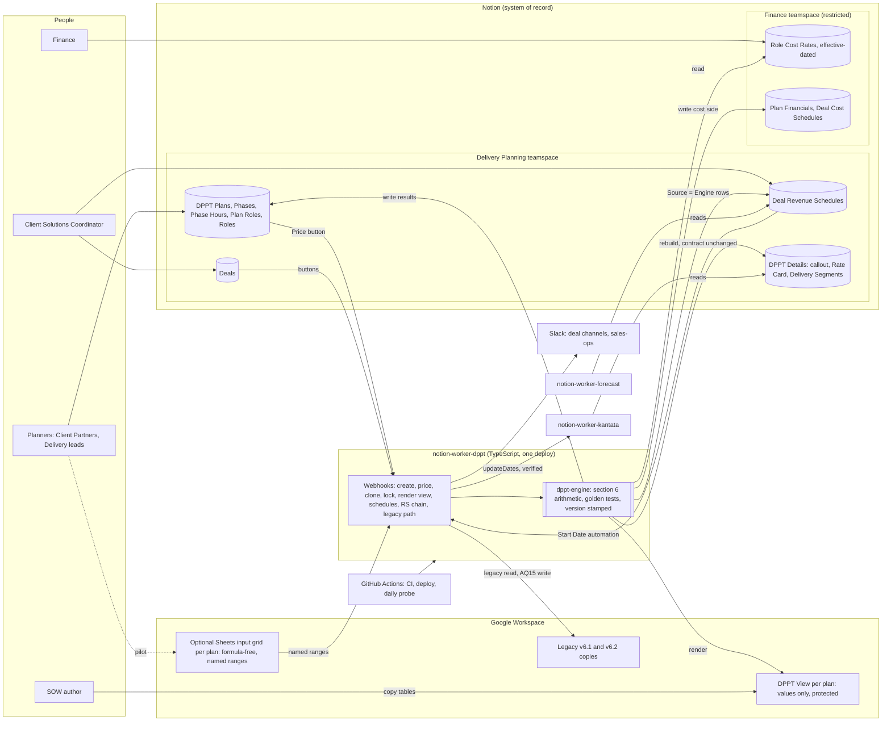

# DPPT: solution options

**Read me first.** This is the framing and options exploration for rebuilding the DPPT (Delivery Project Planning Tool), run with the BlueLabel architect skill (v0.1.0) as Phase 0 (ingest and frame) plus an options study. It answers three questions the architect asked: how to rebuild it in Google Sheets, what other stacks fit, and whether it belongs in Notion. It does not yet choose a platform. That choice is the first gateway decision and it is the architect's to make. Once made, the full design walk (shape, platform and realization, cross-cutting) produces the architecture spec and invariants.

Source of truth for what the tool does today: `DPPT-v6.3-requirements.md` in this folder (sections 6, 7 and 9 matter most here).

---

## 1. Design brief

### 1.1 What the DPPT is, structurally

Today one spreadsheet copy per deal carries three different concerns:

| Concern | What it is | Who uses it |
| --- | --- | --- |
| Authoring | Pick roles, type weekly hours per role per phase, set sprint or month counts, set a start date, tune the margin until the fee matches the SOW | Client Partners, Delivery leads |
| Engine | Cost-plus pricing, sequential date chain, sprint or month expansion, fractional sprints, commission math | Nobody directly; it is the formulas and the bound script |
| Outputs | Output and Allocations tables for the SOW, Rate Card and Delivery Segments for Notion and Kantata, Overview, invoice schedules | Coordinators, the Notion worker, the Kantata worker, clients (via the SOW) |

Because all three live in every copy, the engine is duplicated per deal (version drift), the authoring UI and the engine cannot be changed independently, and the outputs are consumed by scraping header text. Every option below is judged first on whether it separates the engine from the copies.

### 1.2 Drivers (assumptions to confirm)

| ID | Driver | Basis |
| --- | --- | --- |
| D1 | Tiny scale: 5 to 15 planners, tens of DPPTs a year, a handful of phases and up to 30 roles each. No latency or throughput concern. | Live Drive inventory; Team has 30 slots; Tasks has 7 phase rows |
| D2 | Users are fluent in Google Sheets and Notion. Engineering maintains TypeScript Notion Workers and Apps Script. Nobody operates infrastructure for internal tooling. | notion-worker-dppt, notion-worker-forecast; bound script |
| D3 | Confidential but not PII: cost rates, margins, commission. Clients must never see cost or margin; they do see price, fees, dates, roles, hours. Hidden columns are today's only control. | TEAM-16, GOV-09, DEF-16 |
| D4 | Integrations that must keep working: Notion Deals, Deal Revenue Schedules, DPPT Details (Rate Card, Delivery Segments) read by the Kantata worker, Slack, SOW tables. Deal Cost Schedules is planned. | Section 7; section 10.7 |
| D5 | Version drift is the structural pain: copies freeze formulas and rates; bugs ship to every copy; fixes never reach existing deals; the worker scrapes by header text. | DEF-03, PRICE-28, GOV-16 |
| D6 | The pricing model is preserved exactly; the 50 defects are designed out where possible. | Section 6; section 9 |
| D7 | Business-hours availability; a day of data loss is tolerable; small budget; ownership must survive one person leaving. | GOV-10, Q-35 |
| D8 | Deal metadata (code, title, client) lives in Notion; ZenDesk is the CRM. | PRICE-23, notion_schemas |

### 1.3 Constraints and context

- Google Workspace and Notion are both in daily use. The automation platform of record is Notion Workers (TypeScript). There is no GCP provider pack in the golden path; AWS and Azure packs exist.
- Notion made page content on worker-managed rows read-only to integrations on 2026-07-16; property writes still work. A worker with a `worker.sync` needs a managed database and changes the deploy profile.
- Live v6.1 and v6.2 copies will keep circulating for the life of their engagements. Any new tool coexists with them.
- The bound Apps Script cannot be read through the API. Its behaviour is inferred (section 5.9 of the requirements).

### 1.4 Active packs

- `universal-baseline`: always. For a no-code option most service invariants (TLS, health probes, three environments, IaC) do not apply because nothing is deployed; the ones that still apply are: any code lives in a repo with CI and review, secrets never in source, monitoring to Slack for anything that runs, auditability of changes, UTC and IANA zones where code handles dates.
- `workload/web-application` and `workload/server-side`: active only for an option that builds software.
- No compliance pack. No client pack (internal tool).

### 1.5 Architecture barrier check

Choosing the platform (Sheets, Notion, low-code, custom app) selects system-wide technology and introduces or removes system elements, so it is architecture. Everything inside a chosen platform (which formulas, which tab layout, which Notion property) is below the barrier and belongs to the build.

## 2. Decision ledger (seeded)

| Key | State | Notes |
| --- | --- | --- |
| `platform` (authoring surface and engine host) | ready | The gateway. Options A to E below. Everything else is blocked on it. |
| `app_stack` | blocked | Follows platform. TypeScript is the observed team stack (Notion Workers, Apps Script). |
| `primary_datastore` | blocked | Sheets cells, Notion databases, or PostgreSQL by option. |
| `rate_card_source` | ready | Central rate card with effective dates vs per-copy constants. Every option can decide this now; the default is central. |
| `engine_location` | ready | Engine as tested code in one deploy vs formulas per copy. Default: code, one deploy. |
| `integration_contract` | ready | Named ranges or a typed API instead of header scraping. Default: typed contract, versioned. |
| `auth` | blocked | Google Workspace identity in every option; RBAC for cost and margin visibility is the open part. |
| `observability`, `secrets`, `cicd` | blocked | Apply to whatever code exists; universal-baseline defaults (GitHub Actions, Slack alerts). |
| `sow_export` | ready | How Output and Allocations reach the SOW: paste, Google Docs generation, or a rendered Sheet view. |
| `deal_cost_schedules` | deferred | Recorded only, per the architect's request. Inputs exist in every option. |

## 3. What every option must do

Five independent designs were produced (Sheets rebuilt, Notion-native, custom web app, Airtable, and a Notion-plus-engine hybrid) and each was attacked by a people-and-process critic and a technical critic. The designs converged on the same core, and the critics agreed with it. These points hold whatever surface is chosen.

1. **The engine becomes code, deployed once.** Section 6 of the requirements (pricing, date chain, segment expansion, allocations, invoicing, commission) is written as a pure TypeScript package with golden tests for the four worked examples and parity fixtures recomputed from the eight live copies. No per-copy formulas, no custom functions wrapped in IFERROR, no silent $0. This is the only structural answer to version drift (D5). Every design arrived here, including the Sheets rebuild.
2. **The rate card becomes central and effective-dated, and plans pin their rates.** A plan snapshots cost rates when a role is added, refreshes only on an explicit action that shows the price delta, and locks on signature so a later rate or logic change never silently reprices a signed SOW. Today a copy freezes everything; tomorrow bug fixes propagate and contracted prices do not.
3. **The integration contract becomes typed.** Phases, segments and roles carry ids; the worker stops splitting labels on the bar character and stops writing a fixed cell address. The DPPT Details page content (callout, Rate Card table, Delivery Segments table) is frozen as the Kantata worker's contract and version-stamped.
4. **Confidentiality becomes a real boundary, once the business says who it is for.** Hidden columns are not a control. But every critic found the same gap in the brief: nothing in the requirements says Client Partners or delivery leads may not see margin. They set it today, it appears in the DPPT Details callout and the DPPT Margin property, and the Kantata target margin is set from it. The defensible default is to protect **cost** (rate card, team expenses, per-role cost, cost schedules) and leave margin a pricer input. Decide this before any design is built; it halves the complexity of two of the five designs.
5. **Six "defects" are policy decisions, not bugs.** End convention (Sunday vs Friday), bill-rate rounding, zero-hour roles on the Rate Card, Monday snapping, 4-week month vs 12/52, and proration of Allocations for fractional sprints each change SOW-facing or Kantata-facing numbers. Every design listed them as designed out and then listed them again as open. They need an owner and an answer before the engine is frozen, and the safe default for each is today's behaviour so cutover is a parity event.
6. **Migration must preserve contracted prices.** Live copies carry per-copy rates (Executive Client Partner $130 in v6.1 copies vs $325 now) and defects that changed prices (UEI prices at $19,200 under DEF-01; a correct engine gives $24,000). Import needs an "as contracted" mode that pins whatever reproduces the sheet price to the cent and flags the discrepancy, alongside an "as corrected" mode.
7. **Change requests, scenarios and non-deal pricing need a home.** CR copies, Option A / Option B negotiations and service-offering exercises all use Make a copy today. Every design under-specified clone-from-parent and unlinked scenario plans. They are first-class features, not migration details.
8. **Ownership moves only if two people and a bot own it.** A bot Google Workspace identity for the OAuth grant, Passbolt entries, a runbook, CI-only deploys and a named second owner. Otherwise the bus factor is renamed, not removed.
9. **Step zero is exporting the bound Apps Script.** GET_PRICE and formatToUSD are inferred from outputs. If GET_PRICE rounds or applies a minimum, every golden test is wrong. Only the template owner can export it.

## 4. The five candidates

Each summary gives the design in a few lines, what it gets right, what its critics found, and a verdict. Options A, B and C carry at least one completed independent critique; D and E are assessed from their designs and from the critiques of their nearest neighbours (D shares most of B's authoring regression; E shares B's Notion constraints), with a second critique round pending.

### 4.1 Option A: Google Sheets, rebuilt from scratch

**Design.** One price-only Plan workbook per deal (Team, Plan with 40 fixed phase rows, Settings, Output, Allocations, Invoices, Summary, hidden long tables for segments and allocations) created from the Notion Deal by an engine, plus one finance-restricted Rate Card and Pricing Ledger workbook holding cost rates, margins, commission, finance outputs and per-segment cost. A standalone Apps Script engine (TypeScript, bundled, deployed as a web app, run as a bot account) stamps bill rates and formulas into plans, re-stamps on upgrade through versioned migrations, hides columns, locks signed plans and runs a daily fleet sweep. The worker reads named ranges only. Native array formulas carry the price-side math; cost-side math lives in the Ledger; a pricing.ts mirror serves preview and tests.

**Right.** Keeps planner fluency and instant what-if on hours and units. Understands the Sheets security model (the file is the only boundary). Rejects IMPORTRANGE and library pinning for verifiable reasons. Named-range contract with schemaVersion. Create-from-Deal fixes naming, protection drift and the version cell. Fixed block with array formulas removes the insert-row machinery that caused the misaligned v6.1 copies.

**Critics found.** The engine's authorization is built on a bearer header an Apps Script web app cannot see (doPost receives no headers), so identity must come from an ID token. Section 6 is implemented three times (Plan formulas, Ledger formulas, pricing.ts) held equal only by a fixture suite. The bound shim is still per-copy code with per-copy, per-user authorization; a domain-installed Editor Add-on is the fix. Margin tuning, the daily pricing action, becomes a sidebar round trip because margin left the file. The daily heartbeat check assigned to the worker has no trigger (the worker is webhook-only by design). Effort is understated by about half (critic estimate 20 to 28 engineer-weeks). Make a copy cannot actually be retired for editors. Keying Ledger exports by deal code fails on placeholder codes. The Timeline view cannot be bound through the API. PII classification is wrong (Who names people; ISR commission is compensation).

**Verdict.** Viable with changes. The simplified variant the critics describe is the real Option A: one finance-permissioned Plan per deal with margin in the file, cost rates stamped as bill rates only, a central RateCard workbook (no Ledger), pricing.ts as the single engine writing values, and a domain add-on instead of bound scripts. Section 6.1 below is that blueprint.

### 4.2 Option B: Notion-native

**Design.** Eleven Notion databases across a Delivery Planning teamspace (Plans, Phases, Allocations as one row per role per phase, Plan Roles, Roles catalogue, Segments, DPPT Details) and a private Finance teamspace (Role Cost Rates, Pricing, Role Pricing, Deal Cost Schedules). All arithmetic in a pure engine inside the existing notion-worker-dppt, recomputed on input edits through automations and a Recalculate button. DPPT Details content contract unchanged. Revenue Schedule rows generated per phase (Source = DPPT) and Cost Schedule rows mirrored in Finance. SOW tables exported to a Google Doc.

**Right.** One engine, one deploy, golden tests. Roles by page id. Central rate card with snapshots. Segments as rows feeding Details, schedules, invoicing and a native timeline. Per-Deal dispatch keeps v6.1 and v6.2 copies working. Generated Revenue Schedule rows that never touch manual rows honour the process rule that billing lines need not match sprints.

**Critics found.** A blocker on the daily job: live what-if pricing is gone. Each edit becomes automation, webhook, full recompute at about 3 requests per second (15 to 40 seconds), and Notion formulas cannot preview the negotiated figures (Unit Fee, Price) because they sit two relation hops away. The event-driven recompute cannot work as specified: last_edited_time is minute-granular, the worker is stateless, and a burst of 20 cell edits runs 20 concurrent recomputes. Notion cannot lock property values, so worker-written Price, Bill Rate and Start are overwritable with no warning, weaker than today's warning-only protections. The Finance split moves the planner's main knob (Universal Margin) out of reach and then leaks margin anyway through the DPPT Details callout and the DPPT Margin property. Generated Revenue Schedule rows make start-date ownership circular with the existing chain. The roles-by-phases grid becomes a list. Page history on Notion Business is 90 days. Automations, views and buttons cannot be scripted, so the sandbox and production teamspaces drift. drive.file cannot create a Doc in an existing Deal folder. Effort is near full-time, not part-time, and the hand-built Notion configuration is uncounted.

**Verdict.** Viable with changes, and the changes turn it into Option E: button-driven deterministic pricing with a native "stale" flag, protect cost only, lock on Signed with clone for CRs, engine rows excluded from the earliest-start rule, and the SOW tables rendered to a Sheet rather than a Doc.

### 4.3 Option C: Custom web application on the golden path

**Design.** One Next.js app on Vercel with Neon Postgres, a pure engine package, RBAC projections (planner, finance, viewer), effective-dated rate card, versioned plans with published snapshots, a transactional outbox for Notion, Slack and Kantata work, Auth0 with Google Workspace SSO, Logfire, an AWS Lambda health monitor, Terraform, three environments, REST plus an MCP companion, a sheet importer with diff view. Writes the DPPT Details contract byte for byte.

**Right.** Attacks D5 at the root with the cleanest engine story, typed validation errors instead of IFERROR, roles by id, unlimited roles and phases, real RBAC, published snapshots separate from live recompute, and coexistence by forwarding sheet-backed deals to the existing worker. Honest about adoption risk and about what it cannot fix.

**Critics found.** Ownership is moved, not solved: 13 components across seven vendors (Vercel, Neon, Auth0 times three, Logfire, AWS, Terraform Cloud, GitHub) for a tool with 10 to 15 users and no one paid to operate it. "Publish" conflates freezing a version for a proposal (planner, pre-sale) with syncing to Notion and Kantata (coordinator, post-signature). Logic is never pinned, so a signed plan recomputes under the newest engine when the chain moves a start date. Day one for live copies is heavier than described: the service account must be shared into every live sheet, and the importer must read Tasks and Team inputs the worker has never parsed. What-if speed, co-editing and scenario branching are unspecified. Six designed-out defects reappear as open policies. The "half a day a month" maintenance claim is unsupported for that stack.

**Verdict.** Viable with changes, and the strongest on correctness, but the worst fit for D2 and D7. Justified only if BlueLabel wants a product-grade pricing tool (RBAC, plan versions, an API and MCP surface for the AI refresh of Revenue Schedules) and will staff two owners for it.

### 4.4 Option D: Low-code (Airtable)

**Design.** One Airtable base (Roles, Role Rates with effective dates, Plans, Plan Roles, Phases, Role Hours, Segments, Invoices, Requirements, Engine Log). Money math in native formulas and rollups; the date chain, segment and invoice generation in one scripted automation bundled from a TypeScript repo. Four Interfaces (Planner, Finance, Delivery read-only, SOW pack) with interface-only collaborators so planners cannot reach cost or margin at all. The existing worker gains an Airtable adapter selected by the DPPT URL host; the DPPT Details contract is frozen. Nightly schema snapshot through the Meta API as configuration-as-code substitute.

**Right.** The cheapest build (about 5 to 6 engineer-weeks plus UAT). The clearest permission story of the five: interface-only collaborators are denied base and API access by the platform, not by a hidden column. Lock-on-sign with contracted snapshots. Cost per segment exists as a formula from day one. The worker stays the single integration hub.

**Concerns (critique pending).** A fourth platform for a company already on Sheets, Notion and Kantata, at $2,400 to $3,600 a year. The same roles-by-phases grid loss as Notion (per-phase list entry; Interfaces have no editable matrix), and asynchronous recompute of 2 to 10 seconds. Automations and Interfaces are not version-controlled; drift is detected nightly, not prevented. The permission claims on the Team plan must be proven before build; if field-level permissions are needed the Business plan doubles the cost. Vendor lock-in is mitigated by a relational schema that maps to Postgres, but an exit rebuilds the UI. Confidential cost data on a US-hosted SaaS needs a procurement answer.

**Verdict.** Credible as the fastest path to a permissioned, non-drifting tool, and the right answer if BlueLabel would rather configure than code. Its weakness is strategic (another platform) rather than technical.

### 4.5 Option E: Hybrid, Notion as record, engine in the worker, Sheets as a rendered view

**Design.** Six small Notion databases: Plans, Plan Phases, Phase Hours, Plan Roles and a Roles catalogue in a Delivery Planning teamspace; Role Cost Rates, Plan Financials and Deal Cost Schedules in a restricted Finance teamspace. One pure engine library inside notion-worker-dppt computes everything on a Price button, writes results to Plan properties, rebuilds DPPT Details through the existing block builders (contract unchanged), writes DPPT Margin to the Kantata Outline, generates Revenue Schedule and Cost Schedule rows (Source = Engine), and regenerates a values-only, formula-free, hard-protected Google Sheet per plan ("DPPT View": Summary, Output, Allocations, Rate Card, Fee Installments) for SOW copy-paste. Clone plan for what-if, Target Unit Fee goal-seek, Lock on signature, Stale badge, legacy path behind a "Deal has a Plan" predicate, bot Google account, GitHub Actions CI and a daily probe. It explicitly rejects publishing the engine as an Apps Script library (two runtimes reintroduce drift).

**Right.** The engine lives where the integrations already live and in the stack the team maintains. Notion is already the record for Deals and Revenue Schedules, so Deal Cost Schedules is a natural output rather than a new system. The rendered Sheet keeps the SOW paste habit with zero formulas and zero confidential content, which is the one Sheets use that needs no engine. Goal-seek removes the margin-tuning habit (56% typed where 56.12% hits the fee). Near-zero incremental cash cost.

**Concerns (critique pending; Option B's critiques apply).** Authoring moves to Notion rows and loses the grid and instant recalculation; the design's own fallback is a disposable, formula-free Sheets input grid in a later phase. Notion cannot lock values, so Lock must be enforced by the engine refusing to reprice. Margin visibility through the callout and the DPPT Margin property remains unless the callout line is dropped (which needs the Kantata worker owner, Q-37). Generated Revenue Schedule rows must be excluded from the earliest-start rule or the chain becomes circular. Notion API paging (25 relation items) and the shared integration token's rate limit need explicit handling. Two environments and two branches are a recorded deviation.

**Verdict.** The best structural fit for D4, D5, D7 and D8, with one unresolved question: whether planners will accept Notion rows as the authoring surface. That question is cheap to answer with a pilot and expensive to guess.

## 5. Comparison

Scores are the author's judgment (1 poor to 5 strong) from the designs and the completed critiques, not a measurement. Two criteria were added to the eight drivers because every critic raised them: whether defects are removed structurally, and authoring speed for what-if pricing.

| Criterion | A Sheets | B Notion | C Web app | D Airtable | E Hybrid |
| --- | --- | --- | --- | --- | --- |
| D1 Tiny scale | 5 | 5 | 4 | 5 | 5 |
| D2 Team skills, no ops | 3 | 4 | 2 | 3 | 4 |
| D3 Cost and margin confidential | 3 | 3 | 5 | 4 | 4 |
| D4 Integrations keep working | 4 | 4 | 4 | 4 | 5 |
| D5 Version drift removed | 3 | 5 | 5 | 4 | 5 |
| D6 Model preserved, defects out | 4 | 4 | 5 | 4 | 4 |
| D7 Budget and ownership | 3 | 4 | 2 | 3 | 4 |
| D8 Deal metadata stays in Notion | 4 | 5 | 4 | 4 | 5 |
| Defects removed structurally | 3 | 4 | 5 | 4 | 4 |
| What-if authoring speed | 5 | 2 | 3 | 2 | 2 (3 with the Sheets input grid) |
| Time to first value | 3 | 3 | 2 | 4 | 3 |
| **Total** | **40** | **43** | **41** | **41** | **45** |

| Option | Effort (design) | Effort (critic) | Running cost | New platform |
| --- | --- | --- | --- | --- |
| A Sheets rebuilt | L, 10 to 14 engineer-weeks | 20 to 28 engineer-weeks | under $30 a month (bot seat) | No |
| B Notion-native | L, 8 to 12 engineer-weeks | 13 to 19 engineer-weeks | about $0 | No |
| C Web app | L, 14 to 18 engineer-weeks | higher; two owners needed | $60 to $90 a month plus vendor churn | Yes (seven vendors) |
| D Airtable | M, 5 to 6 engineer-weeks plus UAT | pending | $2,400 to $3,600 a year | Yes (one) |
| E Hybrid | L, 8 to 12 engineer-weeks (+2 cost schedules, +2 grid form) | pending; expect B's uplift | $15 to $20 a month (bot seat) | No |

The totals are close on purpose. The engine, rate card, contract and migration are the same work in every option; the surface is where they differ, and the surface is a judgment about people, not technology.

## 6. The three answers

### 6.1 If I rebuilt it in Google Sheets

Keep Sheets as the planning surface and change everything underneath it. In order:

1. **Create plans from the Notion Deal, never by Make a copy.** A Create DPPT button on the Deal calls the engine, which copies a skeleton into the engagement folder, names it from the code and title, and sets the Deal's DPPT URL. Deterministic names, no protection-editor collapse, no stale version cell.
2. **One Plan workbook per deal, fixed block, no row insertion.** Tabs: Team (30 slots keyed 1 to 30), Plan (40 phase rows: title, units, optional start override, notes, 30 weekly-hour columns), Settings (mode, start date, show fees, invoice lead and cadence), Output, Allocations, Invoices, Summary, and hidden long tables for segments and allocations. Each computed column is one array formula over the block. This removes the insert-row script, the Constants tab, the bottom-row sentinel and the misalignment class of defects.
3. **Every lookup by slot key, never by name.** A catalogue role dropdown per slot and a separate display-name column for SOW wording. Two "QA Engineer" rows stop colliding; renames stop breaking Capability and Kantata mapping.
4. **Cost rates leave the file.** The engine stamps bill rates into Team as values, with the rate-card version and time recorded. Cost rates live in one finance-permissioned Rate Card workbook with effective dates. Margin stays in the Plan as a pricer input unless the business decides pricers may not see it (shared truth 4). Hidden columns are never used as a control.
5. **One mode cell drives everything.** Labels, multipliers, chain rule, End rule, invoices and the Summary read Settings.mode. No "sprints" in a monthly plan.
6. **Segments as a long table.** One LET/MAP formula expands phases into segments (number, phase id, fraction, start, end, amount). Output, Allocations, Invoices and Summary all derive from it, so there is one End convention, no phantom block for single-phase plans, mode-aware invoices and no trailing $0 row.
7. **A named-range contract instead of header scraping.** meta.* (schemaVersion, engineVersion, deal id, mode, locked), in.* (start date, mode, lead days) and x.* (flat typed tables for summary, rates, phases, segments, allocations, invoices). The worker reads only named ranges, gates on schemaVersion, and writes only in.startDate.
8. **The engine as a domain-installed Editor Add-on, not bound scripts.** TypeScript bundled with esbuild and pushed with clasp from GitHub Actions; one deployment reaches every plan with one authorization per user. Actions: create, stamp rates, refresh rates (shows the price delta), reset view, lock, upgrade, export. A versioned formula catalog and ordered migrations let a fleet sweep re-stamp unlocked plans and hold locked plans whose numbers would change. Identity by ID token, not a bearer header.
9. **A plan registry.** The rate card workbook also lists every plan (id, Deal id, engine version, lock state) and, if Deal Cost Schedules is built on Sheets, per-segment cost. Key rows by the Notion Deal page id, never by engagement code.
10. **Tests.** pricing.ts golden tests for the four worked examples; a fixture workbook whose inputs are loaded and whose x.* outputs are asserted to the cent in CI; a committed snapshot of x.* for the worker's parser tests.
11. **Remove what is dead.** Requirements, Templates, Top-Level Tasks, Timeline Data and the Timeline object leave the plan. Estimation ships as a separate optional template if anyone still uses it.
12. **Identity and ownership.** A bot Workspace account owns the skeleton, the rate card workbook, the add-on deployment and the worker's OAuth grant; Google Groups for pricers and finance; Passbolt entries; two named owners.

What a Sheets rebuild still cannot do: hide margin from someone who edits the file; avoid per-user add-on authorization; give the worker anything better than a spreadsheet to read; or stop a second implementation of the arithmetic from existing (formulas in the plan plus pricing.ts in the engine, unless the engine writes values and the plan keeps only hours and the chain, which costs the instant fee preview). Expect 20 to 28 engineer-weeks, not 10 to 14.

### 6.2 Other stacks

- **A custom web app on the golden path** (Next.js, Postgres, Auth0 with Workspace SSO, Logfire, GitHub Actions, Terraform) is the most correct system and the heaviest to own. Choose it if the goal is a product: real RBAC, plan versions with diffs, an API and MCP surface the AI refresh of Revenue Schedules can trust, keyboard grid with paste-from-Sheets. Do not choose it to fix a spreadsheet for 10 to 15 people unless two engineers will own it and the baseline's operating discipline is wanted for its own sake. Reduce the vendor count before starting (one Auth0 tenant, two environments) and pin the engine version on published plan versions.
- **Airtable** is the fastest route to a permissioned, non-drifting tool and the only option whose permission model needs no design. It costs a fourth platform, the grid, and about $3,000 a year, and its automations are not in source control. Retool and AppSheet were evaluated by the design agent and set aside: Retool needs a Postgres and a JS backend anyway (at which point Option C is better), and AppSheet reads from Sheets or Cloud SQL and adds little over a direct Sheets rebuild.
- **Excel or another spreadsheet** is not in use at BlueLabel and brings nothing Sheets lacks.
- **Option 0, fix in place.** Not a rebuild, but worth naming because the completeness pass would: cut a v6.4 that repairs the invoicing tabs against Output, keys rows 8, 10 and 11 on the slot id, guards the single-phase Allocations block, bumps Config!J1, and fixes the two worker items (fallback label, chain ordering). One to two weeks. It leaves version drift untouched and fixes nothing in existing copies, so it is an interim for live deals while the engine is built, not an alternative.

### 6.3 Notion

Yes for the record and the outputs. No for the authoring grid, unless a pilot proves otherwise.

- **Notion is the right system of record** for a plan's inputs (roles, phases, hours, mode, margin), for generated Deal Revenue Schedules and Deal Cost Schedules, and for DPPT Details. Deal metadata already lives there, the Kantata worker already reads there, and the future cost schedules are one more database rather than one more system.
- **Notion cannot carry the model in formulas.** Formula 2.0 cannot chain dates across sibling rows, cannot expand one phase into N segment rows, and cannot follow a relation through a relation to preview a Unit Fee. The engine must be code in a worker. That is not a weakness of the hybrid; it is why the hybrid exists.
- **Notion's permission model is databases and teamspaces, not properties.** It protects cost cleanly (a Finance teamspace) and cannot protect margin while the DPPT Details callout and the DPPT Margin property exist.
- **Notion is a poor pricing grid.** One row per role per phase, button-driven recompute of 5 to 15 seconds, no value-level lock, minute-granular edit times, 90 days of page history, API paging at 25 related items, a rate limit shared with the forecast worker, and automations that cannot be scripted. Each has a mitigation (deterministic Price button with a native stale flag, engine-enforced lock, probe, pagination, a second integration token), and together they are the cost of Notion as a surface.
- **The rendered Sheet is the bridge.** A values-only, protected Google Sheet per plan preserves the SOW paste workflow with nothing to unhide and nothing to break. If the pilot shows planners need the grid to author, the same mechanism runs in reverse: a thin, formula-free Sheets input grid read by the engine, with Notion still the record.

## 7. Recommendation

**Decide the engine now and let a pilot decide the surface.** Everything in section 3 is common to all five options and is about two-thirds of the work. Build it first, in the stack the team already runs:

1. Export the bound Apps Script (week 0). Confirm whether RS_CHAIN_DRYRUN is live.
2. Build `dppt-engine` as a pure TypeScript package in the notion-worker-dppt repo with golden tests (template, NFM, Ergo CR10, UEI) and parity fixtures from the eight live copies. Decide the six policy parameters with finance, defaulting each to today's behaviour.
3. Create the Notion record: Plans, Phases, Phase Hours, Plan Roles, Roles, and a Finance teamspace with Role Cost Rates and Plan Financials. Seed the 22 roles and current rates.
4. Add the worker webhooks (create, price, clone, lock, render view, health) and keep the DPPT Details contract byte for byte. Verify on the BLTEST2 deal that the Kantata worker needs no change.
5. Pilot authoring both ways on two real deals with two Client Partners: Notion rows with the Price button, and a thin formula-free Sheets input grid (created by the engine, named-range contract) that the engine reads. Measure time to price a change request and count how often a scratch spreadsheet appears.
6. Choose the surface from the pilot. Keep the other as the fallback the design already specifies.

If forced to choose a surface today, choose **Option E with the Sheets input grid** (call it E+). It keeps the engine where the integrations are, keeps Notion as the record, keeps the SOW paste habit through the rendered view, protects cost by teamspace, and gives planners back a grid without putting any formula or rate in it. Option A is the right answer only if the grid must also carry instant fee math and the business accepts margin visible in the file; Option C only if BlueLabel wants a product and two owners; Option D only if the team prefers configuring a fourth platform to writing TypeScript.

## 8. Decisions only the architect can make

Each has a proposed default. "Keep today's behaviour" means cutover is a parity event and the change is made deliberately afterwards.

| # | Decision | Options | Proposed default | Why it matters |
| --- | --- | --- | --- | --- |
| 1 | Who may see margin? | Pricers see margin, cost hidden; or margin hidden from everyone but finance | Protect cost only; margin is a pricer input | Halves the Finance data model; decides whether a target-fee solver is a convenience or a necessity |
| 2 | Must authoring be a spreadsheet grid? | Notion rows; thin Sheets grid; both | Pilot both on two deals before choosing | The single largest adoption risk; a wrong guess recreates shadow spreadsheets and drift |
| 3 | End convention | Sunday (Tasks) or Friday (Output) | Friday, the value SOWs and Kantata already receive; flag as SOW-facing | Removes DEF-06 but changes the callout date range |
| 4 | Month conversion | 4 weeks of hours (sheet) or 12/52 (Notion Weekly Revenue) | Keep both as today; finance decides | A 7.7% forecast gap on monthly deals |
| 5 | Bill-rate rounding | Fractional (pricing) with whole-dollar display; or round before pricing | Keep today's | Rounding changes every price; display is a Kantata question |
| 6 | Zero-hour roles on the Rate Card | Include-only (today) or hours > 0 | Keep today's until the Kantata worker owner agrees | Drops Client Partner roles from the Kantata rate card |
| 7 | Non-Monday start | Snap, warn, allow | Warn | Deposits can legitimately precede delivery (Q-42) |
| 8 | Allocations proration for fractional sprints | Full (today) or prorated like Output | Keep today's; flag | SOW-facing hours |
| 9 | Lock semantics | What a Signed plan may change | Start Date only (from the chain); everything else needs Supersede, which clones for a CR | Protects the DPPT-price-equals-SOW rule |
| 10 | Start-date ownership | Which schedule rows drive the Deal start | Manual rows only; engine-generated rows excluded | Prevents a circular chain once rows are generated |
| 11 | Requirements worksheet | Retire, separate template, Notion database | Retire from the plan; separate template if used (Q-24) | No formula link today |
| 12 | Environments and branches | Baseline four and three; or two and two | Two and two, recorded deviation | Internal tool, D7 |
| 13 | Bot identity and owners | Create a bot Workspace account; name two owners | Yes, both, before build | D7 |
| 14 | Interim | Ship a v6.4 fix-in-place for live deals? | Only if the rebuild is more than a quarter away | Invoicing has been broken since July |

## 9. Decision ledger (updated)

| Key | State | Decision or next step |
| --- | --- | --- |
| `engine_location` | decided | Pure TypeScript package, one deploy, golden tests and parity fixtures; no formulas, Notion formulas or custom functions carry logic |
| `app_stack` | decided | TypeScript (observed: Notion Workers, Apps Script); deviation from the server-side pack's Python preference recorded |
| `rate_card_source` | decided | Central, effective-dated, finance-owned; per-plan pin at role add; explicit refresh with price delta; lock on signature |
| `integration_contract` | decided | Typed ids and properties; DPPT Details content frozen as the Kantata contract and version-stamped; legacy header parser retained behind a per-Deal predicate until the last sheet-backed deal closes |
| `sow_export` | decided | Values-only protected Google Sheet per plan via the existing spreadsheets scope; Google Docs insertion deferred |
| `platform` (authoring surface) | ready | Default E+; pilot decides between Notion rows and a thin Sheets grid |
| `primary_datastore` | ready | Notion databases for the record (default); Sheets cells only if the pilot picks the grid as record, which is not recommended |
| `auth` | ready | Workspace identity everywhere; cost in a Finance teamspace or file; margin visibility per decision 1 |
| `observability` | ready | Structured run logs, failures to Slack, a daily GitHub Actions probe with state outside Notion; deviation from LangSmith or Logfire recorded |
| `secrets` | ready | Passbolt as store of record; Notion Workers env at runtime; bot Google account owns the OAuth grant |
| `cicd` | ready | GitHub Actions, PR with review, deploy on merge; two environments and two branches (deviation) |
| `deal_cost_schedules` | deferred | Inputs exist in every option; compute in the engine from hours per segment and pinned cost; recorded only, per the architect's request |
| `cloud_provider`, `compute`, `object_storage`, `messaging`, `api_style` | not applicable | Only Option C needs them; see its design if chosen |

## 10. Method and verification status

- Five design agents worked independently from the requirements document, the architecture barrier and the golden-path packs. Each was asked for components, decisions by vocabulary key, a mapping of the twelve core features plus Deal Cost Schedules, defects designed out and remaining, data protection, migration, effort, cost, risks and open questions.
- Each design was critiqued by two adversarial agents (people and process; technical and golden path). Completed: A both lenses, B both lenses, C people and process. Pending at the time of writing: C technical, D both, E both, the cross-option judge and the completeness critic (the run stopped on an account spend limit and has been resumed). The scores and verdicts above are the author's reading; the judge's scoring will be appended when it lands.
- Nothing in Google, Notion, Slack or Kantata was modified. All reads were read-only.
- Known gaps a completeness pass would raise: the Kantata worker source was not available (its parsing of DPPT Details is known only from the dppt worker side); Notion plan tier and page-history retention were not confirmed; Airtable Team-plan permission claims were not verified; the ZenDesk CRM's role beyond "source of the Deal" was not examined; the Workspace template gallery question (From template vs Make a copy) could not be checked through the API.

