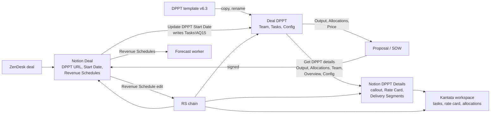

# DPPT v6.3 Requirements (reverse-engineered)

**Read me first.** The DPPT is BlueLabel's per-deal Google Sheet for pricing, staffing and scheduling an engagement. A planner picks roles on the Team tab, types weekly hours per role into one row per phase on the Tasks tab, sets a number of two-week sprints (or months) per phase, and the sheet derives bill rates, phase prices, sprint fees, dates, and the Output and Allocations tabs that feed proposals, SOWs, Notion and Kantata. This document records what the v6.3 template (`BL###.## - [Title] - DPPT v6.3`, spreadsheet id `1kwmFH-61_4K8E-rGVie395TAQsExGBZ8TV3_hZ2oiGE`) does today, as of 2026-10-07. It is an as-is specification, not a redesign. Improvements come in a later phase.

Sources: every non-empty cell of the template (formulas, values, validation, formats, hidden rows and columns, protections, conditional formats, named ranges), the v6.1, v6.2 and v7 sibling templates and the archived v1 to v5 files, eight live deal copies, the `notion-worker-dppt` source code, the Notion Deals, Deal Revenue Schedules and DPPT Details schemas, the Notion how-to and process pages, and the DPPT Issues history. Appendix C lists them.

How to read it: requirements carry an ID by area (TEAM, PRICE, PLAN, SCHED, OPT, OUT, INV, REQ, SCRIPT, GOV, INT, PROC, BIZ, USE, HIST), a statement written as "shall" in the as-is sense, the evidence (cell references or file:line), and a confidence tag: **H** (read directly from the sheet or code), **M** (strongly supported inference), **L** (plausible inference only). Defects are DEF-nn and open questions Q-nn.

Verification status: the Team and Config area went through an independent evidence re-trace (56 verdicts: 52 confirmed, 3 corrected, 1 unverifiable, all 18 calculations reproduced). The other areas were compiled by the lead analyst who re-read the cell dumps and the worker code for every cell-level claim. Figures that come from live deal copies or archived templates that only one analysis pass read are marked "(reported)". The bound Apps Script could not be read through the Sheets or Drive APIs, so every SCRIPT item is inferred from named ranges, custom functions, protections and the issues history.

---

## 1. Purpose and scope

The DPPT exists to answer four questions for one deal: who works on it, how many hours per week each role spends in each phase, what that costs BlueLabel, and what BlueLabel charges for it. From those inputs it produces the price quoted in the SOW, a per-sprint (or per-month) fee, sequential phase dates from a single start date, a rate card, hours per sprint per role, and billing schedules. One copy exists per SOW and per change request.

The sheet sits in the middle of the deal-to-delivery flow. Upstream, a Notion Deal holds the DPPT URL, the start date and the Deal Revenue Schedules. Downstream, the `notion-worker-dppt` Notion Worker parses the sheet into a DPPT Details page in Notion and writes the Deal start date back into exactly one cell, and the Kantata worker rebuilds the delivery workspace from that page. The forecast worker never reads the sheet.

This document covers:

- the six visible tabs (Tasks, Team, Config, Allocations, Output, Templates) and the eight hidden tabs (Requirements, Overview, Sprint Invoicing, Monthly Invoicing, Timeline, Constants, Top-Level Tasks, Timeline Data);
- every calculation, option switch and display rule, with worked examples from the template sample and from live copies;
- the behaviours of the bound Apps Script as far as the sheet reveals them;
- the integration contract that automation depends on, and the process rules around the sheet;
- the business rules and usage patterns the live copies show;
- observed defects, inconsistencies and gaps;
- open questions only a BlueLabel owner can answer.

It does not cover the Kantata worker source (not available in this session), the Apps Script source, or the Deal Cost Schedules feature the requester plans for later (facts relevant to it are collected under Q-40 to Q-43).

## 2. Glossary

| Term | Meaning |
| --- | --- |
| DPPT | The Google Sheets template and its per-deal copies. Expanded as "Delivery Project Planning Tool" in the worker documentation and as "Delivery Plan Pricing Tool" in the v1 file and the Notion how-to page (see DEF-28). |
| Phase row | One Tasks row (15 to 21): a title in column A, weekly hours per role in B:AE, a duration in AF. The header calls it "Phase / Sprint / Team / Milestone / Task"; every formula treats it as a sequential phase with its own team. |
| Sprint | Two calendar weeks. Weeks = sprints x 2, Sprint Fee = Weekly Rate x 2, Output rows advance 14 days, allocation hours per sprint = weekly hours x 2. Output dates a sprint Monday to Friday of the second week (10 business days). |
| Month (monthly mode) | The segment unit when the Monthly checkbox is on. Priced as four weeks of hours (Weeks = months x 4, Month Fee = Weekly Rate x 4); dated by calendar months with EDATE. |
| Weekly hours | Hours per week a role works during a phase, typed in Tasks!B15:AE21. The only effort input in the workbook. |
| Weekly Hours (AL) | Sum of weekly hours over included roles for a phase. |
| Role Hours (row 12) | Hidden Tasks row: total hours per role over all phases (weeks x weekly hours), not gated on Include. Team!K reads it. |
| Weekly Rate (AK) | Phase Subtotal divided by Weeks; the hidden per-week price of the phase team. |
| Sprint Fee / Month Fee (AO) | Weekly Rate x 2 (or x 4). The per-segment price quoted in SOWs; becomes the Per Sprint Rate on a Deal Revenue Schedule row. |
| Subtotal (AP) | The phase price: sum of the hidden per-role prices AT:BW. |
| Price / totalPrice | Config!G3 = SUM(Tasks!AP14:AP). Shown in Tasks!AP1 when Show Total is on and in Overview!H8. Must equal the SOW price. |
| Phase RunSum (AH) | Running total of AF down the rows; the cumulative sprint (or month) count, carried into empty rows. |
| Phase # (AM) | Row offset from hidden row 14 when AF > 0 (1, 2, ...). A position number, not a dense index. Allocations keys its blocks on it. |
| Sprint Text (BX) | "N sprint" or "N sprints" built from Weeks / 2; the Duration text on Overview, also in monthly mode. |
| Delivery Notes (AS) | Free text per phase for the delivery team. Read by no formula or worker. |
| Include (Team!B) | Checkbox per Team role. Excluded roles contribute zero rates, hours, revenue and price, and their Tasks columns are hidden. |
| Visible / Included (row 9) | Hidden Tasks row of booleans per column B:AS: the Team Include flag for role columns, constants or the Show Total switch for helper columns. Drives which columns the script shows. |
| Key / ID | Team!A (1 to 30, one SEQUENCE formula) and Tasks!B7:AE7 (1 to 30, typed). The fixed slot number that links a Team row to a Tasks hours column. |
| Cost Rate (Team!D) | BlueLabel's hourly cost for the role, in dollars per hour. The only cost input in the workbook. |
| Universal Margin | Config!D3, named range `margin`. The target gross margin as a share of price, default 70%. The main pricing knob. |
| Margin Override (Team!E) | Optional per-role percent that replaces the Universal Margin for that role only. |
| Effective Margin (Team!F) | The margin actually applied to a role: the override when typed, else the Universal Margin. |
| Bill Rate (Team!G) | Cost Rate / (1 - Effective Margin). Cost-plus by target margin: a 70% margin is a 3.33x multiplier on cost. The client-facing hourly rate and the basis of the Rate Card. |
| Capability (Team!H) | "Product" or "Engineering" per role, blank for the two Client Partner roles. Colours Team rows and Tasks headers. |
| Who (Team!M) | The person or vendor expected to fill the role (Ryan, XSeed, VStorm, Tatva, TestYantra India, Near Shore ...). Listed on Overview; parsed by the worker but not rendered. |
| Effective Margin (Config) | D4 = (Price - Team Expenses) / Price before commission; D6 = (Revenue - Team Expenses) / Revenue after commission. |
| Commission | Config!D5 percent (named `externalCommissionPercent`) and G4 dollars (`externalCommissionAmount`) taken off Price. Called "ISR Commission" in the issues history and v6.1; the sheet never expands "ISR". |
| ISR Name / Goes to | Config!I4 (named `ISRName`), the commission recipient, shown only when the commission percent is above zero. |
| Revenue (Config!G5) | Price minus Commission. Net revenue retained by BlueLabel. |
| Team Expenses (Config!G6) | SUM(Team!I:I): total direct labour cost of the plan (cost rate x hours per role). |
| Margin Amount (Config!G7) | Revenue minus Team Expenses. |
| Show Total (AR3) | Checkbox named `checkboxOptionShowFees`. Shows the total in AP1 and flags the Sprint Fee and Subtotal columns visible. |
| Monthly (AR4) | Checkbox named `checkboxOptionMonthly`. Sheet-wide switch between sprint-based and monthly engagement arithmetic, headers, chaining, Output and Allocations. |
| GET_PRICE | Custom Apps Script function `GET_PRICE(weeklyHours, weeks, billRate)` used in Tasks!AT:BW. Observed result: weeklyHours x weeks x billRate. Wrapped in IFERROR(..., 0). |
| formatToUSD | Custom Apps Script function used by Allocations to render block prices as "$28,667" text. |
| Reset View | Item of the custom BlueLabel menu added by the bound script (DPPT Issues, 2023-09-21). Inferred to re-apply hidden rows and columns from row 9 and the fixed hidden ranges. |
| Template row | Hidden row holding every formula with no inputs so the script can copy it into inserted rows: Tasks row 14 (`tasksLastHiddenRow`), Requirements row 11 (`reqFormulaSource`). |
| Bottom row | Hidden, deliberately empty last row anchoring open-ended ranges: Tasks row 22 (`tasksBottomRow`), Requirements row 18 (`reqBottomRow`). |
| Constants tab | Hidden two-row tab storing LastTaskRowNum (22) and LastReqRowNum (18) for the script. |
| Line item | One row of the Output tab: "Sprint N \| Phase Title" (or "Month N \| Phase Title"), Start, End, Amount. The worker calls it a segment. |
| Allocation block | A group of rows on the Allocations tab for one phase: title row (label \| price), header row (Role \| Hours per sprint or month), role rows, blank separator. |
| Installment / Invoice | Sprint Invoicing: an installment per line item due 14 days before it starts; an invoice every 28 days covering two installments. Monthly Invoicing: one invoice per calendar month of line-item starts. |
| Rate Card | The Role \| Rate table the worker writes to DPPT Details from included Team rows (bill rate rounded to whole dollars). The Kantata worker builds the Kantata rate card from it. |
| Delivery Segments | The seven-column table (Name, Roles, Hours, Start, End, Duration, Budget) the worker writes to DPPT Details, one row per Output line item. Formerly headed "Sprints". |
| DPPT Details | Notion companion database (data source `7ea7034e-ad61-4ac5-b9c3-25797100c2e2`), one page per Deal, holding the callout, Rate Card and Delivery Segments. Read by the Kantata worker. |
| Deal Revenue Schedule | Notion row describing billing timing: Billing Basis, Rate, Duration Type, Duration, Start Date, Archived. Built by hand from the DPPT; the forecast source of truth; the trigger of the revenue-schedule chain. |
| Kantata Outline | Notion page (relation on the Deal) representing the Kantata workspace; carries Project ID and receives the DPPT Margin property. |
| RS chain | The `onRevenueScheduleChanged` cascade: earliest schedule start, then Deal Start Date, then Tasks!AQ15, then re-parse, then Kantata updateDates, then one Slack message. Dry-run unless `RS_CHAIN_DRYRUN` is exactly `"false"`. |
| Forecast deal | A Deal with the Forecast checkbox set: a pipeline placeholder excluded from the start-date automation. |
| Engagement code | `BL###.##.CR##`: engagement number, SOW number, optional change-request number. The first SOW with a client is `.01`. DPPT files are named `BL###.## - <Title> - DPPT v6.x`; Deal titles `BL###.## \| Client Name Engagement Title`. |
| Bound Apps Script | A Google Apps Script project attached to the spreadsheet; travels with copies, adds menus and custom functions, and is not readable through the Sheets or Drive APIs. |
| Warning-only protection | A protected range that shows a warning but lets any editor proceed. Every DPPT protection is warning-only except Requirements!B8. |

## 3. Actors, lifecycle and where the DPPT sits

### 3.1 Actors

| Actor | What they do with the DPPT |
| --- | --- |
| Client Partner, Strategist, Delivery lead | Create the copy from the template, tick roles and name Who on Team, type phase titles, weekly hours and sprint counts on Tasks, set the Universal Margin, write Delivery Notes. Paste Output and Allocations into the proposal or SOW. |
| Template owner (andon.keller; organizers parvathy, daniel.deserto, parvathy.harilal; file organizers bobby, jordan) | Maintain the template, the bound script, protections and the version cell. Sole editors on the hard protection of Requirements!B8. |
| Sales operations / Client Solutions Coordinator (Alex) | Maintain the Notion Deal (DPPT URL, Start Date, Forecast, Slack Channel ID, Kantata Outline), build Deal Revenue Schedules by hand from the DPPT, press the Notion buttons, run the Kantata setup checklist. |
| VP Finance and Ops (Parvathy) | Owner of the Revenue Schedule to Kantata process; finance rules (margin, commission). |
| `notion-worker-dppt` | Parses the sheet into DPPT Details, mirrors the margin, writes the Deal start date into Tasks!AQ15, runs the revenue-schedule chain, posts to Slack. |
| Kantata worker | Reads DPPT Details and builds Kantata tasks, rate card and allocations. Posts in #delivery-ops. |
| Forecast worker | Reads Deal Revenue Schedules only. |

### 3.2 Deal-to-delivery flow

### 3.3 Source-of-truth rules (Process Library page, status Accurate, 2026-07-30)

| Item | Source of truth | Note |
| --- | --- | --- |
| Deal start date | Earliest non-archived Revenue Schedule date | Applied by automation; the process says review first. |
| Delivery sprint plan | DPPT | Sprints, dates, roles, hours, budget, rate card. |
| Delivery execution | Kantata | Rebuilt from the DPPT when the workflow runs. |
| Billing and revenue timing | Revenue Schedule | Kept separate from delivery unless intentionally aligned. "Do not force Revenue Schedule lines to match DPPT sprints." |

The sync is one-way: Revenue Schedule, then Deal Start Date, then DPPT, then DPPT Details, then Kantata. Edits made in Kantata or typed into the sheet never flow upstream.

### 3.4 Lifecycle of one DPPT

1. Create the copy in the engagement Google folder (New, Google Sheets, From template) and rename it `BL###.## - <Title> - DPPT v6.x`.
2. Team tab: tick Include for the roles involved, name Who, adjust cost rates if needed.
3. Config tab: set the Universal Margin (live deals run 55% to 60% against the 70% default) and any commission.
4. Tasks tab: one row per phase with title, weekly hours per role, number of sprints (or months), the first start date in AQ15, Delivery Notes. Tick Monthly for retainers.
5. Paste Output and Allocations into the proposal or SOW. The SOW price must equal Config!G3.
6. Set the Deal's DPPT URL in Notion. Build Deal Revenue Schedule rows from the Sprint Fee and sprint counts.
7. Press Get DPPT details (project page button) to generate the DPPT Details page. Press Update DPPT Start Date when the Deal start changes, or let the RS chain do it.
8. Kantata setup checklist: confirm DPPT price equals SOW price, target margin equals the DPPT margin, add roles from the DPPT, build the rate card and allocations.

## 4. Workbook anatomy

### 4.1 Tabs

| # | Tab | sheetId | Visible | Grid | Purpose | Who edits |
| --- | --- | --- | --- | --- | --- | --- |
| 0 | Tasks | 1156089416 | yes | 22 x 77 (A:BY), 6 frozen rows | The plan: one row per phase, weekly hours per role, sprint count, dates, prices. Rows 7 to 14 and 22 hidden. | Planner (A, B:AE, AF, AQ15, AS, AR3, AR4) |
| 1 | Team | 1247661352 | yes | 31 x 13, 1 frozen row | Role catalogue: Include, Role, Cost Rate, Margin Override, Effective Margin, Bill Rate, Capability, Cost, Revenue, Hours, Skills Needed, Who. Columns D:J hidden. | Planner (B, C, D, E, H, L, M) |
| 2 | Requirements | 1078800328 | hidden | 18 x 16, 10 frozen rows, 2 frozen columns | Standalone four-step estimation worksheet (groups, complexity, weeks, hours per platform, sprint planning). No formula link to Tasks. | Estimator; B8 owner-only |
| 3 | Config | 2036713466 | yes | 9 x 11 | Finance block: Universal Margin, Price, Commission, Revenue, Team Expenses, effective margins, Margin Amount, DPPT Version. | Planner (D3, D5, I4); owner (J1) |
| 4 | Overview | 947124104 | hidden | 27 x 11 | Summary row (Sprints, Weeks, Dates, Price, Total Hours), phase list, role list with Who and Hours. The worker reads Dates and Price here. | Nobody ("Don't Edit") |
| 5 | Allocations | 232688409 | yes | 500 x 2 | One block per phase: title with sprint range and fee, Role \| Hours per sprint (or month), included roles with hours > 0. For SOWs and the worker. | Nobody (protected) |
| 6 | Output | 1855008443 | yes | 21 x 4, 1 frozen row | One row per sprint or month: label, Start, End, Amount. For SOWs, invoicing tabs and the worker. | Nobody (protected) |
| 7 | Sprint Invoicing | 495690930 | hidden | 613 x 7, 2 frozen rows | 4-week invoice schedule (Due, Amount, Notes) from Output. Amounts are #REF! (DEF-03). | Nobody (protected) |
| 8 | Monthly Invoicing | 407217026 | hidden | 565 x 4, 1 frozen row | Monthly invoice schedule from Output. Amounts are $0.00 (DEF-03). | Nobody (protected) |
| 9 | Templates | 781778228 | yes | 14 x 72, 1 frozen row | Legacy header mirror of Tasks row 6; rows 2 to 14 empty; sheet-scoped names describe an older layout. | Nobody |
| 10 | Timeline | 1712160992 | hidden | OBJECT sheet | A Google Sheets Timeline view fed by Timeline Data. Configuration not readable through the API. | Nobody |
| 11 | Constants | 1809442114 | hidden | 24 x 2 | LastTaskRowNum = 22, LastReqRowNum = 18 for the script. | Script |
| 12 | Top-Level Tasks | 78862207 | hidden | 1000 x 88, 1 frozen row, 4 frozen columns | FILTER of Tasks rows 6 to 15 with Weeks > 0 (all columns). | Nobody |
| 13 | Timeline Data | 1835558126 | hidden | 1000 x 26 | FILTER of Tasks titles rows 6 to 21 with Weeks > 0. | Nobody |

Tab colours: Tasks orange, Team blue, Requirements purple, Config green, Overview magenta. Locale en_US, time zone America/New_York.

### 4.2 The two engagement modes

One checkbox, Tasks!AR4 (`checkboxOptionMonthly`), switches the whole workbook.

| Aspect | Sprint-based (AR4 FALSE) | Monthly (AR4 TRUE) |
| --- | --- | --- |
| Banner A2 | "Sprint-based Engagement" | "Monthly Engagement" |
| Duration input AF | "# of Sprints" (decimals allowed) | "# of Months" |
| Weeks AG | AF x 2 | AF x 4 |
| Fee AO | "Sprint Fee" = Weekly Rate x 2 | "Month Fee" = Weekly Rate x 4 |
| Next phase start AQ | WORKDAY(previous End, 1) | previous End + 1 |
| Phase End AR | Start + 7 x Weeks - 1 (a Sunday for a Monday start) | EDATE(Start, AF) - 1 |
| Duration label AS1 | ROUNDDOWN((AR1 - AQ1) / 7) & " weeks" | DATEDIF(AQ1, AR1 + 1, "M") & " months" |
| Output header A1 | "Sprint" | "Month" |
| Output rows | "Sprint N \| Phase", start + 14 days per sprint, end = start + 14 x fraction - 3, fee x fraction | "Month N \| Phase", EDATE windows, Month Fee x fraction |
| Allocations title | "Sprints a-b \| Phase" or "Sprint a \| Phase" | bare phase title |
| Allocations header | "Hours per sprint" (weekly x 2) | "Hours per month" (weekly x 4 x MIN(1, months)) |
| Not switched | Sprint Text BX ("N sprints"), Overview "Sprints", invoicing tabs | (DEF-07, DEF-44) |

### 4.3 What a user types versus what is computed

User inputs: Team!B (Include), C (Role), D (Cost Rate), E (Margin Override), H (Capability), L (Skills Needed), M (Who); Tasks!A15:A21 (phase titles), B15:AE21 (weekly hours), AF15:AF21 (sprints or months), AQ15 (first start date; automation writes it), AS15:AS21 (Delivery Notes), AR3 and AR4 (checkboxes), optionally a typed date in AQ16:AQ21 to restart the chain; Config!D3 (Universal Margin), D5 (Commission %), I4 (ISR name); Requirements!C3:F6 and A12:M17. Everything else is a formula, a script-maintained value (row 7 keys, row 9 helper flags, Constants) or a protected output.

### 4.4 Sample data in the template

The template ships with a two-phase sample plan that every copy overwrites: Discovery Team (2 sprints; Strategist 10, Product Partner 20, Engineering Architect 10, Executive Client Partner 2 hours per week) and Validation Team (1 sprint; Product Partner 20, Engineering Architect 5, AI Engineer 40, Executive Client Partner 2), start 1/4/2027, seven roles included, Universal Margin 70%, total price $102,667, 302 hours, 1/4/27 to 2/14/27. One live Forecast placeholder copy (BL380.## NFM Delivery Billing) still carries this sample intact (USE-12). The worked examples in section 6 use it.

## 5. Functional requirements by area

Each row states one observed behaviour as a requirement the current tool satisfies ("shall" describes what the v6.3 workbook does today, not what it should do). Evidence points at cells, formulas, code or documents. Confidence: H = formula or value read directly, M = inferred from several consistent observations, L = single-source or circumstantial.

### 5.1 Team roster and rates (TEAM)

Independently verified by an evidence re-tracer on 2026-10-07 (52 confirmed, 3 corrected, 1 unverifiable, 0 refuted across TEAM and PRICE). Corrections are applied below.

| ID | Requirement | Evidence | Conf. |
| --- | --- | --- | --- |
| TEAM-01 | The Team tab provides exactly 30 role slots keyed 1 to 30, generated by one array formula in Team!A2 (`=SEQUENCE(30,1,1)`) and occupying rows 2 to 31. | Team!A2; Tasks!B7:AE7 hold typed constants 1 to 30 | H |
| TEAM-02 | Each Tasks role header takes its name from the Team slot whose key matches Tasks row 7 (`Tasks!B6 =VLOOKUP(B7,Team!$A2:$C,3)`), so Team row order is Tasks column order and a rename on Team propagates to Tasks. | Tasks!B6:AE6; hidden AT6:BW6 mirror the same names | H |
| TEAM-03 | Team column B is a checkbox Include flag per slot. Tasks mirrors it by key into hidden row 9 ("Visible / Included"). | Team!B2:B31 DV BOOLEAN; Tasks!B9 =VLOOKUP(B7,Team!$A:$B,2,FALSE); named range `teamIncludeRoleColumn` | H |
| TEAM-04 | An excluded role contributes zero cost rate, bill rate, hours, revenue and price even when weekly hours are typed in its Tasks column. | Tasks!B10, B11 and AT14:BW22 all gate on `B$9`; Team!K2 and J2 gate on B2; Tasks!AL14 multiplies by row 9 | H |
| TEAM-05 | The bound Apps Script shows or hides each Tasks role column from the row 9 flag over `tasksDynamicVisibilityColumns` (B:AS), with a "Reset View" menu item to reapply it. Script body unreadable, so this is inference. Note: AN9 is blank, not FALSE, yet AN is hidden; AT:BY are hidden via `tasksHiddenColumns`, not row 9. | Hidden columns in Tasks exactly match FALSE row 9 cells for B:AM; issue log "Move Reset View to top of BlueLabel menu" (2023-09-21) | M |
| TEAM-06 | Tasks looks up a role's Capability, Cost Rate and Bill Rate by the role NAME in Team!C with exact match, not by key. | Tasks!B8 VLOOKUP(B6,Team!$C:$L,6,FALSE); B10 index 2; B11 index 5 | H |
| TEAM-07 | Team!D holds one cost rate per role in dollars per hour, formatted as whole-dollar currency. | Team!D2 95 ... D23 325, FMT CURRENCY "$"#,##0 | H |
| TEAM-08 | Effective Margin per role is the Margin Override when entered, otherwise the Universal Margin named range `margin`. | Team!F2 =if(ISBLANK(E2),margin,E2); E2:E31 empty in template | H |
| TEAM-09 | Bill Rate = Cost Rate / (1 - Effective Margin). Margin is defined on price, not as a markup on cost. | Team!G2 =D2/(1-F2); 95/0.3 = $317; 325/0.3 = $1,083; live NFM at 60%: 80/0.4 = $200 | H |
| TEAM-10 | Each role carries a Capability of "Product" or "Engineering", blank for the two Client Partner roles. Tasks mirrors it into hidden row 8 to colour the role headers. | Team!H2:H7 Product, H8:H21 Engineering, H22:H23 empty; Tasks!A8 "Role Capability" | H |
| TEAM-11 | Cost per role = Cost Rate x engagement Hours. | Team!I2 =D2*K2; template I2 = 3,800.00 | H |
| TEAM-12 | Revenue per role = Hours x Bill Rate, or 0 when excluded. Header text is " Revenue" with a leading space. | Team!J2 =IF(B2,K2*G2,0); J2 = $12,667; sum J2:J31 = $102,667 = Config!G3 | H |
| TEAM-13 | Hours per role = Tasks Role Hours (row 12, hours per week x weeks summed over all phase rows), looked up by key. | Team!K2 =IF(B2,HLOOKUP(A2,Tasks!$B$7:$AE$14,6),0); Tasks!B12 =SUMPRODUCT($AG14:$AG,B14:B) | H |
| TEAM-14 | Team!L "Skills Needed" is free text that no formula on any tab reads. | grep of all dumps: L appears only as the right edge of the VLOOKUP range Team!$C:$L | H |
| TEAM-15 | Team!M "Who" names the intended person or vendor. Overview lists it per included role and the Notion worker reads it. | Team!M2 Ryan, M9 XSeed, M10 VStorm, M12:M18 Tatva, M19 TestYantra India, M20 Near Shore; Overview!I12 FILTER; parse.ts `who` | H |
| TEAM-16 | Team hides columns D:J so the default view shows Key, Include, Role, Hours, Skills Needed and Who. | Team hidden cols D..J; named range `teamHiddenColumns` = Team!D:J | H |
| TEAM-17 | Team!D:K is a warning-only protected range named "Team Formulas", editable by the listed BlueLabel editors. | Protected ranges (context pack) | H |
| TEAM-18 | A slot's whole row renders in grey text when Include is FALSE. | Live conditional format Team!A2:M31: =$B2=FALSE, foreground rgb(0.718,0.718,0.718) | H |
| TEAM-19 | A slot's row is tinted lavender (#D9D2E9) when Capability = "Product" and peach (#FCE5CD) when "Engineering". Tasks!B6:AE6 uses the same backgrounds plus dark purple and dark orange text. (Corrected: earlier notes said pink and light blue.) | Live conditional formats on Team A2:M31 and Tasks B6:AE6 | H |
| TEAM-20 | The template ships 22 pre-named roles in slots 1 to 22 with these cost rates: Strategist $95 P; Product Partner $80 P; Design Lead $100 P; Product Designer $80 P; Brand Designer $85 P; Illustrator $45 P; Engineering Architect $110 E; Engineering Partner $70 E; AI Engineer $100 E; Full Stack Engineer $70 E; Frontend Developer, 2, 3 $22 E; Backend Developer, 2, 3, 4 $22 E; QA Engineer $18 E; QA Engineer $60 E; Unity Developer $22 E; Client Partner $120 (none); Executive Client Partner $325 (none). | Team!C2:D23, H2:H23; live NFM and Ergo copies carry identical rates | H |
| TEAM-21 | Seven roles are included by default: Strategist, Product Partner, Engineering Architect, AI Engineer, Full Stack Engineer, Client Partner, Executive Client Partner. | Team!B2, B3, B8, B10, B11, B22, B23 TRUE; Tasks visible role columns B, C, H, J, K, V, W | H |
| TEAM-22 | Slots 23 to 30 (rows 24 to 31) are empty but fully wired: a new role becomes active by typing a name, cost rate and capability and ticking Include. | Team!F24, G24, I24:K24 formulas present; Tasks!X6 resolves to empty, X9 FALSE | H |
| TEAM-23 | A role slot can be renamed in a copy. The new name flows to the Tasks header, Allocations, Overview, the worker Rate Card and therefore Kantata role matching. | Live NFM Team!C8 "AI Solutions Architect" (template "Engineering Architect"); Kantata docs: "DPPT role names do not map cleanly to Kantata roles" | H |
| TEAM-24 | Overview lists every included role with its Who and total Hours, and totals the hours. | Overview!H12 =filter(Team!C2:C31,Team!B2:B31=TRUE), I12, J12; I8 =sum(J12:J27) = 302 | H |
| TEAM-25 | Allocations lists only roles whose Tasks row 9 flag is TRUE and whose hours in the phase exceed 0. | Allocations!A1 FILTER(rawData, TRANSPOSE(includes), INDEX(rawData,,2)>0) | H |
| TEAM-26 | The Notion worker reads Team by header name (case-insensitive, trimmed), requires "Role" and "Bill Rate", treats a row as active when Include is truthy and Role is non-empty, rounds the bill rate to whole dollars and renders a Rate Card table of Role \| Rate. | parse.ts parseTeam; notionBlocks.ts buildRateCardBlocks | H |
| TEAM-27 | Kantata project setup adds the DPPT's included roles to the workspace, confirms each role's cost and billing rate match the SOW and DPPT, and builds the rate card from the DPPT-derived Rate Card. | Kantata setup docs (notion_docs.md sections 2 to 4) | H |
| TEAM-28 | Team keys (A2:A31) and Tasks IDs (B7:AE7) must stay aligned as 1 to 30. Inserting or deleting Team rows is not a supported operation. Both lookups use approximate match, which depends on the sorted sequence. | Team!A2 single spilled array; Tasks row 7 typed constants | H |
| TEAM-29 | Hours (K), Cost (I) and Revenue (J) are engagement totals. Per-sprint role hours exist only on Allocations (weekly x 2); per-sprint role cost exists nowhere. | No formula multiplies Tasks row 10 by hours; Tasks!AT:BW use row 11 only | H |
| TEAM-30 | When two slots share a role name, both Tasks columns price at the FIRST matching slot's cost and bill rate, while Team prices the second slot's Revenue at its own bill rate. Template case: Tasks!S7 = 18 (Team row 19, QA Engineer $18/$60) and Tasks!T7 = 19 (Team row 20, QA Engineer $60/$200); T10 = $18 and T11 = $60, but Team!J20 uses G20 = $200. Both QA slots are FALSE in the template and both live copies. | Tasks!T6, T10, T11; Team!C19:G20, J20 | H |
| TEAM-31 | Tasks row 13 (hidden) computes Role Price per role as Role Hours x Role Bill Rate, equal to Team!J for an included role and 0 for an excluded one. | Tasks!B13 =B12*B11 = $12,667 = Team!J2; W13 $13,000 = Team!J23 | H |
| TEAM-32 | Tasks protects role header cells B6:U6 as a warning-only range "Role Titles"; V6:AE6 (keys 21 to 30, including both Client Partner roles) are unprotected. | Protected ranges; Tasks!B6:AE6 are all VLOOKUP formulas | H |

### 5.2 Pricing and finance (PRICE)

| ID | Requirement | Evidence | Conf. |
| --- | --- | --- | --- |
| PRICE-01 | Config!D3 holds the Universal Margin as a percent, exposed as named range `margin`, default 70%. | Config!B3 "Universal Margin"; D3 0.7 FMT PERCENT 0%; issue log "Move margin setting from tasks to config" (2025-04-30) | H |
| PRICE-02 | Price = sum of the Tasks Subtotal column from the hidden template row down (`Config!G3 =sum(Tasks!AP14:AP)`), named `totalPrice`, and repeated in Tasks!AP1 (when Show Total is on) and Overview!H8. | Config!G3 = $102,667; Tasks!AP15 $57,333 + AP16 $45,333 | H |
| PRICE-03 | Each included role in each phase is priced by the custom function `GET_PRICE(hours per week, weeks, bill rate)`, whose observed result equals the plain product, with IFERROR fallback to 0. | Tasks!AT15 = 12,666.67 = 10 x 4 x 316.667; AU16 = 10,666.67 = 20 x 2 x 266.667; script body unreadable | M |
| PRICE-04 | Effective Margin (before commission) = (Price - Team Expenses) / Price. | Config!D4 =(G3-G6)/G3 = 70%; live NFM 60% | H |
| PRICE-05 | Config!D5 holds a Commission percent, named `externalCommissionPercent`, default 0%. | Config!B5 "Commission"; live NFM 10% | H |
| PRICE-06 | Commission amount = Price x Commission percent, named `externalCommissionAmount`. | Config!G4 =G3*D5; live NFM $16,330 | H |
| PRICE-07 | Config shows "Goes to:" and the ISR name (named range `ISRName`, I4) and hides the whole row F4:J4 white-on-white when `externalCommissionPercent` <= 0. | Live conditional format Config F4:J4 =indirect("externalCommissionPercent")<=0; live NFM I4 "AIL" | H |
| PRICE-08 | Revenue = Price - Commission. | Config!G5 =G3-G4; live NFM $146,970 | H |
| PRICE-09 | Team Expenses = sum of Team Cost column. | Config!G6 =sum(Team!I:I) = $30,800; live NFM $65,320; Ergo $206,000 | H |
| PRICE-10 | Effective Margin % (after commission) = (Revenue - Team Expenses) / Revenue. | Config!D6 =(G5-G6)/G5; live NFM 56% | H |
| PRICE-11 | Margin Amount = Revenue - Team Expenses. | Config!G7 =G5-G6 = $71,867; NFM $81,650; Ergo $262,182 | H |
| PRICE-12 | With every Margin Override blank, Effective Margin (before commission) equals the Universal Margin exactly, because every bill rate is cost/(1-m) and price is the hours-weighted sum of bill rates. | 30,800 / 0.3 = 102,666.67 = Config!G3; Ergo 206,000 / 0.44 = 468,182 | H |
| PRICE-13 | A commission reduces the after-commission margin as m_after = 1 - (1 - m) / (1 - c); Universal Margin and bill rates stay unchanged. | NFM: 1 - 0.4/0.9 = 55.6% shown 56%; bug "ISR Commission affecting margin" fixed 2025-05-28 | H |
| PRICE-14 | A Margin Override on one slot changes that slot's bill rate, revenue and per-role Tasks prices only. | Team!F2, G2; Tasks!B11 by name; issue log "Margin & rate overrides per role" (2024-11-27) | H |
| PRICE-15 | In practice planners edit the Universal Margin per copy until Price or the Sprint Fee matches the SOW or intended discount, and note any residual gap in Delivery Notes. The verifier showed 56.12% would have hit the Ergo SOW fee exactly, so the residual is an input-precision habit, not a model limit. | Ergo CR10 Config!D3 56.00%, Delivery Notes "56% is the closest margin"; NFM 60% | H |
| PRICE-16 | Config!J1 carries the template version number (label I1 "DPPT Version"), named `DPPTVersionNumber`. It reads 6.2 in the v6.3 file (DEF-02). | Config!J1 6.2 in template and both live copies | H |
| PRICE-17 | Config lays out a Finance block: labels in B with values in D (rows 3 to 6); price labels in F with values in G (rows 3 to 7); version in I1:J1; commission recipient in H4:I4. Rows 8 and 9 are empty. | Config dump, grid 9 x 11 | H |
| PRICE-18 | The Notion worker reads margin by finding the label "Universal Margin" on Config and taking the first non-empty cell to its right, falling back to "Effective Margin % (after commission)" then the legacy "Effective Margin (before ISR commission)". It writes it as the callout Margin line and the "DPPT Margin" number property. | parse.ts parseConfig; buildDpptTables.ts DPPT_MARGIN_PROPERTY | H |
| PRICE-19 | The worker reads Price from Overview (Dates and Price headers), not Config!G3, and never reads Commission, Revenue, Team Expenses or Margin Amount. | parse.ts parseOverview; buildDpptTables.ts | H |
| PRICE-20 | Kantata setup confirms DPPT price equals SOW price and sets the Kantata target margin to the DPPT margin, using a rate card built with that margin. | notion_docs.md section 4 | H |
| PRICE-21 | Cost exists only as per-role hourly cost rates (Team!D, hidden Tasks row 10), per-role engagement cost totals (Team!I) and one grand total (Config!G6). No cost per phase, sprint or month is produced. | Tasks!AK, AO, AP, AT:BW are all price-side; Output and Allocations reference AO and hours only | H |
| PRICE-22 | Config carries named ranges `proposalDocTitle` (C8) and `proposalDocId` (C8:E8) that point at empty cells in v6.3. | Named ranges; Config row 8 empty; issue log "Streamline Config / Remove unused fields" (2025-04-30) | H |
| PRICE-23 | The template family intends Config to carry deal metadata (Title "Client Name \| Engagement Title", Code "BL###.##", ZenDesk Deal ID, Description, a Platforms table, ISR Name), as on the v7 branch and as left behind in v6.3 by the stale names `projectCode`, `projectTitle`, `zenDeskDealID`. | Live v7 Config!A1:K20; v6.3 named ranges resolve to Requirements!E3 | M |
| PRICE-24 | Config!D4 and D6 show #DIV/0! when Price is 0 (no priced rows); Team!G shows #DIV/0! for a role whose Effective Margin is 100%. | Formulas D4, D6, G2 | H |
| PRICE-25 | Notion holds the DPPT Universal Margin on the project page as "DPPT Margin" while the Deal keeps a separate "Margin" percent from ZenDesk. The DPPT reads or writes neither. | notion_schemas.md Deals; buildDpptTables.ts | M |
| PRICE-26 | Tasks!AP1 shows `totalPrice` only when Show Total (`checkboxOptionShowFees`, AR3) is TRUE, and sets the row 9 flags AO9 and AP9 (Sprint Fee, Subtotal) to that checkbox. Whether the columns actually hide depends on the inferred script (TEAM-05). Config!G3 computes regardless. | Tasks!AP1 =if(AR3=true,totalPrice,""); AO9, AP9 =checkboxOptionShowFees | H |
| PRICE-27 | Config carries no protected range, so its inputs (D3, D5, I4, J1) and formulas (D4, D6, G3:G7) are equally editable in any copy. The live Ergo copy has lost its D4 formula and shows D3 as 56.00%. | Protected ranges list; live Ergo Config row 4 | H |
| PRICE-28 | Role catalogue and cost rates are literal values inside the workbook with no IMPORTRANGE, so a copy's rates freeze at copy time and later template rate changes never reach existing copies. | grep IMPORTRANGE: none; v6.1 sample had Executive Client Partner at $130, now $325 | H |

### 5.3 Planning grid (PLAN)

Compiled by the lead analyst from the cell dumps and live reads. Not independently re-traced (see "Read me first").

| ID | Requirement | Evidence | Conf. |
| --- | --- | --- | --- |
| PLAN-01 | Tasks is a 22-row by 77-column grid (A:BY) with 6 frozen rows: rows 1 to 5 summaries and switches, row 6 headers, rows 7 to 14 hidden helpers (`tasksHiddenRows`), rows 15 to 21 editable phase rows, row 22 a hidden, protected, permanently empty bottom row (`tasksBottomRow`; Constants!B1 LastTaskRowNum = 22). | Grid properties; hidden rows list; protected range "Last Task Row Stays Empty & Hidden" | H |
| PLAN-02 | Column A of each phase row holds the phase title as free text (header A6 "Phase / Sprint / Team / Milestone / Task") and hidden column AN mirrors it (`AN15 =A15`) for downstream consumers. | Tasks!A6, A15 "Discovery Team", A16 "Validation Team"; Output!A2 reads Tasks!AN14:AR | H |
| PLAN-03 | The 30 role columns B:AE take header names from Team by numeric key (B7:AE7 = 1 to 30). Team row order defines Tasks column order. | Tasks!B6:AE6 VLOOKUP; X6:AE6 evaluate blank | H |
| PLAN-04 | Each cell in B15:AE21 is the hours per week that role works during the phase. The merged banner B5:AG5 reads "WEEKLY HOURS". Every hours total multiplies these by the phase week count. | Tasks!B5; merge B5:AG5; Tasks!B12 SUMPRODUCT; AT15 GET_PRICE(B15,$AG15,B$11) | H |
| PLAN-05 | Hidden row 8 "Role Capability" looks up each role's capability by name (Team!C:L column 6), returning "" for a blank header. Row 6 headers are tinted lavender for Product and peach for Engineering; Client Partner roles have no tint. | Tasks!B8; live conditional formats on B6:AE6 | H |
| PLAN-06 | Hidden row 9 "Visible / Included" carries one boolean per column B:AS: role columns look up the Team Include flag by key (checkbox validation); helper columns are constants (AF9 TRUE; AG9:AM9 FALSE; AN9 blank; AQ9:AS9 TRUE) or the Show Total switch (AO9, AP9). | Tasks!A9, B9:AS9 | H |
| PLAN-07 | Hidden rows 10 "Role Cost Rate" and 11 "Role Bill Rate" show, for each included role, the Team cost rate (Team!D) and bill rate (Team!G) by role name, and 0 for excluded roles or blank headers. | Tasks!B10 "$95", D10 "0"; B11 "$317", W11 "$1,083" | H |
| PLAN-08 | Hidden row 12 "Role Hours" totals each role across all phases as SUMPRODUCT(AG14:AG, B14:B), with no regard to Include. Team!K reads it by HLOOKUP. | Tasks!B12 40, C12 120, H12 50, J12 80, W12 12; live Ergo B12 320 with Team!K2 0 | H |
| PLAN-09 | Hidden row 13 "Role Price" = Role Hours x Role Bill Rate, zero for excluded roles because row 11 is already gated. | Tasks!B13 "$12,667", C13 "$32,000", K13 "$0"; issue log "Show Role Subtotal" (2023-09-21) | H |
| PLAN-10 | Hidden row 14 (`tasksLastHiddenRow`) holds a copy of every computed-column formula with no inputs, evaluating to 0 or blank. It anchors the open-ended ranges (AQ14:AQ, AF$14:AF, AT14:BW14) and the Phase # offset. Inference: the script copies these formulas into inserted phase rows (`tasksFormulaBlockColumns` AG:AR, `tasksResourcePriceColumns` AT:BW; issue "Update Formulas when inserting new row" done 2023-09-21). | Tasks!AG14:BX14 formulas | M |
| PLAN-11 | The template offers seven phase rows (15 to 21). Row 22 stays empty and hidden (protection editor andon.keller only, warning-only) and Constants!B1 records 22 for the script. Inference: new rows are inserted above row 22 so open-ended ranges and the Constants value keep working. | Protected range; row 22 formulas identical to row 14 | M |
| PLAN-12 | Column AF takes the phase duration as sprints (header "# of Sprints") or months when Monthly is on ("# of Months"). The header is a formula and the value may be fractional. | Tasks!AF6 formula; AF15 2, AF16 1; live UEI AF6 "# of Months", AF15 6; parse.test.ts half-sprint sample | H |
| PLAN-13 | Column AS "Delivery Notes" is free text per phase. No formula reads AS15:AS22 and the column is always visible (AS9 TRUE). | grep: only Templates!AN1 references AS6; live Ergo AS15 carries the SOW fee-reduction note | H |
| PLAN-14 | Hidden columns AT:BW (`tasksResourcePriceColumns`) compute each role's phase price as IF(included, IFERROR(GET_PRICE(weekly hours, AG weeks, bill rate), 0), 0). AT6:BW6 mirror B6:AE6 and AT7:BW7 repeat keys 1 to 30. AP sums the block. | Tasks!AT15 12666.67, AU15 21333.33, AV15 0 (excluded); AP15 =sum(AT15:BW15) | H |
| PLAN-15 | `GET_PRICE(weeklyHours, weeks, billRate)` returns weeklyHours x weeks x billRate unrounded, 0 when hours are blank. Every call is wrapped in IFERROR(..., 0), so a script failure reads as $0 rather than an error. | Six observed products match exactly; script body unreadable | M |
| PLAN-16 | Hidden column BX "Sprint Text" renders "<AG/2> sprint" or "sprints" (plural above 1), blank when AG = 0. Overview Duration reads it. The wording does not change in Monthly mode. | Tasks!BX15 "2 sprints", BX16 "1 sprint"; live UEI Overview!E12 "12 sprints" for a 6-month phase | H |
| PLAN-17 | Column BY "Team" (`tasksTeamStringColumn`) is header-only with no formulas; AI and AJ are empty spacer columns (no header, FALSE in row 9, hidden). All three are legacy and inert. | Tasks!BY6; AI9, AJ9 only cells; Templates!D1, E1 mirror blank | H |
| PLAN-18 | A user types only A15:A21, B15:AE21, AF15:AF21, AQ15 (plus optionally a later AQ cell), AS15:AS21, AR3 and AR4. Every other populated cell is a formula or a script-owned constant (row 7 keys, row 9 flags, labels A6, B5, AS3, AS4). | Only non-formula data in rows 15 to 22: A15, A16, B15, C15, H15, W15, C16, H16, J16, W16, AF15, AF16, AQ15 | H |
| PLAN-19 | A row contributes to schedule and price only when AF > 0. Title without duration: AN only, excluded everywhere. Duration without hours: dates, Phase #, Sprint Text and AH increment, but $0, and it still consumes calendar time. Duration without title: Output label "Sprint N \| " with empty team, which the worker drops. | Tasks!AQ14, AR14, AM14, AK14, AO14 gates; Output!A2 filters AF > 0 | H |
| PLAN-20 | Hours typed in a column whose Include is FALSE are ignored by AT:BW, AL, Team!K, I and J, but still counted in row 12 Role Hours. The column is normally hidden, so such hours are invisible. | Live Ergo: Strategist 40 h/week typed, not included; Role Hours 320; AL 254 | H |
| PLAN-21 | Phase rows with Subtotal > 0 are shaded grey across A14:AS22 (rule =$AP14>0). | Live conditional formats, background rgb 0.937 | H |
| PLAN-22 | Zero values render in light grey text in AF, AK:AL, AO:AP and AS (rows 6 to 22) and dark grey in AT:BY (rows 5 to 22) and AH, AM:AN. | Live NUMBER_EQ 0 rules | H |
| PLAN-23 | Header cells B6:U6 are protected as "Role Titles" (warning-only, six named editors); V6:AE6 are not covered. Same fact as TEAM-32. | Live protected ranges | H |
| PLAN-24 | Each phase row describes one sequential phase with its own team, duration and dates. The sheet has no sub-tasks, milestones or parallel activities despite the header wording. | AQ chain starts every phase after the previous End; issue "Concurrent Date Fix / Parallel activities" in progress since 2024-03 | H |

### 5.4 Scheduling and date chain (SCHED)

| ID | Requirement | Evidence | Conf. |
| --- | --- | --- | --- |
| SCHED-01 | AG "Weeks" = AF x 2 in sprint mode (a sprint is two weeks) and AF x 4 in Monthly mode (a month is priced as four weeks). | Tasks!AG15 =AF15*if(checkboxOptionMonthly,4,2); live UEI AG15 24 for 6 months | H |
| SCHED-02 | AH "Phase RunSum" is the running total of AF from row 14 down (`AH15 =sum(AF$14:AF15)`), carrying the final total into empty rows below. Header was "Sprint RunSum" in v6.1. | Tasks!AH15 2, AH16 3, AH17:AH22 3; live NFM rows 17 to 22 show 5 | H |
| SCHED-03 | The first Start is a typed date constant in AQ15 (template 46391 = 1/4/2027, a Monday). It cannot be a chain formula because AQ13:AQ14 are blank. The worker's "Update DPPT dates" writes exactly this cell as MM/DD/YY with USER_ENTERED input. | Tasks!AQ15 constant FMT m/d/yy; updateDpptDates.ts START_DATE_CELL | H |
| SCHED-04 | For every later phase, Start is blank when AG = 0, otherwise the day after the End of the nearest row above with a numeric Start: WORKDAY(prev End, 1) in sprint mode or prev End + 1 in Monthly mode. MATCH(143^143, ...) finds the last numeric Start, so blank rows are skipped and phases are strictly sequential. | Tasks!AQ16 formula -> 2/1/27 (Monday after Sunday 1/31/27); live NFM AQ16 | H |
| SCHED-05 | End is blank when Start is blank, otherwise Start + 7 x AG - 1 in sprint mode (inclusive, a Sunday for a Monday start) or EDATE(Start, AF) - 1 in Monthly mode. | Tasks!AR15 -> 1/31/2027; live UEI AR15 2/27/2027 = EDATE(8/31/26, 6) - 1 | H |
| SCHED-06 | Any Start in AQ15:AQ22 may be overwritten with a typed date to restart the chain (for example to leave a gap). Typed dates in AQ14:AR22 are flagged with a grey background and bold accent text (rule =NOT(ISFORMULA(AQ14))). Later rows chain from the overridden row's End. | Live conditional format; AQ15 is flagged in the template | H |
| SCHED-07 | AQ1 (`startDate`) = MIN(AQ14:AQ) and AR1 (`lastDate`) = MAX(AR14:AR). Overview!E8 builds "m/d/yy - m/d/yy" from them, which the worker copies into the DPPT Details callout. | Tasks!AQ1, AR1; Overview!E8; parse.ts parseOverview "Dates" | H |
| SCHED-08 | AS1 labels the overall duration as ROUNDDOWN((AR1 - AQ1) / 7) & " weeks" or DATEDIF(AQ1, AR1 + 1, "M") & " months". Template shows "5 weeks" for a 6-week plan (DEF-05). | Tasks!AS1; live NFM "9 weeks", Ergo "7 weeks", UEI "5 months" | H |
| SCHED-09 | AK "Weekly Rate" = Subtotal / Weeks when Weeks > 0, else 0. | Tasks!AK15 "$14,333"; live NFM $14,750; Ergo $58,523; UEI $800 | H |
| SCHED-10 | AO is the billing unit price: Weekly Rate x 2 ("Sprint Fee") or x 4 ("Month Fee") when Weeks > 0. Header switches with Monthly. In practice this is the Per Sprint Rate entered on Deal Revenue Schedule rows. | Tasks!AO6, AO15 "$28,667"; live NFM AO16 $33,450 matches the Notion schedule row | H |
| SCHED-11 | AP "Subtotal" is the phase price, the sum of AT:BW (equivalently Weekly Rate x Weeks). Engagement price is SUM(Tasks!AP14:AP) on Config!G3, shown in AP1 when Show Total is on. | Tasks!AP15 "$57,333", AP16 "$45,333"; Config!G3 "$102,667" | H |
| SCHED-12 | AL "Weekly Hours" = SUM(ARRAYFORMULA(B$9:AE$9 * B15:AE15)), included roles only. | Tasks!AL15 42.0; live Ergo 254.0 excludes the not-included Strategist | H |
| SCHED-13 | AM "Phase #" = row() - Row(tasksLastHiddenRow) when AF > 0, else blank. It is a position, not a count, so a blank row between phases skips a number. Allocations keys its blocks on this column. | Tasks!AM15 1, AM16 2, AM17 blank; Allocations!A1 FILTER(AM > 0) | H |
| SCHED-14 | A fractional duration scales weeks, hours and Subtotal (AF 0.5: AG 1, AR = AQ + 6, AP = Weekly Rate x 1) while AO still shows the full unit fee. Output expands the phase into ROUNDUP(AF) sprints with the last sprint's end and fee scaled by the fraction. Sprint Text reads "0.5 sprint". | Tasks!AG, AR, AO, BX formulas; Output!A2 counts_int, fraction | H |
| SCHED-15 | Monthly mode uses calendar months (EDATE) for dates while hours and price use four weeks per month. A 6-month phase at 4 hours per week yields 96 hours and $19,200 over 181 days. | Live UEI Tasks and Output values | H |
| SCHED-16 | A fractional month count scales weeks, hours and price but not the End date, because EDATE truncates its months argument. The Output monthly branch does scale the last month by the fraction. | Tasks!AR15 EDATE(AQ15, AF15); Output!A2 monthly fraction | L |
| SCHED-17 | Output derives each sprint window as start + 14 x (n - 1) with end = start + 14 x fraction - 3 (a Friday, 10 business days), whereas Tasks End is start + 7 x weeks - 1 (a Sunday). The two differ by two days at every phase end (DEF-06). | Output!C3 1/29/2027 vs Tasks!AR15 1/31/2027; live NFM 11/6 vs 11/8/2026 | H |
| SCHED-18 | v6.3 date rules differ from v6.1: v6.1 End = Start + 7 x Weeks (exclusive, equal to next Start), chained Start without WORKDAY, no Monthly mode, exact duration label "(28 weeks)". v6.2 introduced the inclusive "- 1" End, WORKDAY chaining, the Monthly switch and ROUNDDOWN. | Live v6.1 template Tasks!AR15, AQ16 formulas | M |
| SCHED-19 | Template arithmetic at 70%: bill rates Strategist $316.67, Product Partner $266.67, Engineering Architect $366.67, AI Engineer $333.33, Executive Client Partner $1,083.33; Discovery Team Subtotal $57,333.33, Weekly $14,333.33, Sprint Fee $28,666.67; Validation Team Subtotal $45,333.33, Weekly $22,666.67, Sprint Fee $45,333.33; total $102,666.67; 302 hours; 1/4/27 to 1/31/27 and 2/1/27 to 2/14/27. | Team!G; Tasks!AT:BO, AP, AK, AO | H |
| SCHED-20 | The same arithmetic reproduces the live DPPTs: NFM (60%, bill $200/$275/$250/$812.50) Phase 1 weekly $14,750, Sprint Fee $29,500; Phase 2 weekly $16,725, Sprint Fee $33,450, Subtotal $133,800; total $163,300; Role Hours 200/62/360/20. Ergo (56%) weekly $58,522.73, Sprint Fee $117,045.45, Subtotal $468,181.82 over 8 weeks. | Live reads recomputed in Python | H |
| SCHED-21 | Start cells display as m/d/yy (AQ14:AQ22, AQ1, AR1) while End cells AR15:AR22 display as m/d/yyyy (AR14 is m/d/yy), so one row shows two-digit and four-digit years (DEF-27). | Cell formats; live NFM "10/26/26" vs "11/8/2026" | H |
| SCHED-22 | The chain skips only Saturdays and Sundays (WORKDAY with no holidays) and relies on the typed first Start being a Monday. A mid-week first Start propagates mid-week boundaries. Monthly mode makes no weekday adjustment at all. | Tasks!AQ16 two-argument WORKDAY; live UEI Month 2 starts on a Wednesday | H |

### 5.5 Option switches and view control (OPT)

| ID | Requirement | Evidence | Conf. |
| --- | --- | --- | --- |
| OPT-01 | AR3 is a checkbox named `checkboxOptionShowFees`, labelled "Show Total" (AS3). TRUE: AP1 shows total price and AO9, AP9 are TRUE. FALSE: AP1 blank and those columns flagged hidden. Config!G3 and Output keep computing. | Tasks!AR3, AS3, AP1, AO9, AP9 | H |
| OPT-02 | AR4 is a checkbox named `checkboxOptionMonthly`, labelled "Monthly" (AS4). It switches banner A2, headers AF6 and AO6, AG and AO multipliers, AQ chaining, AR End rule, AS1 label, the Output header and expansion formula and the Allocations branch. | All listed formulas reference `checkboxOptionMonthly` or AR4 | H |
| OPT-03 | Engagement mode is one sheet-wide setting. A DPPT cannot mix sprint-based and monthly phases. | Only one switch cell; no per-row mode column | H |
| OPT-04 | A2 displays "<Sprint-based \| Monthly> Engagement" in a merged band A2:AO3. | Tasks!A2 formula; merge A2:AO3; live UEI "Monthly Engagement" | H |
| OPT-05 | Columns B:AS (`tasksDynamicVisibilityColumns`) show when their row 9 flag is TRUE, and AT:BY (`tasksHiddenColumns`) are always hidden. The script performs the hiding ("Reset View"), not formulas. Template hidden set: D, E, F, G, I, L:U, X:AE, AG:AN, AT:BY. Visible: A, B, C, H, J, K, V, W, AF, AO, AP, AQ, AR, AS. | Hidden columns list matches row 9 exactly | M |
| OPT-06 | Toggling a Team Include checkbox updates row 9 immediately but does not show or hide the Tasks column until the script view reset runs. A column with Include TRUE and zero hours (template Full Stack Engineer, K) stays visible. | Tasks!K9 TRUE, K15:K16 blank, K visible | M |
| OPT-07 | Weekly Rate (AK) and Weekly Hours (AL) carry hard FALSE flags and are hidden in every copy. The legacy names `optionShowWeeklyBillRate` and `optionShowActivityHours` both point at the empty cell AQ5, so no user switch remains (DEF-21). | Tasks!AK9, AL9 FALSE; named ranges; no AQ5 cell | H |
| OPT-08 | Rows 7 to 14 and 22 are hidden and rows 1 to 6 frozen. | Hidden rows list; frozenRowCount 6 | H |
| OPT-09 | Role flags B9:AE9 are formula cells carrying checkbox validation, so they render as checkboxes although their value comes from Team!B. Clicking one would replace the formula with a constant and detach that column from Team (normally unreachable because row 9 is hidden). | Tasks!B9 formula with DV BOOLEAN | H |

### 5.6 Derived outputs: Output, Allocations, Overview and feeds (OUT)

| ID | Requirement | Evidence | Conf. |
| --- | --- | --- | --- |
| OUT-01 | Output has four columns A:D with a frozen header row: A1 reads "Sprint" (Monthly FALSE) or "Month" (TRUE), B1 "Start", C1 "End", D1 "Amount" (currency "$"#,##0). Grid 21 x 4, whole-sheet warning protection. | Output!A1 formula; B1:D1 | H |
| OUT-02 | The whole Output body (rows 2 down, A:D) comes from the single formula in A2, which picks a sprint or monthly LET branch on `checkboxOptionMonthly`, each wrapped in IFERROR so any evaluation error renders a blank body. | Output!A2; B2:D4 are spilled values only | H |
| OUT-03 | Sprint mode treats as a phase every Tasks row from 14 down with AF > 0, taking title from AN, per-sprint fee from AO and start from AQ. | Output!A2: valid = Tasks!AF14:AF > 0; phases = FILTER(Tasks!AN14:AR, valid) | H |
| OUT-04 | Sprint mode emits ROUNDUP(count) rows per phase, numbered 1..SUM(ROUNDUP(count)) continuously across phases. The owning phase is found by XMATCH of the row number against the running first-sprint index (SCAN running sum minus count plus 1). | Output!A2 counts_int, seq, scan_arr, phase_idx; A2:A4 "Sprint 1 \| Discovery Team" ... "Sprint 3 \| Validation Team" | H |
| OUT-05 | Each sprint row is labelled exactly "Sprint " & N & " \| " & Phase Title (space, bar, space), N being the global sprint number. | Output!A2 sprint_names; live Mapline copy | H |
| OUT-06 | Sprint Start = phase Start + 14 days for every earlier sprint in that phase. | Output!B2 1/4/2027, B3 1/18/2027, B4 2/1/2027 (= Tasks!AQ16) | H |
| OUT-07 | Sprint End = Start + fraction x 14 - 3, so a whole sprint from a Monday ends on the Friday of its second week (start + 11), two days before the Tasks End of the same phase. | Output!C2 1/15/2027, C3 1/29/2027 vs Tasks!AR15 1/31/2027 | H |
| OUT-08 | A fractional # of Sprints yields whole sprints then one partial sprint whose fraction is the remainder. Its End is Start + fraction x 14 - 3 and its Amount is Sprint Fee x fraction. | Output!A2 fraction; parse.test.ts v6.2 fixture "Sprint 4 \| Wrap up" Mon 9/14/26 to Fri 9/18/26, $1,433 | H |
| OUT-09 | Sprint Amount = owning phase Sprint Fee (Tasks!AO) x fraction, so the sum of Output!D per phase equals Tasks!AP and the grand total equals Config!G3. | Output!D2:D4 $28,667, $28,667, $45,333; sum $102,667 | H |
| OUT-10 | Monthly mode considers every Tasks row from 15 down with a non-empty Phase Title, reads AF as months, and emits rows only when ROUNDUP(months) > 0. | Output!A2 monthly branch FILTER(Tasks!AN15:AN<>""), IF(m_count_int<=0, acc, ...) | H |
| OUT-11 | Monthly rows are labelled "Month " & N & " \| " & Phase Title with N continuing across phases. | Live UEI Output!A2:A7 "Month 1 \| Ah-hoc Support Team" .. "Month 6 \| ..." | H |
| OUT-12 | Month m Start = EDATE(phase start, m - 1); End = that + fraction x (EDATE(start, m) - EDATE(start, m - 1)) - 1. Whole months run from the anchored start day to the day before the next anchor (28 to 31 days), not calendar months. | Output!A2 monthly branch; live UEI 8/31/2026 to 9/29/2026 ... 1/31/2027 to 2/27/2027 | H |
| OUT-13 | Monthly Amount = phase Month Fee (Tasks!AO = Weekly Rate x 4) x month fraction. | Output!A2 INDEX(fees, r) * fraction; live UEI $3,200 per month | H |
| OUT-14 | Monthly mode drops the REDUCE seed row with CHOOSEROWS(expanded, SEQUENCE(ROWS(expanded) - 1, 1, 2)). With no months anywhere the zero-length SEQUENCE errors and IFERROR blanks the body. | Output!A2 monthly branch | H |
| OUT-15 | For the same phase, Tasks End is 2 days after the last Output sprint End in sprint mode (Sunday vs Friday) and exactly equal to the last Output month End in monthly mode. | Tasks!AR16 2/14/2027 vs Output!C4 2/12/2027; live UEI AR15 = Output!C7 2/27/2027 | H |
| OUT-16 | Output holds at most 20 line-item rows (grid rows 2 to 21). A plan with more than 20 sprints or months cannot spill into the fixed grid (inferred; largest live sample uses 6). | Output rowCount 21 | M |
| OUT-17 | Sprint Invoicing (due = Output!B - 14, every 28 days from Output!B2 - 14, labels from Output!A) and Monthly Invoicing (Output rows grouped by TEXT(B,"YYYY.MM"), amounts summed from D) derive from Output, and the worker builds Delivery Segments from the same tab. | Sprint Invoicing!A3, E3, G3; Monthly Invoicing formulas; buildDpptTables.ts | H |
| OUT-18 | Allocations renders, from the single formula in A1, a vertical stack of per-phase blocks in A:B (grid 500 x 2, whole-sheet warning protection), choosing a sprint or monthly variant on `checkboxOptionMonthly`. | Allocations!A1 FMT TEXT | H |
| OUT-19 | Allocations builds one block per Tasks row with Phase # (AM) > 0: the first via makeSection(INDEX(phases, 0)) and, through REDUCE/VSTACK, one for every Phase # > 1. | Allocations!A1 phases, firstPhase, restPhases, REDUCE | H |
| OUT-20 | Each block is, in order: a title row (A label, B formatted price), a header row "Role" \| "Hours per sprint" or "Hours per month", one row per qualifying role, one blank separator row. | Allocations!A1:B7; A8 "Sprint 3 \| Validation Team" | H |
| OUT-21 | Sprint-mode title: "Sprint S \| title" when the phase has exactly 1 sprint, else "Sprints S-E \| title", E = SUMIF(Tasks!AM <= Phase #, Tasks!AF), S = E - count + 1. | Allocations!A1 "Sprints 1-2 \| Discovery Team", A8 "Sprint 3 \| Validation Team" | H |
| OUT-22 | Monthly-mode title is the phase title alone, no range and no bar. | Live UEI Allocations!A1 "Ah-hoc Support Team" | H |
| OUT-23 | The title row price is text from the script function `formatToUSD()`: Sprint Fee in sprint mode, Month Fee x MIN(1, months) in monthly mode. Observed output is whole dollars with "$" and thousands separators. | Allocations!B1 "$28,667" from 28666.67; B8 "$45,333" | M |
| OUT-24 | Weekly hours convert to hours per sprint (x 2) or per month (x 4 x MIN(1, months)); non-numeric cells pass through. | Tasks!B15 10 -> Allocations!B3 20; W15 2 -> B6 4 | H |
| OUT-25 | Only roles with row 9 TRUE and scaled hours > 0 are listed, in Tasks column order (Team row order). | Allocations!A1 FILTER(rawData, TRANSPOSE(includes), INDEX(rawData,,2)>0) | H |
| OUT-26 | Sprint mode shows the full two-week hours and full Sprint Fee regardless of a fractional count; monthly mode scales both hours and price by MIN(1, months). | Allocations!A1 branches compared | H |
| OUT-27 | With exactly one phase, Allocations appends a phantom second block "#N/A" \| "#ERROR!", a normal header row, and "#VALUE!" \| "#N/A", because FILTER(AM > 1) returns #N/A into REDUCE (DEF-04). | Live Mapline Allocations!A6:B8; live UEI shows the same | H |
| OUT-28 | Inferred: if the first phase row is not Tasks row 15, the first phase renders twice, because the first block is the first Phase # found while the rest are every Phase # > 1 and Phase # is a row offset, not a dense index. | Allocations!A1 firstPhase, restPhases; Tasks!AM16 formula | L |
| OUT-29 | Overview (hidden, "Don't Edit" protection, 27 x 11) has a summary header row 7 (C7 "Sprints", D7 "Weeks", E7 "Dates", H7 "Price", I7 "Total Hours") with values in row 8, and two list blocks headed in row 11 (C11 "Phase", E11 "Duration", F11 "Price"; H11 "Role", I11 "Who", J11 "Hours") spilling from row 12. | Overview dump | H |
| OUT-30 | Weeks D8 = (Tasks!AR1 - Tasks!AQ1) / 7, no inclusive day, displayed with 0 decimals; Sprints C8 = ROUND(D8 / 2) on the unrounded value. Template shows 6 and 3 for a 41-day span. | Overview!D8, C8 | H |
| OUT-31 | Dates E8 = TEXT(startDate,"m/d/yy") & " - " & TEXT(lastDate,"m/d/yy"), ending on the Tasks calendar End (two days after the last Output sprint End). | Overview!E8 "1/4/27 - 2/14/27" vs Output!C4 2/12/2027 | H |
| OUT-32 | Price H8 = `totalPrice` (Config!G3), whole-dollar currency. | Overview!H8 "$102,667" | H |
| OUT-33 | Total Hours I8 = SUM(J12:J27), the included roles' Team!K. | Overview!I8 302; J12 spills 40, 120, 50, 80, 0, 0, 12 | H |
| OUT-34 | Overview lists each Tasks row from 14 down with AG > 0: title (C), duration text from BX (E), Subtotal (F). | Overview!C12, E12, F12 FILTER formulas | H |
| OUT-35 | Overview lists every Team row with Include TRUE: Role (H), Who (I), Hours (J), including zero-hour roles. | Overview!H16:J17 "Full Stack Engineer" \| "XSeed" \| 0; "Client Partner" \| "Ryan" \| 0 | H |
| OUT-36 | In monthly mode Overview still labels C7 "Sprints" and computes ROUND(weeks / 2), and Duration still reads "N sprints" from Weeks / 2. A 6-month plan shows Sprints 13 and Duration "12 sprints" (DEF-07). | Live UEI Overview!C7:D8 "Sprints" 13, "Weeks" 26; C12:F12 "12 sprints" | H |
| OUT-37 | Overview holds at most 16 listed roles and 16 phases (rows 12 to 27); I8 sums only J12:J27. More than 16 included roles would overflow and be excluded (inferred). | Overview rowCount 27; Team has 30 slots | M |
| OUT-38 | Top-Level Tasks (hidden, 1000 x 88, 1 frozen row, 4 frozen columns) holds in A1 a FILTER of whole Tasks rows 6 to 15 (all 77 columns) where AG6:AG15 > 0, which yields the header row 6, the row 9 flags (text and booleans compare greater than a number) and phase rows within 14 to 15. | Top-Level Tasks!A1 =filter(Tasks!A6:15,Tasks!$AG6:AG15>0) | H |
| OUT-39 | Top-Level Tasks never includes phases in Tasks rows 16 to 21 because its range ends at row 15. The template's second phase is absent (DEF-19). | Dump shows rows 1 to 3 only; Timeline Data uses rows 6 to 21 by contrast | H |
| OUT-40 | Top-Level Tasks carries the hidden per-role price columns AT:BW and the Weekly Rate, Sprint Fee and Subtotal for every mirrored row, so a reader of hidden tabs sees unrounded per-role pricing. | Top-Level Tasks!AT3 12666.66667 etc. | H |
| OUT-41 | Timeline Data (hidden, 1000 x 26) holds in A1 a FILTER of Tasks!A6:A21 where AG6:AG21 > 0: one column of header, "Visible / Included", then phase titles. No dates, durations or amounts. | Timeline Data!A1; 4 non-empty cells | H |
| OUT-42 | A hidden OBJECT sheet "Timeline" (sheetId 1712160992) is a Sheets Timeline view reportedly fed by Timeline Data. Its mapping is unreadable through the API, and since Timeline Data carries titles only the view is inferred to be non-functional or stale (DEF-20). | Sheets metadata; charts endpoint returned nothing | L |
| OUT-43 | The Notion worker does not read Top-Level Tasks, Timeline Data or Timeline. It reads the line-items tab (Output, else Sprints), the allocations tab (Allocations, else Sprint Allocations), Team, Overview and Config, and writes only Tasks!AQ15. | buildDpptTables.ts ranges; updateDpptDates.ts START_DATE_CELL | H |
| OUT-44 | The worker reads through values:batchGet with UNFORMATTED_VALUE and SERIAL_NUMBER, so dates arrive as serials, amounts unrounded (28666.66667), Allocations prices as formatToUSD text, and error cells as error strings. | sheets.ts params; parse.test.ts fixtures | H |
| OUT-45 | The worker locates Output columns by header: "Start" and "End" required (case-insensitive exact, else throws), "Amount" optional. The label column is the first whose data cells contain "\|". Label parses as N = digits left of the first bar, team = trimmed text right of it. Rows without a bar or with an empty team are skipped. Rows sort by N. | parse.ts parseSprints, parseSprintLabel | H |
| OUT-46 | The worker recognises an Allocations block title as non-empty A with B containing "$" or a digit, requires a "Role" header on the next row, takes hours from "Hours per sprint", else "Hours per month", else "Hours per week" x 2, stops at the first empty role, and keys the block by text after the first bar (or the whole title), which must equal the Output team. | parse.ts isBlockTitle, parseAllocations | H |
| OUT-47 | The worker finds the first Overview row with a cell exactly "Price", reads the row below, takes Dates (raw text) and Price (number) by header, and writes Dates verbatim into the callout. | parse.ts parseOverview; notionBlocks.ts buildInfoCallout | H |
| OUT-48 | The worker attaches to every Output row the block whose team equals the row's team. Phases sharing a title collapse into one Map entry (last block wins). Titles containing a bar are split differently by the two parsers, so such a phase gets no roles (DEF-33). | parse.ts byTeam Map; label.split("\|") vs title.split("\|").slice(1) | M |
| OUT-49 | Delivery Segment Duration = count of Monday-to-Friday days between Start and End serials inclusive, rendered "<n>d" (10d for a whole sprint under both the v6.1 Sunday-end and v6.2 Friday-end conventions). Start/End render M/D/YY, Budget whole dollars. | dates.ts businessDaysInclusive, formatDuration; notionBlocks.ts | H |
| OUT-50 | A Tasks row is a phase for derivation only when AF > 0: Output sprint mode filters AF > 0, Allocations filters Phase # > 0, Overview and the feeds filter AG > 0, and Output monthly mode also requires a title. | All listed formulas | H |
| OUT-51 | Output rows are in strictly increasing date order with no overlap, because each phase Start is the next WORKDAY after the previous End (or End + 1 monthly) and numbering is continuous in row order. | Tasks!AQ16; Output!B2:C4 | H |
| OUT-52 | Output produces Friday ends only when AQ15 is a Monday. The +14 / -3 arithmetic carries any other weekday through every sprint. The worker writes the Deal Start Date into AQ15 with no weekday adjustment (DEF-30). | Output!A2 arithmetic; updateDpptDates.ts | M |
| OUT-53 | Output hides every error behind IFERROR (a malformed plan renders blank, including text in # of Sprints), whereas Allocations has no IFERROR and surfaces errors in place. | Output!A2 vs Allocations!A1 | H |
| OUT-54 | By observed practice, Deal Revenue Schedule rows are created by hand or by an AI pass with Billing Basis Per Sprint, Rate = phase Sprint Fee, Duration = # of Sprints, Start = phase Start, so Output is the per-sprint expansion of those rows. Discounts are applied manually and explained in Notes. | Live Ergo CR10 row: Per Sprint, Rate 117,373, 4 sprints, Start 2026-11-02 vs DPPT AO15 $117,045 | M |
| OUT-55 | Output and Allocations carry warning-only whole-sheet protections; Overview carries "Don't Edit". Overview, Top-Level Tasks, Timeline Data and Timeline are hidden. Output and Allocations stay visible for copying into proposals and SOWs. | Protected ranges; sheet metadata | H |

### 5.7 Invoice schedules (INV)

Both tabs have been broken since the v6.2 restructure (INV-28 to INV-33). The "shall" rows below describe the intended behaviour the surviving formulas encode, with the current state called out separately.

| ID | Requirement | Evidence | Conf. |
| --- | --- | --- | --- |
| INV-01 | Two hidden, whole-sheet-protected invoicing tabs exist: Sprint Invoicing (sheetId 495690930, 613 x 7, 2 frozen rows) and Monthly Invoicing (sheetId 407217026, 565 x 4, 1 frozen row). | Sheet properties | H |
| INV-02 | Sprint Invoicing presents the 4-week schedule as Due \| Amount \| Notes in A:C, header row 2, data from row 3, addressable as named range `InvoiceSchedule4Weeks` (A:C). | A2:C2; named range | H |
| INV-03 | Sprint Invoicing computes one installment per Output line item in hidden columns E:G (E2 "Installment Due", F2 "Amount", G2 "Notes"); D is an empty hidden spacer and row 1 is hidden, so only A:C shows when unhidden. | Hidden rows [1], hidden cols D:G | H |
| INV-04 | Due dates spill from A3 as one SEQUENCE starting at Output!B2 - 14 with a 28-day step. | A3 =SEQUENCE((COUNTIF(Output!$A2:A,"<>")/2)+1,1,Output!B2-14,28) -> 12/21/26, 1/18/27 | H |
| INV-05 | The tab produces TRUNC(N/2 + 1) invoice rows, N = non-empty labels in Output!A2:A. | Template N=3 -> 2 rows; v6.1 14 sprints -> 8 rows | H |
| INV-06 | Installment due (E) = Output line-item start - 14 days, blank when no start. | E3 =if(Output!$B2,Output!$B2-14,) -> 12/21/2026 | H |
| INV-07 | Installment amount (F) is intended to be the phase Sprint Fee looked up by Phase # in Tasks!AM:AR column 3, guarded on the line item's sprint number. | v6.1 F3 =if(Sprints!$A2,VLOOKUP(Sprints!$B2,Tasks!$AM$6:$AR$26,3,FALSE),); v6.3 F3 references #REF! | H |
| INV-08 | Installment Notes (G) copies the Output label. | G3 =Output!A2 -> "Sprint 1 \| Discovery Team" | H |
| INV-09 | Invoice Amount (B) sums two consecutive installments, pairing (2k-1, 2k) with invoice k via OFFSET anchored at $Fn offset by MATCH($En,$E$3:$E,0)-1, height 2. Empty string when Due is blank. | B3:B388 formula; v6.1 B3 $63,333 = 31,667 x 2 | H |
| INV-10 | Invoice Notes (C) is a newline TEXTJOIN of the two installment labels starting at the installment whose due equals the invoice Due (MATCH from fixed anchor $G$3). Empty unless Amount > 0. | C3:C388 formula; v6.1 C3 "Sprint 1 \| Discovery Team\nSprint 2 \| Discovery Team" | H |
| INV-11 | Sprint-based billing model: one invoice every 28 days covering two consecutive sprints, issued 14 days before the first sprint it covers. | A3 step 28, start - 14, OFFSET height 2; example SOW "FEE INSTALLMENTS" table matches | H |
| INV-12 | The first installment falls 14 days before the engagement start (E3 = Output!B2 - 14 = Tasks!AQ1 - 14), exposed as named range `firstInstallmentDate`. | E3; named range E3 | H |
| INV-13 | Formats: invoice Due m/d/yy (A), installment due M/d/yyyy (E), both Amount columns "$"#,##0. | Cell formats | H |
| INV-14 | Monthly Invoicing presents A "Invoice Month" (YYYY.MM key), B "Due", C "Amount " (trailing space), D "Notes", header row 1, data from row 2. B:D is named `InvoiceScheduleMonthly`. | A1:D1; named range | H |
| INV-15 | A2 spills SORT(UNIQUE(TEXT(Output!B, "YYYY.MM"))) ascending, one row per calendar month in which a line item starts. | A2 formula -> 2027.01, 2027.02 | H |
| INV-16 | Due (B) = MIN start among line items in that month - 14; empty when A blank. | B2:B197 formula -> 12/21/26, 1/18/27 | H |
| INV-17 | Amount (C) is intended to be SUMIF over a per-line-item month-key column of the per-line-item amounts; empty when B blank. | v6.1 C2 =IF(B2="","",SUMIF(Sprints!$E$2:$E,$A2,Sprints!$I$2:$I)) -> $63,333.33; v6.3 criteria range is #REF! | H |
| INV-18 | Notes (D) = newline TEXTJOIN of Output labels whose start month equals the key; empty when A blank. | D2:D262 formula; D2 "Sprint 1 \| Discovery Team\nSprint 2 \| Discovery Team" | H |
| INV-19 | Monthly formats: Due m/d/yy, Amount "$"#,##0.00 (cents, unlike Sprint Invoicing). | B2, C2 formats | H |
| INV-20 | Monthly invoices are keyed by the month sprints start in, while Due may fall in the preceding month because of the 14-day lead. | A2 "2027.01" with B2 "12/21/26"; live NFM A2 "2026.10" due 10/12/26 | H |
| INV-21 | Neither tab contains user-entered values. Every data cell is a formula over Output (A, B, D) and, for the intended installment amount, Tasks!AM:AR. | 951 and 718 non-empty cells, all headers or formulas | H |
| INV-22 | Each tab drives its row set from one spilled array (Sprint Invoicing!A3, Monthly Invoicing!A2) while other columns are filled to fixed extents: Sprint B and C to row 388, E:G to row 59 (at most 57 installments); Monthly B to 197, C to 256, D to 262. | Cell counts per column | H |
| INV-23 | Neither tab references `checkboxOptionMonthly`, so in monthly mode Sprint Invoicing still generates a 28-day sequence against EDATE month starts (DEF-44). | grep of both dumps | M |
| INV-24 | The positional amount pairing (INV-09) and date-keyed notes lookup (INV-10) agree only when consecutive line items start exactly 14 days apart, which the Output arithmetic and WORKDAY chaining guarantee in sprint mode. | Output sprint_starts; Tasks!AQ16 | M |
| INV-25 | Named range `invoiceFrequency` on Sprint Invoicing column E is zero-height (startRowIndex 1 = endRowIndex 1) in v6.1, v6.3 and v7, so no cell carries the frequency and the 28-day step exists only as a literal in A3 (DEF-22). | Named range metadata, identical namedRangeId across versions | M |
| INV-26 | The schedules are copy-ready Due \| Amount \| Notes tables for Proposals and SOWs, matching the SOW template's "Fee Installments" table. | Issue log "Output Invoice Schedules for Proposals & SOWs" done 2025-05-28; example SOW | M |
| INV-27 | The Notion worker reads neither invoicing tab; no invoice data reaches Notion. | buildDpptTables.ts ranges; grep "invoic" over the worker returns nothing | H |
| INV-28 | Current state: every installment amount F3:F59 evaluates to #REF! because the guard and VLOOKUP key reference deleted columns of the former Sprints tab. | F3 =if(#REF!,VLOOKUP(#REF!,Tasks!$AM$6:$AR$22,3,FALSE),) | H |
| INV-29 | Current state: the export range A:C shows valid Due dates with #REF! in Amount and Notes for every invoice row, in the template and both live copies. | B3:C4 #REF!; live NFM and Ergo B3:C5 #REF! | H |
| INV-30 | Current state: E10:E49 and G10:G49 are #REF! (40 cells each) and E50:E59/G50:G59 reference Output rows 12 to 21, so sprints 8 to 10 have no installment row and sprints 11 to 20 land in helper rows 50 to 59. | E9, E10..E49, E50, E59; G column likewise | H |
| INV-31 | Current state: Monthly Amount C2:C246 evaluates to $0.00 because the SUMIF criteria range is #REF!; C247:C256 carry an older variant summing 'Sprint Invoicing'!$F$3:$F with the same #REF!. | C2, C247 formulas | H |
| INV-32 | Every v6.2 copy inspected (v6.2 template, BL380.05 NFM, BL373.01.CR10 Ergo) carries the same broken formulas, so no DPPT created since 2026-07-29 can produce an invoice schedule (DEF-03). | Live reads 2026-10-07 | H |
| INV-33 | Cause: in the v6.2 restructure the Sprints tab (same sheetId 1855008443) was renamed Output, helper columns A:E (Sprint, Phase, DuplicateNum, DaysOffset, Month) were deleted, 40 of 58 rows were deleted and per-row formulas became one LET array. References to Sprints!A, B, E became #REF!; F, G, I were rewritten to Output!A, B, D. | v6.1 Sprints headers A1:I1; sheetId continuity | H |
| INV-34 | With an even number of line items the +1 in the SEQUENCE count produces one extra invoice row with Amount 0 and empty Notes inside the export range. | v6.1: 14 items -> A10 11/2/26, B10 $0 | H |
| INV-35 | The installment VLOOKUP addresses Tasks!$AM$6:$AR$<bottom row>, which differs per copy (26 in v6.1/v7, 22 in v6.2/v6.3 and NFM, 21 in Ergo) and shrinks when Tasks rows are deleted. | F3 ranges across versions | M |
| INV-36 | The intended installment amount (whole Sprint Fee via VLOOKUP) differs from what Output!D now publishes (fee x fraction for a partial last sprint). Output!D is the only amount column left on the line-items tab. | Output sprint_fees; v6.1 Sprints!I2 had no fraction | H |
| INV-37 | The schedules are an internal hidden feature: the how-to page does not mention them, both tabs are hidden and protected, and the only record of purpose is the 2025-05-28 issue row. | notion_docs.md; issue log | M |
| INV-38 | Monthly header C1 reads "Amount " with a trailing space, which any header-matching consumer must tolerate. | Monthly Invoicing!C1 | H |
| INV-39 | The v6.1 line-items design the invoicing tabs expect: per line item a sprint number (1..Overview!C8), Phase # by XLOOKUP of the sprint number against Tasks!AH (match mode 1), DuplicateNum, DaysOffset = index x 14, Month key TEXT(start,"yyyy.mm"), label, Start = phase start + offset, End = Start + 13, Amount = phase Sprint Fee. | v6.1 Sprints!A2:I2 formulas | H |

### 5.8 Requirements estimation worksheet (REQ)

The Requirements tab is hidden and has no formula link to Tasks, Team, Config or Overview in either direction. It is a standalone estimation aid.

| ID | Requirement | Evidence | Conf. |
| --- | --- | --- | --- |
| REQ-01 | Requirements is a hidden standalone worksheet (18 x 16, 10 frozen rows, 2 frozen columns, purple tab) with no formula link to any other tab. | Sheet properties; grep for "Requirements!" in all dumps returns nothing | H |
| REQ-02 | B8 (`reqView`) selects one of four steps: "1 \| Enter Requirements", "2 \| T-Shirt Size", "3 \| Estimate Hours", "4 \| Sprint Planning". | B8 ONE_OF_LIST strict, chip style; current value "4 \| Sprint Planning" | H |
| REQ-03 | Up to four platforms are defined in C3:C6 (Interface) and F3:F6 (Technology), concatenated in L3:L6 as "Interface \| Technology" (a single space when blank), exposed as named range `platformList`. | L3 =IF(ISBLANK(C3)," ",CONCATENATE(C3," \| ",F3,)); values "Backend \| ?", "Admin Web \| ?", "Mobile \| ?", " " | H |
| REQ-04 | E10:H10 is one array formula =TRANSPOSE(platformList), so hours columns are labelled by platform and a blank platform yields a blank header. | E10 formula and spill | H |
| REQ-05 | Row 10 headers: A Group, B Requirement, C Complexity, D Weeks, E:G platform hours, H blank, I Sprint #, J Story Points, K "Notes", L "Questions & Assumptions", M "Risks" (with emoji), N "Next header delta", O "Last row in group", P "Sum Weeks". | Row 10 values | H |
| REQ-06 | Column A (`reqGroupCheckboxColumn`) is a checkbox per row. TRUE marks a group header, rendered grey and bold across A:P, whose Weeks cell sums the rows beneath it up to the next header. | A11:A18 BOOLEAN; A12 TRUE; D12 =P12 -> 4.2; conditional format | H |
| REQ-07 | Column C offers a strict dropdown of four complexity levels: "1 \| Straightforward", "2 \| Normal", "3 \| Complicated", "4 \| Never Done Before". | C11:C18 ONE_OF_LIST strict, arrow style | H |
| REQ-08 | Column D (`reqWeekCountColumn`) holds a typed weeks estimate per requirement (decimals allowed), and on group rows the formula =P<row>. D15 carries =P15 on a non-group row (DEF-24). | D13 2, D14 0.2, D16 1, D17 1; D12 =P12 | H |
| REQ-09 | Columns E:G hold typed hours per platform per requirement. No formula totals them by requirement, platform or group. | No formulas in E11:H18 beyond the E10 header | H |
| REQ-10 | Columns I (Sprint #) and J (Story Points) are typed in step 4 and never computed. | No values or formulas in I11:J18 | H |
| REQ-11 | Columns K:M hold free text for notes, questions and assumptions, and risks. | K10:M10; no validation | H |
| REQ-12 | Column N (`reqNextHeaderColumn`) computes, on a group row, rows to the next header: =IF($A11,MATCH(TRUE,$A12:A,0),""), #N/A when no later group exists. | N11, N12 -> #N/A | H |
| REQ-13 | Column O (`reqLastRowInGroupColumn`) = IF($A11,ROW()+N11-1,""), #N/A for the last group. | O11, O12 -> #N/A | H |
| REQ-14 | Column P (`reqWeekCountFormulaColumn`) sums a group's children: =IF($A11,SUM(INDIRECT("D"&ROW()+1&":"&"D"&IFNA(O11,))),""). When O is #N/A the IFNA yields an open-ended range so the last group sums to the bottom. | P11; P12 = 4.2 = 2 + 0.2 + 1 + 1 | H |
| REQ-15 | Columns N:P and rows 11 and 18 stay hidden: row 11 is the formula template (`reqFormulaSource`) and row 18 the bottom row (`reqBottomRow`). | Column and row metadata; named ranges | H |
| REQ-16 | Rows 12 to 17 ship as sample content (a group "Group" with two children "requirement / goal / outcome" at 2 and 0.2 weeks, two unnamed rows at 1 week each) to be replaced per deal. | B12:D17 values | M |
| REQ-17 | The v6.2/v6.3 layout is a relocation of v6.1: v6.1 kept the selector at B2, header row 4, template row 5, bottom row 12, and the platform list on Config!J4:J7. v6.2 moved the platform list into Requirements!C3:L6, selector to B8, header to row 10, bottom row to 18, and hid the tab. | v6.1 live values and named ranges | H |
| REQ-18 | Named ranges `projectCode`, `projectTitle` and `zenDeskDealID` are orphaned: in v6.3 all three point at Requirements!E3, an empty cell; in v7 they pointed at Config!C3, C2 and C4 (DEF-21). | Named range metadata | H |

### 5.9 Bound Apps Script behaviours (SCRIPT)

Google does not expose container-bound Apps Script through the Sheets or Drive APIs, and a Drive search for script files returned nothing relevant. Every SCRIPT row is an inference from the script's footprint: named ranges whose names describe operations, the DPPT Issues history, and the two custom functions the formulas call.

| ID | Requirement | Evidence | Conf. |
| --- | --- | --- | --- |
| SCRIPT-01 | The DPPT adds a custom "BlueLabel" menu on open, with "Reset View" as its first item. | Issue "Move Reset View to top of BlueLabel menu" done 2023-09-21 | M |
| SCRIPT-02 | Reset View shows each column in `tasksDynamicVisibilityColumns` (Tasks!B:AS) when its row 9 cell (`tasksRowResourceIncluded`) is TRUE and hides it otherwise. | Named ranges; hidden columns match row 9 | M |
| SCRIPT-03 | Reset View hides `tasksHiddenRows` (7 to 14), `tasksBottomRow` (22), `tasksHiddenColumns` (AT:BY) and `teamHiddenColumns` (Team!D:J). | Named ranges; observed hidden state | M |
| SCRIPT-04 | Sprint Fee (AO), Subtotal (AP) and the AP1 total are exposed only when Show Total (AR3) is TRUE; AO9 and AP9 mirror the checkbox so Reset View hides or shows those columns. | AR3, AS3, AO9, AP9, AP1 | M |
| SCRIPT-05 | An insert-task-row routine inserts a new phase row above row 22 and fills `tasksFormulaBlockColumns` (AG:AR), `tasksResourcePriceColumns` (AT:BW) and `tasksSprintCountTextColumns` (BX) by copying the hidden template row 14. | Issue "Tasks > Update Formulas when inserting new row" done 2023-09-21; named ranges | M |
| SCRIPT-06 | Constants!B1 (`constantLastTaskRowNum` = 22) and B2 (`constantLastReqRowNum` = 18) are typed numbers the script updates when rows are inserted or removed. Live Ergo copy has B1 = 21 with Tasks bottom row 21. | Constants values in template and live copies | M |
| SCRIPT-07 | `tasksRoleCellFormatSource` (Tasks!B15) and `tasksRoleCells` (B15:AE22) let the script re-apply the first hours cell's formatting across the grid, for example after inserting a row. | Named ranges only | L |
| SCRIPT-08 | The insert-row routine writes formulas only into Tasks, not into other sheets. | Bug "Task formulas are copied down in other sheets" fixed 2023-10-30 | M |
| SCRIPT-09 | `GET_PRICE(weeklyHours, weeks, billRate)` returns weeklyHours x weeks x billRate. | Every observed value matches the product | H |
| SCRIPT-10 | `formatToUSD(number)` returns text in the form $#,##0, rounded to whole dollars. | Allocations!B1 "$28,667" for 28666.67 | H |
| SCRIPT-11 | The DPPT must stay attached to its bound script. Without it GET_PRICE and formatToUSD return #NAME?; IFERROR in AT:BW turns every role price into 0 while Allocations shows #NAME?. The worker reads computed values only, so it would see $0 prices and a #NAME? block title. | Formula structure | M |
| SCRIPT-12 | The Requirements view selector B8 drives the script to show or hide `reqEstimationWeeksColumns` (C:D), `reqEstimationHoursColumns` (E:H) and `reqSprintPlanningColumns` (I:J) by step. | B8 validation; named ranges | M |
| SCRIPT-13 | Requirements keeps helper formulas in hidden template row `reqFormulaSource` (N11:P11); the script copies them into `reqFormulaDestination` (N12:P18) when rows are added, keeps row 11, row 18 and N:P hidden, and updates `constantLastReqRowNum`. | Named ranges | M |
| SCRIPT-14 | Config!C8:E8 (`proposalDocId`) and C8 (`proposalDocTitle`) are reserved for a script-generated proposal or SOW Google Doc. In v6.3 they are empty and nothing reads them. The Drive file "BlueLabel Doc Test" in the DPPT folder is the likely remnant. | Named ranges; Config row 8 empty | L |
| SCRIPT-15 | Config!J1 (`DPPTVersionNumber`) carries the template version as a number so a script or reader can tell which layout a copy came from. v6.1 held the text "DPPT v6.1" in J2 instead. | Config!J1 6.2; v6.1 Config!J2 | M |
| SCRIPT-16 | The Templates tab is a legacy mirror of Tasks row 6: row 1 pulls every Tasks header, rows 2 to 14 are empty, and its sheet-scoped names describe an older Tasks layout nothing uses. | Templates!A1 =Tasks!AQ6 ... AN1 =Tasks!AS6 | H |
| SCRIPT-17 | Tasks!BY (`tasksTeamStringColumn`, header "Team") is reserved for a script-written team description per phase. In v6.3 it is empty and unread. | BY6 only; legacy Templates name points at BT | L |
| SCRIPT-18 | `optionShowWeeklyBillRate` and `optionShowActivityHours` both resolve to Tasks!AQ5, an empty cell. Visibility of AK and AL is governed by the hard FALSE flags AK9 and AL9 instead. | Named ranges; AK9, AL9 | H |

### 5.10 Governance, file handling and conventions (GOV)

| ID | Requirement | Evidence | Conf. |
| --- | --- | --- | --- |
| GOV-01 | The template lives in the Drive folder "DPPT" (id 18wdqv1ZnrM8DK2fagr0CBM262ZLYKQhu, created 2023-09-27) at the root of a shared drive, with sibling templates v6.2 and v7, subfolders "Archived Versions" and "Next", and the files "BlueLabel Doc Test" and "kantata role ids.csv". | Drive metadata | H |
| GOV-02 | Each DPPT is named "<Engagement Code> - <Title> - DPPT v<major.minor>", code BL###.##[.CR##]. The template keeps placeholders "BL###.## - [Title] - DPPT v6.3". | Template title; live copies BL187.17, BL373.01.CR10, BL380.05 | H |
| GOV-03 | A new DPPT is created by copying the template (New > Google Sheets > From template, or Make a copy) into the engagement folder and renaming it. The copy carries script, named ranges, protections, sheet ids and hidden tabs. | Notion how-to steps 1 to 4; live copies keep sheet ids | H |
| GOV-04 | Superseded versions move to "Archived Versions": v1 (2023-08-30), v3 old (2023-10-30), v4 old (2024-11-27), v5 old (2025-04-30), v6.1 (2025-05-09). The main folder holds v6.2 (2026-07-29), v6.3 (2026-10-07) and v7 (2025-05-28). | Drive searches | H |
| GOV-05 | Config!J1 is updated by hand when a version is cut. It is not derived from the title and the script does not maintain it. | J1 = 6.2 in the v6.3 file; typed number | H |
| GOV-06 | As of 2026-10-07 v6.3 is an unmodified copy of v6.2: created 02:13:03Z, last modified 02:13:24Z, every compared range identical. The only observed difference is alex.asaro removed from protection editor lists. | Drive metadata; range comparisons | M |
| GOV-07 | The template is editable only by shared-drive organizers (parvathy, andon.keller, daniel.deserto, parvathy.harilal) and file organizers (bobby, jordan). No domain or anyone-with-link permission. | Drive permissions | H |
| GOV-08 | A live copy is writable by anyone in the bluelabellabs.com domain (domain "writer") plus the engagement folder's named users. | NFM permissions: domain writer plus 16 named users | M |
| GOV-09 | Formula and output areas carry warning-only protections: Tasks!B6:U6 "Role Titles"; Team!D:K "Team Formulas"; whole Overview "Don't Edit"; whole Allocations, Output, Sprint Invoicing, Monthly Invoicing. Each lists the six delivery leadership editors. | Protected ranges | H |
| GOV-10 | Two ranges are reserved for the template owner: Requirements!B8 is hard-protected with andon.keller as sole editor; Tasks row 22 is warning-protected with andon.keller as sole listed editor. | Protected ranges | H |
| GOV-11 | When the template is copied, protected-range editor lists collapse to the person who copied it. Both live copies list only alex.asaro as editor of "Last Task Row Stays Empty & Hidden". | NFM and Ergo protected ranges | M |
| GOV-12 | Eight tabs hidden (Requirements, Overview, Sprint Invoicing, Monthly Invoicing, Timeline, Constants, Top-Level Tasks, Timeline Data), six visible (Tasks, Team, Config, Allocations, Output, Templates). Tab colours as in section 4.1. | Sheet properties | H |
| GOV-13 | Locale en_US, time zone America/New_York. Dates display m/d/yy or m/d/yyyy, money "$"#,##0. WORKDAY, EDATE, DATEDIF and serial MIN/MAX evaluate in that zone. | Spreadsheet properties; cell formats | H |
| GOV-14 | User inputs are limited to the cells listed in section 4.3. Every other populated cell is a formula, a script-maintained value or a protected output. | Dumps | H |
| GOV-15 | Tasks rows 7 to 14 and 22 and Requirements rows 11 and 18 stay hidden, and rows 14, 22, 11 and 18 stay free of data. New phases go between rows 15 and 21 through the script's insert routine, never by typing into row 22. | Protection description; named ranges; AQ1 =MIN(AQ14:AQ) | M |
| GOV-16 | Names the worker locates must not change: tabs Output, Allocations, Team, Overview, Config (fallbacks Sprints, Sprint Allocations); Team headers Include, Role, Bill Rate, Hours, Who; Output headers Start, End, Amount with labels containing a bar; Allocations title rows with a $ amount in B followed by Role and "Hours per sprint" or "Hours per month"; Overview headers Dates and Price; Config label "Universal Margin" (with two fallbacks); Tasks!AQ15. | buildDpptTables.ts; parse.ts; updateDpptDates.ts | H |
| GOV-17 | Each live DPPT must be shared so the Google account behind the worker's OAuth token can read all tabs and write Tasks!AQ15, and the Deal's "DPPT URL" must point at that copy. | Worker README | M |
| GOV-18 | Top-Level Tasks and Timeline Data are formula mirrors of Tasks for the Sheets Timeline view; Timeline is an OBJECT sheet with no readable spec. | Formulas; sheet metadata | H |
| GOV-19 | The template ships with sample data every copy overwrites (section 4.4), plus Requirements rows 12 to 17 placeholders. | Dumps | H |
| GOV-20 | DPPT price (Config!G3) and margin (Config!D3) must match the signed SOW and carry into Kantata (target margin, roles and rates from the DPPT). The DPPT Details page is regenerated from the sheet, never edited by hand. | Kantata setup checklist; DPPT Details QA checklist | H |
| GOV-21 | "BL###.## - [Title] - DPPT v7" is a parallel experiment, not the successor of v6.3: it keeps the pre-v6.2 tab set (Sprints, Sprint Allocations, 26-row Tasks, 12-row Requirements, 20-row Config with Title, Code, ZenDesk Deal ID, Description, Platforms), labels itself "DPPT v6" in Config!J2, last modified 2026-07-22. | v7 sheet properties and Config values | H |
| GOV-22 | The Notion page "Delivery Plan Pricing Tool (DPPT)" is the user-facing how-to and the home of the "DPPT Issues" database (26 rows). | notion_docs.md section 1; dppt_issues.md | H |

## 6. Calculation specification

This section restates the arithmetic in one place, independent of cell addresses, so a redesign or a reimplementation can be checked against it. Notation: `m` margin fraction, `c` commission fraction, `h_r,p` weekly hours of role r on phase p, `w_p` weeks of phase p, `n_p` sprints or months of phase p.

### 6.1 Team and rates

| Quantity | Rule | Where |
| --- | --- | --- |
| Effective Margin per role | override if typed, else Universal Margin `m` | Team!F |
| Bill Rate | cost / (1 - effective margin) | Team!G |
| Hours per role | SUM over phases of `h_r,p x w_p`, zero when excluded | Team!K via Tasks row 12 |
| Cost per role | cost rate x hours | Team!I |
| Revenue per role | hours x bill rate, zero when excluded | Team!J |

Margin is defined on price. A 70% margin on a $95 cost gives a $316.67 bill rate (a 233% markup), not $161.50.

### 6.2 Tasks phase arithmetic

| Quantity | Sprint mode | Monthly mode |
| --- | --- | --- |
| Weeks `w_p` | `n_p x 2` | `n_p x 4` |
| Per-role phase price | `GET_PRICE(h_r,p, w_p, bill_r)` = `h_r,p x w_p x bill_r`, 0 when excluded | same |
| Subtotal | SUM over included roles | same |
| Weekly Rate | Subtotal / `w_p` | same |
| Unit fee (Sprint Fee / Month Fee) | Weekly Rate x 2 | Weekly Rate x 4 |
| Weekly Hours | SUM over included roles of `h_r,p` | same |
| Phase RunSum | cumulative `n_p` from row 14 | same |
| Phase # | row offset from row 14 when `n_p > 0` | same |
| Start, first phase | typed date (automation writes it) | same |
| Start, later phases | WORKDAY(previous End, 1) | previous End + 1 |
| End | Start + 7 x `w_p` - 1 | EDATE(Start, `n_p`) - 1 |
| Overall start / end | MIN(Start) / MAX(End) | same |
| Duration label | ROUNDDOWN((End - Start) / 7) weeks | DATEDIF(Start, End + 1, "M") months |
| Sprint Text | `w_p / 2` sprint(s) | unchanged: still "sprints" |

Because the unit fee is Weekly Rate x units per fee period and Subtotal is Weekly Rate x `w_p`, Subtotal = unit fee x `n_p` exactly, and Price = SUM of Subtotals = SUM over phases of unit fee x `n_p`.

### 6.3 Output expansion

Sprint mode, for a phase with count `n` (decimals allowed), starting at `S`, with sprint fee `F`, and sprint index `k = 0 .. ROUNDUP(n) - 1`:

- fraction `f_k` = 1 if `n - k >= 1`, else `n - k`
- start = `S + 14k`
- end = `start + 14 f_k - 3` (a Friday for a Monday `S`, 10 business days when `f_k = 1`)
- amount = `F x f_k`
- global number = running count across phases, label "Sprint N | title"

Monthly mode, for a phase with `n` months and month fee `F`, `k = 0 .. ROUNDUP(n) - 1`:

- start = EDATE(S, k)
- end = start + `f_k` x (EDATE(S, k + 1) - EDATE(S, k)) - 1
- amount = `F x f_k`
- label "Month N | title"

SUM of Output amounts per phase = Subtotal in both modes.

### 6.4 Allocations

Per phase block, in Tasks column order, roles with Include TRUE and hours > 0:

| Item | Sprint mode | Monthly mode |
| --- | --- | --- |
| Title | "Sprint S \| title" (one sprint) or "Sprints S-E \| title", E = cumulative sprints through this phase | bare title |
| Price text | formatToUSD(Sprint Fee) | formatToUSD(Month Fee x MIN(1, n)) |
| Hours header | "Hours per sprint" | "Hours per month" |
| Hours | `h_r,p x 2` | `h_r,p x 4 x MIN(1, n)` |

Sprint mode does not prorate a fractional count. Monthly mode prorates both hours and price.

### 6.5 Overview and Config

| Quantity | Rule |
| --- | --- |
| Weeks | (overall End - overall Start) / 7, no inclusive day, shown rounded |
| Sprints | ROUND(Weeks / 2) |
| Dates | "m/d/yy - m/d/yy" from overall Start and End |
| Price | SUM of Subtotals |
| Total Hours | SUM of included roles' hours |
| Commission | Price x `c` |
| Revenue | Price - Commission = Price x (1 - c) |
| Team Expenses | SUM of cost per role |
| Effective Margin (before commission) | (Price - Team Expenses) / Price = `m` when no overrides |
| Effective Margin % (after commission) | (Revenue - Team Expenses) / Revenue = 1 - (1 - m) / (1 - c) |
| Margin Amount | Revenue - Team Expenses |

### 6.6 Intended invoicing (as the surviving formulas encode it)

- Sprint billing: one invoice every 28 days starting 14 days before the first sprint, each covering two consecutive sprints, amount = sum of the two phases' Sprint Fees, notes = the two sprint labels. Row count = TRUNC(N/2 + 1), which leaves one $0 row when N is even.
- Monthly billing: one invoice per calendar month in which a segment starts, due 14 days before the earliest start in that month, amount = sum of segment amounts, notes = the labels.
- Neither tab knows about Monthly mode. The amount formulas are #REF! in v6.2 and v6.3.

### 6.7 Worker-side arithmetic

| Quantity | Rule |
| --- | --- |
| Rate Card rate | Math.round(bill rate), rendered "$NNN" |
| Serial to date | 1899-12-30 UTC epoch, whole days, rendered M/D/YY |
| Duration | Monday-to-Friday days between Start and End inclusive, "Nd" |
| Budget, Price | whole dollars with US separators |
| Margin line | round(fraction x 100) % |
| Start date write | Deal Start Date as MM/DD/YY text, USER_ENTERED, into Tasks!AQ15 |
| Earliest schedule start | lexicographically smallest ISO Start Date among non-archived Deal Revenue Schedule rows with a date |
| Notion Weekly Revenue (schedule formula) | Per Week = Rate; Per Sprint = Rate / 2; Per Month = Rate x 12 / 52; Fixed Dates = 0 |

### 6.8 Worked examples

**Template (70%, two phases).** Bill rates: Strategist $316.67, Product Partner $266.67, Engineering Architect $366.67, AI Engineer $333.33, Executive Client Partner $1,083.33.

| Phase | Hours per week | Sprints | Weeks | Subtotal | Weekly Rate | Sprint Fee | Dates (Tasks) | Output rows |
| --- | --- | --- | --- | --- | --- | --- | --- | --- |
| Discovery Team | 10 / 20 / 10 / 2 | 2 | 4 | $57,333.33 | $14,333.33 | $28,666.67 | 1/4/27 to 1/31/27 | Sprint 1 1/4 to 1/15 $28,667; Sprint 2 1/18 to 1/29 $28,667 |
| Validation Team | 20 / 5 / 40 / 2 | 1 | 2 | $45,333.33 | $22,666.67 | $45,333.33 | 2/1/27 to 2/14/27 | Sprint 3 2/1 to 2/12 $45,333 |

Price $102,666.67. Team Expenses $30,800. Margin 70%. Total hours 302. Overview Weeks 5.857 shown as 6, Sprints 3, AS1 "5 weeks".

**NFM (BL380.05, 60%, two phases, reported).** Bill rates $200 / $275 / $250 / $812.50. Phase 1: weekly $14,750, Sprint Fee $29,500, 1 sprint, Subtotal $29,500. Phase 2: weekly $16,725, Sprint Fee $33,450, 4 sprints, Subtotal $133,800. Price $163,300. Commission 10% to "AIL" = $16,330. Revenue $146,970. Team Expenses $65,320. Margin before commission 60%, after commission 56%. Dates 10/26/26 to 1/3/27, "9 weeks". The Notion schedule row for Phase 2 has Rate 33,450 with Duration 3 while its title says $38,229 and the DPPT has 4 sprints (DEF-35).

**Ergo CR10 (BL373.01.CR10, 56%, one phase, reported).** Weekly cost $25,750 at 40 / 5 / 25 / 180 / 4 hours. Weekly Rate $58,522.73, Sprint Fee $117,045.45, 4 sprints, Subtotal $468,181.82. SOW fee $117,373 per sprint; a 56.12% margin would hit it exactly. The Strategist column holds 40 hours per week but is excluded, so Role Hours shows 320 while Team!K shows 0. Config!D4 formula missing in this copy.

**UEI (BL365.03, 60%, monthly, reported).** One phase, 6 months, 4 hours per week. Weeks 24, Weekly Rate $800, Month Fee $3,200, Subtotal $19,200, 96 hours. Dates 8/31/26 to 2/27/27 (EDATE), "5 months". Output: Month 1 8/31 to 9/29 ... Month 6 1/31/27 to 2/27/27 at $3,200. Overview shows Sprints 13 and Duration "12 sprints". A second slot renamed "Product Partner" ($100 cost) is priced at the first Product Partner's $80/$200, so Price is $19,200 while Team Revenue is $24,000 and the effective margin shows 50% against a 60% universal margin.

## 7. Integration contract and process

### 7.1 Integration (INT)

Compiled from the notion-worker-dppt source on the checked-out branch and its README and CLAUDE.md. Code citations were read directly; Kantata-side behaviour comes from the process page because the Kantata worker repo is not checked out.

| ID | Requirement | Evidence | Conf. |
| --- | --- | --- | --- |
| INT-01 | Four webhooks drive the integration: buildDpptTables (Notion button on a project page), updateDpptDates ("Update DPPT dates" button on a Deal), onRevenueScheduleChanged (automation on a Deal Revenue Schedule Start Date) and backfillDpptDetails (manual POST). Deliveries carry the clicked row under body.data; the worker takes only its id and re-reads every property. | webhooks/*.ts; notionProps.ts | H |
| INT-02 | The DPPT is located from a Notion URL property: Deal "DPPT URL"; on a project page the url property "DPPT" (manual override) else the rollup "Deal DPPT". The URL must contain "/spreadsheets/d/<id>" or the run fails with an InputError. | sheets.ts; buildDpptTables.ts | H |
| INT-03 | The worker reads the tab list and uses "Output" when present else "Sprints"; "Allocations" else "Sprint Allocations"; and always "Team", "Overview", "Config". Each is read as a whole-tab range in one values:batchGet. No other tab is read. | buildDpptTables.ts; sheets.ts | H |
| INT-04 | Reads use UNFORMATTED_VALUE and SERIAL_NUMBER, so Start/End must be real dates, rates and hours numbers, Include booleans. formatToUSD text is parsed by stripping "$", ",", "%" and whitespace. | sheets.ts; parse.ts num() | H |
| INT-05 | Team header row 1 must contain "Include", "Role", "Bill Rate", "Hours", "Who" (case-insensitive, trimmed, any order). "Role" and "Bill Rate" are required. | parse.ts parseTeam | H |
| INT-06 | A Team row enters the Rate Card when Role is non-empty and Include is truthy. Without an "Include" header every named role is included. Hours are not considered. | parse.ts | H |
| INT-07 | Rate Card rate = Team!G rounded to the nearest whole dollar, rendered "$NNN". The sheet prices with the unrounded value (DEF-28). | parse.ts Math.round; notionBlocks.ts | H |
| INT-08 | Line-items header row 1 must contain "Start" and "End" (required) and "Amount" (optional, 0 when absent). The first header cell may read "Sprint" or "Month" and is not used. | parse.ts parseSprints | H |
| INT-09 | The label column is the first whose data cells contain a bar. N is read from digits (and dots) left of the first bar and rounded; team is the trimmed text between the first and second bars. Rows without a bar or a positive N are skipped. Rows sort by N. | parse.ts parseSprintLabel | H |
| INT-10 | Phase titles must be non-empty for priced rows, unique, and free of the bar character, because the two parsers split differently and blocks are keyed by team in a Map that overwrites duplicates. | parse.ts | H |
| INT-11 | Output rows carry Start and End as serials and Amount in dollars per section 6.3. The worker uses them as-is and computes Duration itself. | Output!A2; dates.ts | H |
| INT-12 | Allocations is a sequence of blocks: title row (A non-empty, B containing "$" or a digit), header row with "Role" and "Hours per sprint" or "Hours per month" (legacy "Hours per week" accepted and doubled), role rows until an empty Role, blank separator. A title row not followed by a Role header is skipped silently. | parse.ts parseAllocations | H |
| INT-13 | The block team key is everything after the first bar when present, else the whole title. Column B is used only to recognise the title row. | parse.ts | H |
| INT-14 | Block hours are hours per segment (weekly x 2, or x 4 x MIN(1, months)); the worker stores them as hoursPerSprint regardless of mode and renders them unchanged. | Allocations!A1; notionBlocks.ts | H |
| INT-15 | Each Delivery Segment takes Roles and Hours from the block whose team key equals the row's team. No match leaves the cells empty and the run succeeds. | notionBlocks.ts allocByTeam.get | H |
| INT-16 | Overview must contain a row with the exact cell "Price" and a "Dates" header in the same row, values in the row below. Dates passes through unchanged; Price is a number. A missing value renders as a dash. | parse.ts parseOverview | H |
| INT-17 | Config must keep the label "Universal Margin" with the fraction in the first non-empty cell to its right. Fallbacks: "Effective Margin % (after commission)", then "Effective Margin (before ISR commission)" (stale, DEF-29). | parse.ts parseConfig | H |
| INT-18 | Margin renders as "Margin: NN%" and is written as the raw fraction to the number property "DPPT Margin" on the clicked project page (button) or the Deal's Kantata Outline (chain, backfill). The property write is best-effort. | buildDpptTables.ts; onRevenueScheduleChanged.ts | H |
| INT-19 | Serial dates convert with the 1899-12-30 UTC epoch, rendered "M/D/YY". Duration = business days inclusive, "Nd". | dates.ts | H |
| INT-20 | Callout Price and Budget round to whole dollars with US separators; Rate Card rates are "$" plus the rounded integer. | notionBlocks.ts money() | H |
| INT-21 | Automation writes exactly one DPPT cell, Tasks!AQ15, as "MM/DD/YY" with USER_ENTERED. The address is a hard-coded constant; nothing else in Google is modified. | updateDpptDates.ts START_DATE_CELL; sheets.ts updateCell | H |
| INT-22 | For the write to propagate: row 15 must stay the first phase row, AQ15 a typed constant, AQ16:AQ22 the chain formula, AR the End formula, locale en_US. No protected range covers AQ15. | Tasks formulas; protected ranges | M |
| INT-23 | The Deal must expose "Deal Title", "DPPT URL", "Start Date" (date, formula or rollup), "Slack Channel ID" and "Forecast". Forecast TRUE: do nothing. Missing URL or Start Date: warn #sales-ops, write nothing. Unparseable date: warn and stop. | updateDpptDates.ts; notionProps.ts | H |
| INT-24 | After a successful write the button posts to the Deal channel "*<Deal Title>* start date changed to M/D" with the bullet "Dates updated in DPPT" (both linked). A missing channel or failed post warns #sales-ops while the write stands. | updateDpptDates.ts; slack.ts | H |
| INT-25 | The chain reads the "Deal" relation on the triggering schedule row, queries data source 37bf6504-1608-4bf0-af10-c6e5123cc618 for rows with that Deal, Archived false and Start Date set, and takes the earliest ISO start. No rows, or Deal Start Date already equal: stop. | onRevenueScheduleChanged.ts | H |
| INT-26 | When live, the chain (1) sets Deal Start Date, (2) writes Tasks!AQ15 with the channel post suppressed and stops if the write did not happen, (3) finds or creates the DPPT Details page and re-parses, (4) POSTs {"data":{"id":"<outline id>"}} to KANTATA_UPDATE_DATES_URL with retries at 10 s and 20 s on 403, 429, 5xx or network error, (5) posts one combined deal-channel message, with a Kantata bullet only when Kantata accepted. A rejected trigger posts ":x:" to #sales-ops. | onRevenueScheduleChanged.ts; commits fce6369, a1e73b0 | H |
| INT-27 | The chain is a logging no-op unless RS_CHAIN_DRYRUN is exactly "false". The deployed value is masked by `ntn workers env list`. | onRevenueScheduleChanged.ts isDryRun; CLAUDE.md | H |
| INT-28 | The Deal relation "Kantata Outline" must point at the outline page whose text property "Project ID" holds the Kantata workspace id. Without an outline the chain ends at the details page; without a Project ID the Kantata bullet is dropped. | onRevenueScheduleChanged.ts | H |
| INT-29 | DPPT Details (data source 7ea7034e-ad61-4ac5-b9c3-25797100c2e2, override DPPT_DETAILS_DATA_SOURCE_ID) must keep a title property "Title" and a relation "Deal". The worker finds a page by "Deal contains <id>" (first match) else creates one with the gray t-square icon. | dpptDetails.ts; commit a677d64 | H |
| INT-30 | The worker appends a gray callout starting "Populated ", bold run date "Month D, YYYY" (UTC), " from ", the bold live spreadsheet title linked to the DPPT URL, then "Margin: NN%", "Dates: ...", "Price: $N" with a dash for any missing value. | notionBlocks.ts buildInfoCallout | H |
| INT-31 | Then a heading_2 "Rate Card" and a two-column table Role \| Rate, one row per included Team role in Team order. | notionBlocks.ts | H |
| INT-32 | Then a heading_2 "Delivery Segments" and a seven-column table Name \| Roles \| Hours \| Start \| End \| Duration \| Budget, one row per Output line sorted by N. Headers are identical for sprint and monthly DPPTs. | notionBlocks.ts; commit 25abb59 | H |
| INT-33 | Before appending, the worker deletes every top-level callout starting "Populated " and every heading_2 exactly "Rate Card", "Sprints" or "Delivery Segments" with the following block when it is a table. Other content is untouched. Appends are chunked at 100 blocks. | notionBlocks.ts | H |
| INT-34 | A parse aborts (one ":x:" to #sales-ops naming the page) when Team lacks Role or Bill Rate, the line-items tab lacks Start or End, or no data cell contains a bar. It does not abort for missing Include, Hours, Who or Amount, an unrecognisable Allocations tab, or missing Overview or Config values. | parse.ts throws; buildDpptTables.ts | H |
| INT-35 | backfillDpptDetails queries Deals (ee89a6dd-be27-4bc5-bc5f-86b6ef40be2b) with a non-empty DPPT URL (Forecast not consulted), finds or creates each details page titled with the Deal Title, parses with the Kantata Outline as margin target, and posts "DPPT Details backfill: ok/total deals populated." plus issues to #sales-ops. | backfillDpptDetails.ts | H |
| INT-36 | Sheets access uses a user-managed OAuth token with the spreadsheets scope, so every DPPT must be shared with that account with edit rights. Notion uses NOTION_API_TOKEN. Slack uses SLACK_BOT_TOKEN with chat:write and membership in #sales-ops and each Deal channel. | worker.ts; README | M |
| INT-37 | The Kantata worker reads DPPT Details as an unmanaged database: one Delivery Segments row per sprint task (Name, Start, End, predecessors chained in order, Roles, Hours per role, Budget), the Rate Card as roles and billable rates of a card named by Engagement Code, and allocations from estimated hours. Renaming a heading, column or the Title/Deal properties can break it. | Process page; notion-worker-kantata not checked out | M |
| INT-38 | A monthly DPPT emits "Month N \| title" labels, bare block titles with "Hours per month", "# of Months" and "Month Fee" headers, and month-based dates. The worker produces the same table; only Name text and hour basis differ. | Tasks, Output, Allocations formulas; parse.ts | H |
| INT-39 | The worker never reads Tasks weekly hours, Team Cost Rate, Margin Override, Capability, Cost or Revenue, Delivery Notes, Config!J1, or the Requirements, invoicing, Templates, Timeline, Constants or feed tabs. Team Hours and Who are parsed but never rendered. | buildDpptTables.ts ranges; notionBlocks.ts | H |

### 7.2 Deal-to-delivery process (PROC)

| ID | Requirement | Evidence | Conf. |
| --- | --- | --- | --- |
| PROC-01 | A DPPT is created from the Drive template in the engagement folder (New > Google Sheets > From template) and renamed per the file-naming convention. | Notion how-to steps | H |
| PROC-02 | File name "BL###.## - <Title> - DPPT v6.x", code per the Engagement Code standard [Engagement].[SOW].[CR]: first engagement with a client is .01; CRs are BL###.##.CR## and are not engagements. The Deal title follows "BL###.## \| Client Name Engagement Title". | Engagement Codes standard (2026-04-23); live names | H |
| PROC-03 | Authoring starts on Team (tick Include, name Who), then on Tasks per activity row: sprints (AF), title (A), weekly hours (B:AE), Delivery Notes (AS). The how-to still describes "lines underneath activities" and "Sprints" wording. | Notion how-to; Tasks headers | H |
| PROC-04 | Flow: estimate in the DPPT -> SOW quotes the DPPT price -> Deal holds DPPT URL, Start Date, Revenue Schedules -> DPPT worker parses into DPPT Details and writes the start date back -> Kantata worker builds tasks, rate card, allocations -> delivery. The forecast worker reads Revenue Schedules only, never the sheet. | Process page; worker CLAUDE.md files | H |
| PROC-05 | Before Kantata setup the Client Solutions Coordinator confirms DPPT price equals SOW price, plus target start and end dates and the Deal title. | Process page section 4 | H |
| PROC-06 | Kantata target margin = DPPT margin, preferably via a rate card carrying that margin. The worker mirrors Universal Margin to "DPPT Margin" for this. | Process page; buildDpptTables.ts | H |
| PROC-07 | Kantata roles are added from the DPPT (cross-referenced against Kantata resources, "Add Unnamed Resource" for new roles); each cost and billing rate is checked against SOW and DPPT; Delivery Lead is the Product Partner. | Process page | H |
| PROC-08 | DPPT role names map to Kantata roles by hand. No exact Kantata match exists for Product Partner, Brand Designer, Full Stack Engineer, Frontend Developer 3, Backend Developer 2/3/4, Unity Developer, Client Partner or Executive Client Partner. Strategist, Product Designer, Design Lead, Illustrator, Engineering Architect, Engineering Partner, AI Engineer, Frontend Developer, Frontend Developer 2, Backend Developer and QA Engineer match by name. Live renames widen the gap. | kantata_roles.md; Team!C | H |
| PROC-09 | Deal start date = earliest Revenue Schedule date (applied by automation, reviewed by a human first). Sprint plan = the DPPT. Execution = Kantata, rebuilt from the DPPT. Billing and revenue timing = the Revenue Schedule. | Process page sources-of-truth | H |
| PROC-10 | Changes flow Revenue Schedule -> Deal Start Date -> DPPT -> DPPT Details -> Kantata, never backwards. Edits made in Kantata or typed into the sheet are not propagated upstream. | Process page known edge cases | H |
| PROC-11 | Revenue Schedule lines are not forced to match DPPT sprints. Only the start date is synchronised. Deposits, retainers, milestone billing and schedules with more lines than sprints are normal. | Process page | H |
| PROC-12 | After a schedule change the coordinator reviews the schedule, clicks Update DPPT Start Date, confirms sprint dates recalculated, clicks Get DPPT details and reviews Margin, Date range, Price, Rate Card, Sprint table, budgets and role hours, then Update Outline, Rebuild Kantata, Build rate card, Rebuild allocations. | Process page QA checklist | H |
| PROC-13 | Revenue Schedule rows are created manually or by an AI pass ("AI Refresh" status) as one row per phase: Per Sprint, Rate = Sprint Fee, Duration Type Sprints, Duration = sprint count, Start = phase start, a Delivery Phase tag. Discounts are applied by hand in Notes, sometimes as Fixed Dates rows. | Live schedule rows; notion_schemas.md | M |
| PROC-14 | A Per Sprint row reads as Rate / 2 per week (Per Week = Rate, Per Month = Rate x 12 / 52, Fixed Dates = 0) in Notion formulas and the forecast worker, so Rate must be the per-sprint fee, never the phase subtotal. | notion_schemas.md; notionForecast.ts | H |
| PROC-15 | When the contracted fee differs from the computed Sprint Fee, the author tunes Universal Margin to approximate it and documents the gap in Delivery Notes. No target-fee input exists. | Ergo CR09 57.9%, CR10 56%; issue "Ability to adjust margin of ongoing sprint rate" not started | M |
| PROC-16 | After the Deal exists, the DPPT start date is changed through the Deal (Start Date plus the button, or a schedule edit firing the chain), not by typing into AQ15. | Button description; process page | M |
| PROC-17 | After signature the coordinator populates custom fields, confirms dates and budget, converts soft to hard allocations, takes a baseline snapshot "Snapshot YYYY-MM-DD \| SoW Signed", starts the project, sets Delivery Status Active and sets Kantata End Date on the Deal. | Process page | H |
| PROC-18 | Forecast deals ("NOT for real deals") are excluded from the start-date automation with no Slack output, but may hold a DPPT URL and are parsed by the backfill and the Get DPPT Details button (DEF-32). | updateDpptDates.ts; backfillDpptDetails.ts | H |
| PROC-19 | Output, Allocations and the invoicing tabs were added 2025-05-28 to feed proposals and SOWs, so their shape is shared between document generation and the worker. The 2023 "Export to Kantata" request was fulfilled outside the sheet by the workers. | Issue log | H |
| PROC-20 | The worker keeps supporting the v6.1 tab set (Sprints / Sprint Allocations, "Hours per week") and the v6.2/v6.3 set because live copies of both circulate (BL373.01.CR09 is v6.1; NFM, Ergo CR10, Mapline are v6.2). | parse.test.ts fixtures; buildDpptTables.ts | H |
| PROC-21 | Success notices go to the Deal Slack channel, errors and batch summaries to #sales-ops, and the Kantata worker posts its own confirmations in #delivery-ops. | slack.ts; CLAUDE.md; process page | H |

## 8. Business rules, observed usage and history

### 8.1 Business rules (BIZ)

The rules below restate the model in business terms. Each is backed by the formulas cited in section 5.

| ID | Rule | Backing |
| --- | --- | --- |
| BIZ-01 | One sprint is exactly two calendar weeks: weeks = 2 x sprints, Sprint Fee = 2 x Weekly Rate, Output rows advance 14 days, allocation hours per sprint = 2 x weekly hours. | SCHED-01, SCHED-10, OUT-06, OUT-24 |
| BIZ-02 | Effort is entered as hours per week per role per phase. Phase Weekly Hours sum included roles; role totals sum weekly hours x phase weeks. | PLAN-04, SCHED-12, TEAM-13 |
| BIZ-03 | A monthly engagement prices a month as four weeks of hours while dating phases and segments by calendar months (EDATE). | SCHED-01, SCHED-15, OUT-12 |
| BIZ-04 | Bill Rate = Cost Rate / (1 - margin). Margin is a share of price, not a markup on cost. | TEAM-09 |
| BIZ-05 | One Universal Margin applies to every role unless a per-role Margin Override is typed. | TEAM-08, PRICE-14 |
| BIZ-06 | Price per role per phase comes from GET_PRICE for included roles only, summed into the phase Subtotal. | PLAN-14, PRICE-03 |
| BIZ-07 | Weekly Rate = Subtotal / weeks; Sprint or Month Fee = Weekly Rate x 2 or x 4. Neither is an input. | SCHED-09, SCHED-10 |
| BIZ-08 | The Team Include checkbox gates a role's cost rate, bill rate, phase price, Weekly Hours, Team hours and Team revenue. | TEAM-04 |
| BIZ-09 | Phases are strictly sequential: each starts after the previous ends (next workday, or next day monthly) and ends start + 7 x weeks - 1 (or EDATE - 1). No overlap is possible. | SCHED-04, SCHED-05, PLAN-24 |
| BIZ-10 | Exactly one date is typed, the first phase start. Any other typed Start or End is flagged. | SCHED-03, SCHED-06 |
| BIZ-11 | Fractional sprint counts prorate the last segment's length and fee on Output; Sprint Text reads "0.5 sprint". | SCHED-14, OUT-08 |
| BIZ-12 | Intended billing: an installment 14 days before each sprint, grouped two sprints per invoice every 28 days; or one invoice per calendar month of sprint starts, due 14 days before the first. | INV-11, INV-16, INV-20 |
| BIZ-13 | The catalogue is 22 roles with default cost rates and a Who column, plus 8 empty slots for ad hoc roles. | TEAM-20, TEAM-22 |
| BIZ-14 | Each role carries a Capability of Product or Engineering that colours headers and rows (lavender / peach). | TEAM-10, TEAM-19 |
| BIZ-15 | Client Partner and Executive Client Partner are account-leadership roles with blank Capability, included by default and priced like any other role when hours are entered. | TEAM-10, TEAM-21 |
| BIZ-16 | Commission = Price x %, Revenue = Price - Commission, margin before commission on Price and after commission on Revenue; the recipient block hides when the percentage is zero. | PRICE-05 to PRICE-11 |
| BIZ-17 | Price = SUM of phase Subtotals, shown on Tasks only when Show Total is on, and must equal the signed SOW price before Kantata setup. | PRICE-02, PRICE-20, PROC-05 |
| BIZ-18 | Team Expenses = SUM of cost rate x hours; Margin Amount = Revenue - Team Expenses. | PRICE-09, PRICE-11 |
| BIZ-19 | Show Total controls visibility of the total price and the Sprint Fee / Subtotal columns via row 9 flags. | OPT-01 |
| BIZ-20 | One checkbox switches the whole workbook between sprint-based and monthly engagements. | OPT-02, OPT-03 |
| BIZ-21 | Output sprint n of a phase runs start + 14(n-1) to start + 14f - 3 (the second Friday), while the Tasks phase End is the Sunday two days later. | SCHED-17, OUT-15 |
| BIZ-22 | Files are named "BL###.## - <Title> - DPPT v6.x" per the Engagement Code standard; CRs add .CR## and are not new engagements. | GOV-02, PROC-02 |
| BIZ-23 | Deal Revenue Schedule rows (billing timing) stay separate from DPPT sprints (delivery timing). The Deal Start Date is the earliest non-archived schedule row and is pushed into Tasks!AQ15, never the reverse. | PROC-09 to PROC-11, INT-25 |
| BIZ-24 | Forecast deals are skipped by the start-date automation: no sheet write, no re-parse, no Slack. | INT-23, PROC-18 |
| BIZ-25 | Allocations emits per phase a title with the segment fee, a Role \| Hours header, only included roles with hours, then a blank row. | OUT-20, OUT-25 |
| BIZ-26 | Overview shows Sprints, Weeks, a date string, Price, total hours, a phase list and a role list with Who and hours. | OUT-29 to OUT-35 |

### 8.2 Observed usage in live copies (USE)

Single-pass live reads on 2026-10-07 unless stated. All are "(reported)" facts.

| ID | Observation | Evidence |
| --- | --- | --- |
| USE-01 | File names mostly follow the convention but also appear with a bar separator, a missing dash, placeholder digits ("BL###.01", "BL349.##", "BL380.##"), legacy suffixes ("DPPT ✨", "DPPT v6", "DPPT v4 ") and test prefixes (BLTEST2, BLTEST3, TEST, BETA). | Drive titles |
| USE-02 | Change requests get their own DPPT with the .CR## suffix. A single phase (or a half-sprint plus full-sprint pair) describes only the added team, titled with the CR lineage. | BL373.01.CR09, CR10 |
| USE-03 | When a SOW fixes the sprint fee, planners tune Universal Margin to the nearest value (57.9% in CR09, 56% in CR10 against $117,373) and note the residual in Delivery Notes. | CR09 AS17; CR10 AS15 |
| USE-04 | Delivery Notes holds fee reconciliation and scope context, on the phase row and sometimes on empty rows below. The Deal has a separate, unsynchronised "Delivery Notes" property. | CR10 AS15; CR09 AS17 |
| USE-05 | Monthly engagements are one phase with a small team over N months: UEI 4 h/wk x 6 months at $3,200/month; GeniusLink .Net developer 40 h/wk x 12 months at $7,000/month. Notion holds a Per Month schedule. | UEI, GeniusLink BL361.08 |
| USE-06 | Planners retype Team role names to match SOW wording ("AI Solutions Architect", ".NET Senior", a second "Product Partner" in the AI Engineer slot) without updating Capability. The name flows to Tasks, Output, Allocations and the Notion Rate Card. | NFM Team!C8; GeniusLink Tasks!L6:M6; UEI |
| USE-07 | Duplicate names price wrong: in UEI the second "Product Partner" prices at $80/$200 instead of $100/$250, so Price is $19,200 while Team Revenue is $24,000 and the effective margin shows 50% against 60%. | UEI Tasks!J10:J11; Team row 10 |
| USE-08 | Most live DPPTs have exactly one phase (NTI, Mapline, UEI, GeniusLink, BL187.16; NFM has two), and every single-phase copy shows the phantom Allocations error block. | Allocations reads |
| USE-09 | Live copies carry hours in excluded role columns (NTI Strategist 10 / Product Partner 13; GeniusLink the same plus 2/3 on an empty row; BL187.16 Design Lead 5 / Product Designer 5; CR10 Strategist 40). They inflate hidden Role Hours but are excluded from price and Team. | Tasks row 12 vs Team!K |
| USE-10 | Client Partner and Executive Client Partner stay included with no hours, so they appear in Overview and the Rate Card with 0 hours. | UEI, Mapline Team!B22:B23 |
| USE-11 | Deal DPPTs lower the margin from 70% to 55 to 60% (NFM 60, UEI 60, NTI 55, Mapline 55, CR10 56, CR09 57.9). Only test and template files stay at 70%. | Config!D3 / Team!F reads |
| USE-12 | A Forecast deal's DPPT (BL380.## NFM Delivery Billing, created 2026-10-05) is a straight template copy with the sample plan intact, beside Fixed Dates placeholder revenue rows. | Drive; Tasks!A15 |
| USE-13 | Revenue Schedule rows are hand-built or AI-built one per phase and visibly drift from the DPPT: NFM "SOW 5" Rate 33,450 with Duration 3 while its title says $38,229 and the DPPT has 4 sprints; CR10 Rate 117,373 vs Sprint Fee 117,045. | Notion rows vs sheet |
| USE-14 | DPPT copies also exist outside deal folders for service-offering and advisory pricing exercises without an engagement code. | "2025 Service Offering Building Blocks - DPPT v6"; "Gen AI Process Accelerator ... - DPPT Template" |
| USE-15 | Phase titles take the forms "<Name> Team", "Phase N - <Name>" or a plain scope name, and propagate verbatim (typos included, "Ah-hoc") into Output, Allocations, Delivery Segments and Kantata task titles. | Template; NFM; UEI |
| USE-16 | Who mixes vendors (XSeed, VStorm, Tatva, TestYantra India, Near Shore) with individuals. The worker parses it but does not render it; Kantata setup adds an Unnamed Resource when no person is named. | Team!M across copies |
| USE-17 | Every live copy carries the hidden Requirements, Templates, invoicing (#REF!), Timeline, Constants and feed tabs unchanged from the template. | BLTEST3 and others |
| USE-18 | Live v6.1 copies show per-row formula misalignment after row edits (BL187.16 Tasks!AN15 "#REF!" with the title one row lower). | BL187.16 |
| USE-19 | Config!J1 cannot identify the version: it reads 6.2 in v6.3, is text at J2 in older versions, and the worker resolves the layout from tab names. | Config reads; buildDpptTables.ts |

### 8.3 Version history (HIST)

| ID | Generation | What it established |
| --- | --- | --- |
| HIST-01 | "Delivery Plan Pricing Tool v1" (2023-08-30; precursor "Pricing Tool - Resource Hours" 2023-08-28) | Tabs Team, Summary, Tasks, hidden Top-Level Tasks. Project, Code, Dates, Margin 73% and Total Price in Tasks!A2:B7. Team: Key, Include, Role, Cost Rate, Bill Rate, Capability, Total Hours, "Staffing Notes: Skills needed?", "Who do we have in mind?". |
| HIST-02 | v2 (2023-09-20) | Hidden Constants tab; Delivery Notes, Weekly Rate, Weekly Hours, Role Subtotal; formulas filled into inserted rows; "Reset View" at the top of a BlueLabel menu. Title "BL### - [Project Title] - DPPT v2". |
| HIST-03 | v3 (2023-10-30) | Overview, Requirements, hidden Templates, Timeline and Timeline Data tabs; code placeholder "BL###.##"; 10-column Team without margin override. |
| HIST-04 | v4 (2024-11-27) | Margin Override and Effective Margin on Team (12 columns); rates refreshed; margin still on Tasks with "Show Weekly Rate" and "Show Weekly Hours" checkboxes. |
| HIST-05 | v5 (2025-04-30) | Config tab (Title, Code, Description, Platforms, Finance with Margin, ISR Commission, Effective Margin); Summary dropped; older Tasks layout with Start, End, Weeks, Start Day, Duration in A:E and title in F. |
| HIST-06 | v6.1 (created 2025-05-09; features closed 2025-05-28) | "Weeks" renamed "# of Sprints"; Sprints (9 columns), Sprint Allocations, Sprint Invoicing, Monthly Invoicing tabs; typed start moved into Tasks!AQ; Product Manager renamed Product Partner; QA roles renamed "QA Engineer"; Full Stack Engineer and Executive Client Partner ($130, key 21) added; default margin 70%; Platforms on Config with "ISR" wording. |
| HIST-07 | "v7" (created 2025-05-28 23:14, modified 2026-07-22) | Experiment branch with the v6.1-era tab set and Config layout (margin D15, proposalDocId C20:E20), stale `phaseListForProposal`. No live DPPT references it. |
| HIST-08 | v6.2 (2026-07-29) | Sprints renamed Output (4 columns) and Sprint Allocations renamed Allocations; Monthly checkbox and "Month" wording; Show Total moved to AR3; A6 header "Phase / Sprint / Team / Milestone / Task"; AH6 "Phase RunSum"; Client Partner ($120, key 21) added and Executive Client Partner re-priced $325 (key 22); Platforms moved from Config to the now-hidden Requirements tab; "ISR" wording dropped; numeric version in Config!J1. Invoicing tabs broke. |
| HIST-09 | v6.3 (2026-10-07) | Same 14 tabs, grid sizes, named ranges and formulas as v6.2 as far as the API shows; Config!J1 still 6.2. The differentiating change is not visible through the Sheets API. |
| HIST-10 | Bound script (all versions) | BlueLabel menu with Reset View, insert-row formula fill, GET_PRICE and formatToUSD, reads tasks*/req*/constant* names and Constants. Unreadable through the API. |
| HIST-11 | Not implemented as of v6.3 | Parallel phases (in progress since 2024-03-27); developer-hours-under-40 alert (in progress since 2024-01-22, no such format exists); hours-over-timeline chart (not started 2023-10-27); per-activity Include/Exclude (not started 2023-09-19); adjust margin of an ongoing sprint rate (not started 2025-05-06); Export to Kantata (not started 2023-09-13, delivered outside the sheet in 2026). |
| HIST-12 | Default margin | 73% in v1 and v2, 60% in v4 and v5, 70% from v6.1. Live 2026 deals run 55 to 60%. |
| HIST-13 | Catalogue evolution | "Product Strategist" $100 (v1) and $85 (v3 to v5) to "Strategist" $95 (v6.1); Product Manager to Product Partner (v6.1); "QA - India" / "QA - Near Shore" to two "QA Engineer" rows (v6.1); Frontend Developer 4 replaced by Full Stack Engineer (v6.1); Executive Client Partner $130 (v6.1) to $325 (v6.2); Client Partner $120 added (v6.2). |
| HIST-14 | Integration history | 2026-07-16 Notion made managed-row page content read-only; output moved to the DPPT Details companion DB with the cascade (cebda46, f5c82ac). 2026-07-23 Title property fix (a677d64). 2026-07-27 and 08-07 Forecast gating (0291d96, 704e019). 2026-07-29 v6.2 support (fda53f7). 2026-07-30 process page marked Accurate. 2026-09-08 Kantata trigger verified and retried (fce6369). 2026-09-24 icons and docs. |
| HIST-15 | Invoicing tabs | Delivered 2025-05-28, hidden in v6.2/v6.3, non-functional for amounts since the v6.2 restructure. |
| HIST-16 | Version mix in the field | v6.1 copies created 2026-06-17, 07-13, 07-28; v6.2 copies from 2026-08-13; "v6" copies 2025-06 to 2026-01; v4/v5 copies early 2025. The worker resolves the version by tab names. |

### 8.4 Dated timeline

| Date | Event |
| --- | --- |
| 2023-08-28 | "Pricing Tool - Resource Hours" precursor |
| 2023-08-30 | "Delivery Plan Pricing Tool v1" |
| 2023-09-12 | DPPT training recording (linked from the Notion how-to) |
| 2023-09-13 to 09-21 | First issue burst: Delivery Notes, Weekly Rate, Weekly Hours, Role Subtotal, insert-row formula fill, Reset View to top of menu; "Export to Kantata" requested |
| 2023-09-20 | v2 |
| 2023-09-27 | Drive folder "DPPT" created |
| 2023-10-30 | v3; bug "Task formulas are copied down in other sheets" closed |
| 2024-01-22 | "Alert when developer hours < 40h / week" opened (still in progress) |
| 2024-03-27 | "Concurrent Date Fix / Parallel activities" opened (still in progress) |
| 2024-10-30 | "Updated rates" |
| 2024-11-27 | v4; "Margin & rate overrides per role", "Role & rate updates" |
| 2025-04-30 | v5; "Move margin setting from tasks to config", "Streamline Config", "ISR Commission %" |
| 2025-05-06 | "Ability to adjust margin of ongoing sprint rate" opened (not started) |
| 2025-05-09 | v6.1 template created |
| 2025-05-24 | "Example SOW" Google Doc and "kantata role ids.csv" |
| 2025-05-28 | v6.1 features closed ("Output Invoice Schedules for Proposals & SOWs", "ISR Commission affecting margin" fixed); "v7" file created |
| 2026-04-23 | Engagement Codes standard published |
| 2026-07-14 | v6.1 last modified |
| 2026-07-16 | Notion managed-row content read-only; DPPT Details companion DB and cascade in the worker |
| 2026-07-22 | "v7" last modified |
| 2026-07-23 | Worker: Title property fix |
| 2026-07-27 | Worker: skip missing-DPPT warning for Forecast deals |
| 2026-07-29 | v6.2 template created; worker v6.2 support (Output, Allocations, monthly) |
| 2026-07-30 | Process page marked Accurate |
| 2026-08-07 | Worker: Forecast checkbox gate replaces the name heuristic |
| 2026-09-08 | Worker: Kantata trigger verified and retried |
| 2026-09-24 | Worker: row icons and docs |
| 2026-10-01 | v6.2 last modified |
| 2026-10-05 | BL380.## NFM Delivery Billing placeholder copy created |
| 2026-10-07 | v6.3 created (02:13Z) as an unmodified copy of v6.2; this analysis |

## 9. Defects and inconsistencies

Facts only. Each row states what is observed and where. Proposed fixes belong to the improvement phase the user asked to defer.

| ID | Area | Observation | Evidence |
| --- | --- | --- | --- |
| DEF-01 | Pricing | Tasks rows 8, 10 and 11 look roles up by NAME while rows 6 and 9 use the key, so two slots sharing a name both price at the first match. The template ships two "QA Engineer" rows ($18 and $60); live UEI prices a second "Product Partner" at $80/$200 instead of $100/$250 (Price $19,200 vs Team Revenue $24,000; margin 50% vs 60%). | TEAM-30, USE-07 |
| DEF-02 | Governance | Config!J1 "DPPT Version" reads 6.2 inside the v6.3 template; copies of v6.3 self-identify as 6.2. | PRICE-16, GOV-05 |
| DEF-03 | Invoicing | Sprint Invoicing amounts F3:F59 are #REF! and Monthly Invoicing amounts $0.00 in the template and every v6.2 copy, because the v6.2 restructure deleted the Sprints helper columns they referenced. No DPPT created since 2026-07-29 can produce an invoice schedule. | INV-28 to INV-33 |
| DEF-04 | Outputs | Single-phase DPPTs render a phantom Allocations block ("#N/A" / "#ERROR!" / "#VALUE!") because FILTER(AM > 1) returns #N/A into REDUCE. Every single-phase live copy shows it; the two-phase template hides it. The worker skips the block silently. | OUT-27, USE-08 |
| DEF-05 | Scheduling | AS1 is one unit short: ROUNDDOWN((End - Start)/7) gives "5 weeks" for a 6-week plan; DATEDIF drops a month when the start day exceeds the end day (UEI "5 months" for 6). | SCHED-08 |
| DEF-06 | Scheduling | Two end dates for one phase: Tasks End is the Sunday (start + 7w - 1), Output End the Friday two days earlier. The Notion callout Dates and the last Delivery Segment End therefore disagree on the same page. | SCHED-17, OUT-15 |
| DEF-07 | Monthly mode | Sprint vocabulary leaks: Sprint Text always says "N sprints", Overview reports Sprints and Weeks (UEI: Sprints 13, Duration "12 sprints" for 6 months). | PLAN-16, OUT-36 |
| DEF-08 | Scheduling | Overview Weeks (unrounded, displayed 0 decimals, shows 6) and AS1 (ROUNDDOWN, shows 5) disagree for the same plan. | OUT-30, SCHED-08 |
| DEF-09 | Planning | Role Hours row 12 counts hours in excluded columns while Team!K, Weekly Hours and the price block ignore them (Ergo: 320 vs 0). | PLAN-20 |
| DEF-10 | Script | GET_PRICE is wrapped in IFERROR(..., 0) in all 270 price cells, so a failed or missing script yields $0 prices and a lower total with no visible error. | PLAN-15, SCRIPT-11 |
| DEF-11 | Fractions | For a fractional phase AO shows the full unit fee while AP and Output are prorated; Allocations sprint mode shows full hours and fee; the range label can read "Sprints 4-3.5". | SCHED-14, OUT-26 |
| DEF-12 | Outputs | Phase # is a row offset, so a blank row skips a number, and Allocations would render the first phase twice if it were not in row 15 (inferred). | SCHED-13, OUT-28 |
| DEF-13 | Feeds | Top-Level Tasks and Timeline Data include the header row 6 and the row 9 flags as data because text and booleans compare greater than 0. | OUT-38, OUT-41 |
| DEF-14 | Governance | Config has no protected range. The live Ergo copy lost its D4 formula and shows D3 as 56.00%. | PRICE-27 |
| DEF-15 | Governance | "Role Titles" protection covers B6:U6 only; V6:AE6 is unprotected. | TEAM-32 |
| DEF-16 | Governance | "Team Formulas" D:K also covers the input columns D and E, and the hidden set D:J hides Capability with the finance columns. | TEAM-16, TEAM-17 |
| DEF-17 | Formatting | " Revenue" header has a leading space; Capability cells carry a currency format; Who cells M2 and M22 carry number formats; AN9 is blank where every other flag is explicit; the $AP>0 highlight covers AH only for rows 14 to 15; Config!B2 "Finance" carries a number format. | Dumps |
| DEF-18 | Pricing | Division by zero: Config!D4 and D6 when Price is 0; Team!G when a Margin Override is 100%. | PRICE-24 |
| DEF-19 | Feeds | Top-Level Tasks filters Tasks rows 6 to 15 only, so only the first phase row can appear. | OUT-39 |
| DEF-20 | Feeds | The hidden Timeline view is fed by titles only (no dates), so it cannot plot bars (inferred). | OUT-42 |
| DEF-21 | Named ranges | Stale names: `optionShowWeeklyBillRate` and `optionShowActivityHours` point at empty AQ5; `projectCode`, `projectTitle`, `zenDeskDealID` all point at empty Requirements!E3; `proposalDocId` / `proposalDocTitle` are empty (and #REF! in the NFM copy); Templates carries sheet-scoped names for an older layout. | OPT-07, REQ-18, PRICE-22, SCRIPT-16 |
| DEF-22 | Invoicing | `invoiceFrequency` is a zero-height range; the 28-day step and 14-day lead are literals. | INV-25 |
| DEF-23 | Governance | The Templates tab is visible in v6.2/v6.3 although hidden in v6.1 and v7, and is empty apart from the header mirror. | SCRIPT-16 |
| DEF-24 | Requirements | D15 holds the group formula =P15 although A15 is FALSE. | REQ-08 |
| DEF-25 | Requirements | B8 (view selector) is hard-protected to one person, so in a copy only the copier can change the view. | GOV-10, GOV-11 |
| DEF-26 | Named ranges | `reqHiddenColumns` is a cell block (N12:P18) rather than whole columns like the other hidden-column names. | Named ranges |
| DEF-27 | Formatting | Start displays m/d/yy and End m/d/yyyy on the same row; row 14 End uses m/d/yy. | SCHED-21 |
| DEF-28 | Worker | Bill rates are rounded to whole dollars in the Rate Card while the sheet prices with fractions, so Rate Card x hours does not reproduce the DPPT price. | INT-07 |
| DEF-29 | Worker | parseConfig's third fallback label is the v6.1 wording "Effective Margin (before ISR commission)"; v6.2/v6.3 read "Effective Margin (before commission)". | INT-17 |
| DEF-30 | Worker | The Deal Start Date is written to AQ15 with no weekday adjustment while Output's +14/-3 arithmetic and the business-day Duration assume a Monday start. | OUT-52, INT-21 |
| DEF-31 | Worker | The write targets the fixed address Tasks!AQ15 although the sheet exposes named ranges and a script insert-row feature that can move rows. | INT-21, INT-22 |
| DEF-32 | Worker | The Forecast gate is inconsistent: the date button and the chain skip Forecast deals, but Get DPPT Details and the backfill parse them. | PROC-18 |
| DEF-33 | Worker | The two parsers split a bar inside a title differently and duplicate titles collapse into one Map entry, so such phases lose their roles. | OUT-48, INT-10 |
| DEF-34 | Worker | Rate Card membership is Include-only, so zero-hour roles (Full Stack Engineer, Client Partner in the template) are exported. | INT-06, USE-10 |
| DEF-35 | Process | Hand-built Revenue Schedules drift from their DPPTs (Ergo CR10 117,373 vs 117,045; NFM "SOW 5" Rate 33,450, title $38,229, Duration 3 vs 4 sprints; NFM Phase 1 scheduled 10/12 at $19,934 vs DPPT 10/26 at $29,500). | USE-13 |
| DEF-36 | Worker | The chain sets the Deal Start Date before the sheet write and returns when the write fails, leaving Deal and DPPT out of step. | INT-26 |
| DEF-37 | Worker | The DPPT Details page title depends on the path: the button uses the project page Name, the chain and backfill use the Deal Title. | INT-29, INT-35 |
| DEF-38 | Notion | Two unrelated margins exist: Deal "Margin" (from ZenDesk) and "DPPT Margin" (Universal Margin from the worker). Nothing reconciles them, and the worker exports Universal rather than effective margin when overrides or a commission exist. | PRICE-25, INT-18 |
| DEF-39 | Notion | The Deal property "Monthly Fee" is typed email instead of number. | notion_schemas.md |
| DEF-40 | Deployment | Whether the Revenue Schedule chain is live is unknown: RS_CHAIN_DRYRUN defaults to dry-run and its deployed value is masked. | INT-27 |
| DEF-41 | Monthly mode | The DPPT month is 4 weeks of hours while Notion's Per Month weekly revenue is Rate x 12 / 52 (4.33 weeks), a 7.7% gap (UEI $800/week in the sheet vs $738.46 in the forecast). | SCHED-15, PROC-14 |
| DEF-42 | Documentation | The how-to names the old template title and "Sprints" wording and "lines underneath activities"; the process page names the Sprints and Sprint Allocations tabs; the acronym expands two ways ("Delivery Plan Pricing Tool" vs "Delivery Project Planning Tool"). | GOV-22, PROC-03 |
| DEF-43 | Team | Capability is not updated when a role is renamed in a copy, and both Client Partner roles have blank Capability, so colours and the Product/Engineering split miss them. | TEAM-10, USE-06 |
| DEF-44 | Invoicing | Neither invoicing tab checks the Monthly switch, so a monthly engagement still gets a 28-day sprint sequence. | INV-23 |
| DEF-45 | Invoicing | An even line-item count yields a trailing $0 invoice row; fill extents are ragged (B/C to 388, E:G to 59; Monthly B 197, C 256, D 262); B pairs positionally while C pairs by date; Sprint amounts are whole dollars, Monthly cents. | INV-22, INV-34 |
| DEF-46 | Live copies | A live v6.1 copy shows a misaligned Phase Title (AN15 "#REF!", AN16 holds row 15's title). | USE-18 |
| DEF-47 | Governance | Folder hygiene: the older-layout "v7" sits beside v6.2 and v6.3; v6.2 is not archived; one live name keeps "##"; protected-range editor lists drift (v6.2 lists alex.asaro, v6.3 does not; copies list only the copier). | GOV-04, GOV-11 |
| DEF-48 | Live copies | Several unrelated copies carry hours in excluded columns, including the same stray 10 and 13 in Strategist / Product Partner (NTI, GeniusLink). | USE-09 |
| DEF-49 | Monthly mode | EDATE clamps when the start day is 29 to 31, so month windows drift off calendar months, and a fractional month count scales price but not the End date. | OUT-12, SCHED-16 |
| DEF-50 | Capacity | Overview sums only 16 role rows (J12:J27) while 30 can be included; Output holds at most 20 rows. | OUT-16, OUT-37 |

## 10. Open questions

Grouped by area. These need an answer from the template owner or the business before requirements can be refined.

### 10.1 Pricing model

- **Q-01** What does GET_PRICE actually implement beyond hours x weeks x bill rate (rounding, minimum charge, half-sprint handling)? Are there other custom functions? Only an export of the bound script can answer.
- **Q-02** Should duplicate role names be prevented on Team, or should rows 8, 10 and 11 key on the slot id like rows 6 and 9 (DEF-01)? The UEI copy needs correcting either way. Are the two "QA Engineer" slots meant as on-shore / off-shore variants?
- **Q-03** Is "a month is 4 weeks of hours with calendar-month dates" the intended rule, and should Notion's Per Month conversion (Rate x 12 / 52) be aligned to it or the sheet aligned to calendar months (DEF-41)?
- **Q-04** Are fractional months a supported input (DEF-49)?
- **Q-05** Has the per-role Margin Override ever been used on a live deal? Every copy inspected leaves it blank.
- **Q-06** What does ISR stand for, who is entitled to Commission, and is it ever non-zero besides NFM's 10% to "AIL"?
- **Q-07** Which margin should Kantata's "Target margin: same as DPPT" use when a commission or override exists: Universal (what the worker exports) or effective after commission?
- **Q-08** Is Config "Revenue" (net of commission) what finance recognises, or is the gross Revenue Schedule the revenue of record?
- **Q-09** Where is the master rate card maintained? Rates exist only inside each template version.
- **Q-10** Should Capability be a validated dropdown, and should the Client Partner roles get a third value such as "Leadership" instead of blank?
- **Q-11** Should Client Partner and Executive Client Partner hours be billed and shown to clients, or are they overhead? Live copies include them with 0 hours; the template gives the Executive Client Partner 2 h/wk.
- **Q-12** Is tuning Universal Margin to approximate a fixed sprint fee the sanctioned practice, or should a per-phase fee override replace it (issue "Ability to adjust margin of ongoing sprint rate")?

### 10.2 Scheduling

- **Q-13** Is the inclusive Sunday End (new in v6.2) intentional given Output ends on Friday and v6.1 used an exclusive End? Which End should the SOW, the Revenue Schedule and Kantata use (DEF-06)?
- **Q-14** Is the one-unit undercount in AS1 and Overview known (DEF-05, DEF-08)? Should the summary come from AH (sum of AF) instead of date arithmetic?
- **Q-15** Are typed AQ overrides (gaps between phases) used in practice?
- **Q-16** When phases must overlap ("Concurrent Date Fix", open since 2024-03-27), what is wanted: a per-phase start override or a dependency column?
- **Q-17** Should the Deal Start Date written to AQ15 be constrained to a Monday, or is a Monday start a rule enforced by people (DEF-30)?
- **Q-18** For fractional sprints, is the partial-sprint end Start + 14f - 3 intended (it goes below Start for f < 3/14), and should Allocations prorate like Output (DEF-11)?

### 10.3 Outputs and feeds

- **Q-19** Is the single-phase Allocations error block known (DEF-04)? Single-phase plans are the common case.
- **Q-20** What does formatToUSD do with blanks and errors, and what rounding mode?
- **Q-21** Is the EDATE-anchored month window (8/31 to 9/29, 9/30 to 10/30) the intended billing month, given Monthly Invoicing groups by calendar month of Start?
- **Q-22** Does anyone use the hidden Timeline view, Top-Level Tasks or Timeline Data (DEF-13, DEF-19, DEF-20)? Is Top-Level Tasks read by the script?
- **Q-23** Who reads the hidden Overview tab besides the worker? Did an older proposal generator?
- **Q-24** Is the hidden Requirements tab still part of the estimating workflow, and if so should its weeks or hours feed Tasks?
- **Q-25** Can the Templates tab be hidden again or deleted without breaking the script (DEF-23)?

### 10.4 Invoicing

- **Q-26** Who consumed `InvoiceSchedule4Weeks` and `InvoiceScheduleMonthly`: the script, a Docs merge, or a person pasting into the SOW? Has anyone produced an SOW Fee Installments table from a v6.2 copy, and how?
- **Q-27** Which schedule is the contractual default (4-week two-sprint or calendar month), is the choice per deal, and was `invoiceFrequency` meant to select it?
- **Q-28** For a partial last sprint, should the installment bill the prorated Output amount (v6.2) or the full Sprint Fee (v6.1)?
- **Q-29** Is the 14-day lead a firm billing rule or a template default sales adjusts? Should the trailing $0 row be suppressed? Why does the Example SOW show cents?
- **Q-30** Should the invoice schedule live in Notion (billing events next to Deal Revenue Schedules) rather than in hidden tabs, and should the tabs be rebuilt against Output or retired?

### 10.5 Script and governance

- **Q-31** Can the template owner export the bound Apps Script so GET_PRICE, formatToUSD, Reset View, the insert-row routines and any proposal generator can be documented from source?
- **Q-32** Which events run the script (onOpen only, or onEdit on Team!B, AR3/AR4, Requirements!B8)? Does it update Constants!B1 on deletion as well as insertion (Ergo has 21)?
- **Q-33** Was a proposal or SOW generator ever shipped (`proposalDocId`, `phaseListForProposal`, "BlueLabel Doc Test")? If not, should those names and Config row 8 go?
- **Q-34** What is planned for v6.3? It is a verbatim copy of v6.2 with J1 at 6.2. Should J1 be bumped and v6.2 archived once v6.3 diverges? Is the template in the Workspace gallery or copied by hand?
- **Q-35** Who owns the template going forward, given the hard protections name one person and copies collapse editors to the copier?
- **Q-36** Tooling note to confirm: the Sheets MCP returned inconsistent namedRanges lists for live copies (6 then 16 entries for the same file) while values.get by name resolved correctly. Treat API named-range listings of live copies as unreliable until checked.

### 10.6 Integration and process

- **Q-37** Which headings and columns does notion-worker-kantata key on when reading DPPT Details? Its CLAUDE.md property-drift notes must be read before any rename.
- **Q-38** Is RS_CHAIN_DRYRUN "false" on the deployed worker (`ntn workers env pull`)?
- **Q-39** Which DPPT versions must keep parsing: are v6.1 copies still active, and are any v5 or earlier copies linked from Deals? Should v6.1 copies be migrated?
- **Q-40** Should the Rate Card exclude zero-hour roles, and how should two same-named Team rows appear in Kantata? Is there a maintained role-id mapping ("kantata role ids.csv", 2025-05-24) or is mapping redone per engagement?
- **Q-41** Should the Revenue Schedule built from the DPPT equal Sprint Fee x count, or is it intentionally the SOW figure (Ergo 117,373 vs 117,045)? This decides whether the two can be reconciled automatically.
- **Q-42** Who reviews the earliest Revenue Schedule date before it becomes the Deal start, given deposits and retainers can precede delivery and the automation does not wait?
- **Q-43** Which page type carries the "Get DPPT Details" button today, and does "DPPT Margin" exist on both engagement and outline pages?
- **Q-44** Are hours typed into excluded columns deliberate unbilled effort to keep for staffing, or leftovers to flag or clear (DEF-48)? Why do unrelated copies share the stray 10 and 13?
- **Q-45** What is the official expansion of DPPT?

### 10.7 Deal Cost Schedules (deferred, recorded only)

The user asked to circle back to this feature later. Facts gathered so far and the questions they raise:

- **Fact.** The sheet holds cost only as per-role hourly cost rates (Team!D, hidden Tasks row 10), per-role engagement cost totals (Team!I) and one grand total (Config!G6). No cost per phase, per sprint or per month exists anywhere (PRICE-21, TEAM-29).
- **Fact.** The worker never reads Team!D, Team!I or Tasks row 10 (INT-39). It reads Allocations hours per segment and Team Bill Rate only.
- **Fact.** Per-segment cost would be SUM over included roles of hours per segment x cost rate, where hours per segment are already on Allocations (weekly x 2, or x 4 x MIN(1, months)).
- **Fact.** Deal Revenue Schedules use Billing Basis (Per Week, Per Sprint, Per Month, Fixed Dates), Rate, Duration Type, Duration, Start Date and Fixed End Date, with a Weekly Revenue formula (Per Sprint = Rate / 2, Per Month = Rate x 12 / 52).
- **Q-46** Should cost per segment be computed in the sheet (a hidden cost block parallel to AT:BW using row 10, or a GET_COST function) or by the worker from Team!D and Allocations hours? The latter means exposing the hidden Team finance columns to the integration.
- **Q-47** Should cost schedules reuse the Revenue Schedule vocabulary (Billing Basis, Duration Type) and the same weekly-conversion formula, including the 4-week vs 12/52 month question (DEF-41)?
- **Q-48** Is the cost side meant to come from the DPPT at all, or from Kantata actuals once delivery starts?
- **Q-49** Should hours typed in excluded columns (DEF-48) count as cost?

## 11. Appendices

### Appendix A. Tasks tab map

Rows:

| Row | Content |
| --- | --- |
| 1 | AP1 total price when Show Total; AQ1 earliest Start (`startDate`); AR1 latest End (`lastDate`); AS1 duration label |
| 2 to 3 | A2 banner "Sprint-based / Monthly Engagement" merged A2:AO3; AR3 Show Total checkbox (`checkboxOptionShowFees`), AS3 label |
| 4 | AR4 Monthly checkbox (`checkboxOptionMonthly`), AS4 label |
| 5 | B5 "WEEKLY HOURS" merged B5:AG5; AQ5 empty (target of two stale names) |
| 6 | Headers (frozen through row 6) |
| 7 (hidden) | Slot keys 1 to 30 in B:AE and AT:BW |
| 8 (hidden) | Role Capability by name |
| 9 (hidden) | Visible / Included flags for B:AS |
| 10 (hidden) | Role Cost Rate by name, gated |
| 11 (hidden) | Role Bill Rate by name, gated |
| 12 (hidden) | Role Hours = SUMPRODUCT(weeks, hours), ungated |
| 13 (hidden) | Role Price = row 12 x row 11 |
| 14 (hidden) | Formula template row (`tasksLastHiddenRow`) |
| 15 to 21 | Phase rows (template uses 15 and 16) |
| 22 (hidden, protected) | Empty bottom row (`tasksBottomRow`) |

Columns:

| Column | Header | Role |
| --- | --- | --- |
| A | Phase / Sprint / Team / Milestone / Task | Phase title (input) |
| B:AE | role names from Team | Weekly hours per role (input); 30 slots |
| AF | # of Sprints / # of Months | Duration (input) |
| AG | Weeks | AF x 2 or x 4 |
| AH | Phase RunSum | Cumulative AF |
| AI, AJ | (none) | Empty spacers |
| AK | Weekly Rate | AP / AG |
| AL | Weekly Hours | Included roles' weekly hours |
| AM | Phase # | Row offset when AF > 0 |
| AN | Phase Title | = A |
| AO | Sprint Fee / Month Fee | AK x 2 or x 4 |
| AP | Subtotal | SUM(AT:BW) |
| AQ | Start | Typed in AQ15; chained below |
| AR | End | Start + 7 x AG - 1 or EDATE - 1 |
| AS | Delivery Notes | Free text (input) |
| AT:BW (hidden) | role names | Per-role phase price via GET_PRICE |
| BX (hidden) | Sprint Text | "N sprint(s)" |
| BY (hidden) | Team | Empty, reserved |

### Appendix B. Named ranges by tab

Tasks (1156089416): `startDate` AQ1; `lastDate` AR1; `checkboxOptionShowFees` AR3; `checkboxOptionMonthly` AR4; `optionShowWeeklyBillRate` AQ5; `optionShowActivityHours` AQ5; `tasksHiddenRows` rows 7 to 14; `tasksRowResourceIncluded` row 9; `tasksLastHiddenRow` row 14; `tasksBottomRow` row 22; `tasksRoleCells` B15:AE22; `tasksRoleCellFormatSource` B15; `tasksResourceHoursColumns` B:AE; `tasksDynamicVisibilityColumns` B:AS; `tasksFormulaBlockColumns` AG:AR; `tasksRangeWeeks` AG14:AG22; `tasksWeekCountColumn` AG; `tasksSprintSumColumn` AH; `tasksCalculatedColumns` AK:AP; `tasksWeeklyRateColumn` AK; `tasksActivityHoursColumn` AL; `tasksPhaseNumColumn` AM; `tasksPhaseTitleColumn` AN; `tasksSprintRateColumn` AO; `tasksPriceColumn` AP; `tasksStartDateColumn` AQ; `tasksEndDateColumn` AR; `tasksHiddenColumns` AT:BY; `tasksResourcePriceColumns` AT:BW; `tasksSprintCountTextColumns` BX; `tasksTeamStringColumn` BY.

Team (1247661352): `teamIncludeRoleColumn` B; `teamHiddenColumns` D:J.

Requirements (1078800328): `projectCode`, `projectTitle`, `zenDeskDealID` all E3 (orphaned); `platformList` L3:L6; `reqView` B8; `reqGroupCheckboxColumn` A; `reqEstimationWeeksColumns` C:D; `reqWeekCountColumn` D; `reqEstimationHoursColumns` E:H; `reqSprintPlanningColumns` I:J; `reqFormulaColumns` N:P; `reqNextHeaderColumn` N; `reqLastRowInGroupColumn` O; `reqWeekCountFormulaColumn` P; `reqHiddenRows` row 11; `reqFormulaSource` N11:P11; `reqFormulaDestination` N12:P18; `reqHiddenColumns` N12:P18; `reqBottomRow` row 18.

Config (2036713466): `DPPTVersionNumber` J1; `margin` D3; `totalPrice` G3; `externalCommissionAmount` G4; `externalCommissionPercent` D5; `ISRName` I4; `proposalDocTitle` C8; `proposalDocId` C8:E8.

Sprint Invoicing (495690930): `InvoiceSchedule4Weeks` A:C; `invoiceFrequency` zero-height on column E; `firstInstallmentDate` E3.

Monthly Invoicing (407217026): `InvoiceScheduleMonthly` B:D.

Constants (1809442114): `constantLastTaskRowNum` B1 (22); `constantLastReqRowNum` B2 (18).

Templates (781778228): sheet-scoped legacy copies of the tasks* names describing an older layout (bottom row 14, template row 2, Start/End in A:B, roles in G:AJ).

### Appendix C. Sources

Google Sheets (read-only through the Sheets API on 2026-10-07):

| File | Id |
| --- | --- |
| BL###.## - [Title] - DPPT v6.3 (this document's subject) | 1kwmFH-61_4K8E-rGVie395TAQsExGBZ8TV3_hZ2oiGE |
| BL###.## - [Title] - DPPT v6.2 | 1n29g-iNQ-qkUE0vbKXlAQ5uh1-jppBvSMrohyAkkAYY |
| BL###.## - [Title] - DPPT v7 (older layout) | 15uz_8M7HjjpWoJQUXtTPDJIErtq_YixHtbe46rWK700 |
| BL###.## - [Title] - DPPT v6.1 (archived) | 1bLSl1if47ezYfA_d0-DcT9Cxlq97aF3-xx4GmZksZio |
| v5, v4, v3, v2 (old), Delivery Plan Pricing Tool v1 (archived) | 1iOCVunaYHsvShzUtmBDYOzDpWJFyIedaEu4A8PhFjeU, 1SSqke5MgboP5EUNRdy0KHkbBRtgjZ3G-Dx_LPjOHK5A, 1cPaE17b7FW4C-mYzksTlNTa-9EX-9g5sKmrSL1luwwk, 1cHnSp-FAj_2utO6LrVgIZ8M9zAjlwEHaZwCwVvcrapM, 1OwsY87o7OYTR5yp4UuvLVxtSTm1rXh-sTcNMAzMPvoQ |
| BL380.05 - NFM ACDV & Credit Reporting - DPPT v6.2 | 1_R-_5_y0eAU4CR26UmWkcxJ8ENLSAk3oar2tTVHTtWQ |
| BL373.01.CR10 - Ergo Overwatch Team Increase Through 2026 - DPPT v6.2 | 1JYLCxe51-FZBq-9Mz80TKA6zJPj6SaebSNewZUpvOUo |
| BL365.03 - UEI Maintenance Team - DPPT v6.2 | 1OaxruKIfq5Ht5AaSV-PhnDfnUL1yIXRfN8ATJ2P8wi8 |
| BL349.## - Mapline 2026 Additional Features- DPPT v6.2 | 1yeMYkVScslGz4ztfNxGuEnVR_me-gigU9y9rtTEWKmk |
| BL380.## - NFM Delivery Billing - DPPT v6.2 (Forecast placeholder) | 1opWl8gb8oEEH6DQaB62TtQ54rWi60IgR9sH7xFGb7xk |
| Drive folder "DPPT" | 18wdqv1ZnrM8DK2fagr0CBM262ZLYKQhu |
| Drive folder "Archived Versions" | 1CCE7CPxGlCS8dOcYxmXL1pZTwSf9ITpa |
| Example SOW (Google Doc, 2025-05-24) | 1UYJp0QJcjh_HNhiQ5CsiwPpN4c70I5pu1xDdZcbEncM |

Notion:

| Object | Id |
| --- | --- |
| Deals data source | ee89a6dd-be27-4bc5-bc5f-86b6ef40be2b |
| Deal Revenue Schedules data source | 37bf6504-1608-4bf0-af10-c6e5123cc618 |
| DPPT Details data source | 7ea7034e-ad61-4ac5-b9c3-25797100c2e2 |
| DPPT Issues collection (on the DPPT how-to page) | e033af84-cbc0-4996-a52e-abb685de9784 |
| Pages | "Delivery Plan Pricing Tool (DPPT)" how-to; the deal-to-delivery process page; Kantata project setup checklist; Engagement Codes standard (Process Library, 2026-04-23) |

Code: `notion-worker-dppt` (src/lib/parse.ts, sheets.ts, dates.ts, notionBlocks.ts, dpptDetails.ts, notionProps.ts; src/webhooks/buildDpptTables.ts, updateDpptDates.ts, onRevenueScheduleChanged.ts, backfillDpptDetails.ts; parse.test.ts; README.md; CLAUDE.md) and `notion-worker-forecast` (src/lib/notionForecast.ts, forecast.ts; CLAUDE.md). `notion-worker-kantata` was not checked out.

Evidence files in this repository: `docs/dppt/reference/cell-dumps/` (per-tab formula and value dumps of the v6.3 template), `docs/dppt/reference/context/` (context pack, Notion docs and schemas, DPPT Issues export, Requirements/Constants/Templates notes, Kantata roles), `tools/sheets-dump/` (the scripts that produced the dumps).

